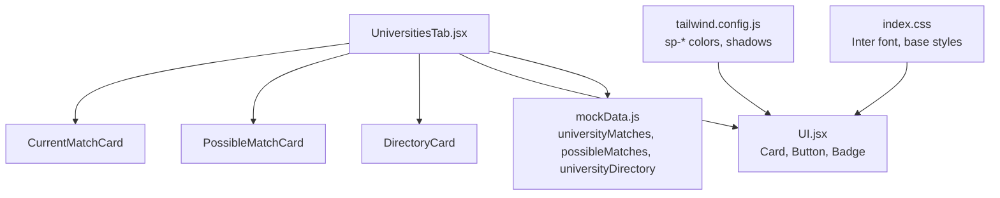
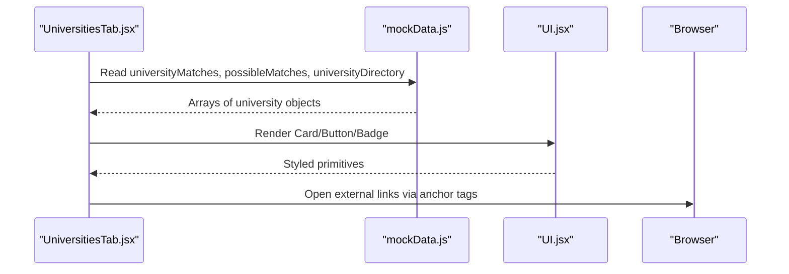
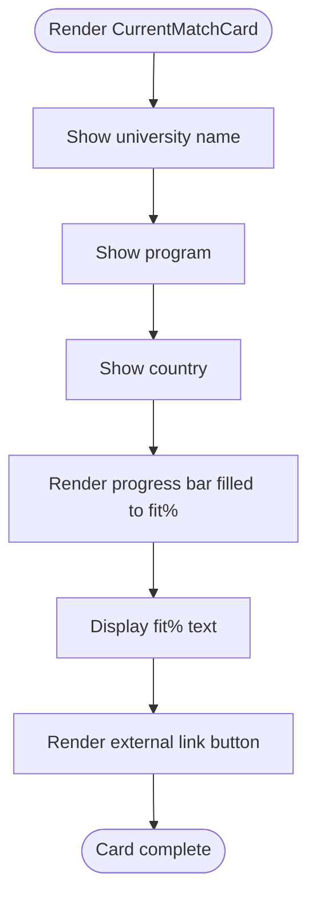
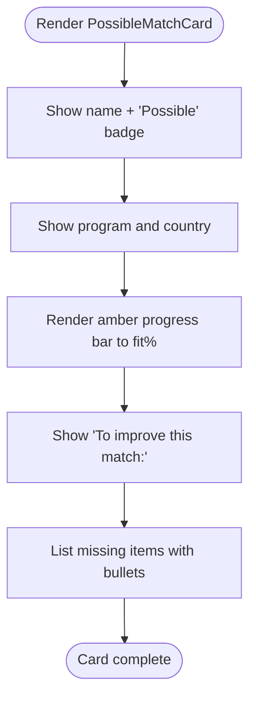
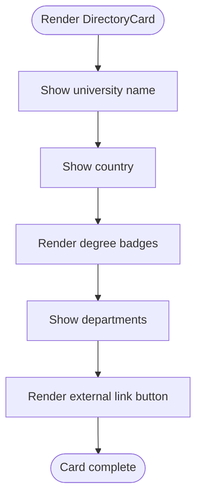
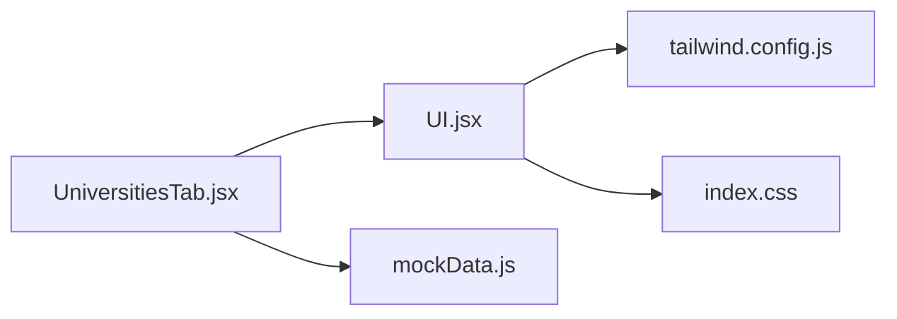

# University Display Cards

<cite>
**Referenced Files in This Document**
- [UniversitiesTab.jsx](file://scholarpath-frontend (2)/scholarpath/src/pages/UniversitiesTab.jsx)
- [UI.jsx](file://scholarpath-frontend (2)/scholarpath/src/components/UI.jsx)
- [mockData.js](file://scholarpath-frontend (2)/scholarpath/src/data/mockData.js)
- [index.css](file://scholarpath-frontend (2)/scholarpath/src/index.css)
- [tailwind.config.js](file://scholarpath-frontend (2)/scholarpath/tailwind.config.js)
</cite>

## Table of Contents
1. [Introduction](#introduction)
2. [Project Structure](#project-structure)
3. [Core Components](#core-components)
4. [Architecture Overview](#architecture-overview)
5. [Detailed Component Analysis](#detailed-component-analysis)
6. [Dependency Analysis](#dependency-analysis)
7. [Performance Considerations](#performance-considerations)
8. [Troubleshooting Guide](#troubleshooting-guide)
9. [Conclusion](#conclusion)
10. [Appendices](#appendices)

## Introduction
This document explains the three university display card components used to present match results and a browsable directory: CurrentMatchCard, PossibleMatchCard, and DirectoryCard. It covers how each card communicates information differently—match percentages with progress bars, missing requirements lists, and program badges—along with visual design patterns such as color coding, typography hierarchy, spacing, interactive external links, and responsive grid layout. It also includes examples of data structures passed into each component and guidance for customization.

## Project Structure
The cards are implemented within a single page that renders three sections:
- Current matches
- Possible matches
- University directory

Reusable UI primitives (Card, Button, Badge) live in a shared component file. Data is provided via a mock data module. Styling uses Tailwind CSS with custom theme tokens defined in configuration.

**Diagram sources**
- [UniversitiesTab.jsx:1-163](file://scholarpath-frontend (2)/scholarpath/src/pages/UniversitiesTab.jsx#L1-L163)
- [UI.jsx:1-47](file://scholarpath-frontend (2)/scholarpath/src/components/UI.jsx#L1-L47)
- [mockData.js:43-133](file://scholarpath-frontend (2)/scholarpath/src/data/mockData.js#L43-L133)
- [tailwind.config.js:1-31](file://scholarpath-frontend (2)/scholarpath/tailwind.config.js#L1-L31)
- [index.css:1-35](file://scholarpath-frontend (2)/scholarpath/src/index.css#L1-L35)

**Section sources**
- [UniversitiesTab.jsx:1-163](file://scholarpath-frontend (2)/scholarpath/src/pages/UniversitiesTab.jsx#L1-L163)
- [UI.jsx:1-47](file://scholarpath-frontend (2)/scholarpath/src/components/UI.jsx#L1-L47)
- [mockData.js:43-133](file://scholarpath-frontend (2)/scholarpath/src/data/mockData.js#L43-L133)
- [tailwind.config.js:1-31](file://scholarpath-frontend (2)/scholarpath/tailwind.config.js#L1-L31)
- [index.css:1-35](file://scholarpath-frontend (2)/scholarpath/src/index.css#L1-L35)

## Core Components
- CurrentMatchCard: Displays a matched university with a blue progress bar indicating fit percentage and an external link to the university website.
- PossibleMatchCard: Displays a “possible” match with an amber progress bar, a “Possible” badge, and a list of missing requirements to improve eligibility.
- DirectoryCard: Displays a university from the directory with degree badges and department text, plus an external link to the official portal.

All three share a common Card wrapper and use consistent typography and spacing. Buttons open external links using target="_blank" and rel="noopener noreferrer".

**Section sources**
- [UniversitiesTab.jsx:8-71](file://scholarpath-frontend (2)/scholarpath/src/pages/UniversitiesTab.jsx#L8-L71)
- [UI.jsx:1-47](file://scholarpath-frontend (2)/scholarpath/src/components/UI.jsx#L1-L47)

## Architecture Overview
The page composes three card types and renders them in responsive grids. Data flows from mockData into the page, which maps arrays to card instances. Shared UI primitives provide consistent styling and interaction patterns.

**Diagram sources**
- [UniversitiesTab.jsx:73-163](file://scholarpath-frontend (2)/scholarpath/src/pages/UniversitiesTab.jsx#L73-L163)
- [mockData.js:43-133](file://scholarpath-frontend (2)/scholarpath/src/data/mockData.js#L43-L133)
- [UI.jsx:1-47](file://scholarpath-frontend (2)/scholarpath/src/components/UI.jsx#L1-L47)

## Detailed Component Analysis

### CurrentMatchCard
Purpose:
- Communicates a strong match with a clear percentage and progress visualization.
- Provides a direct call-to-action to visit the university’s website.

Information hierarchy:
- University name (primary emphasis)
- Program (secondary)
- Country (tertiary)
- Fit percentage with progress bar (visual metric)
- External link button

Visual design:
- Color coding: Blue progress bar and text indicate a confirmed match.
- Typography: Name bold and slightly larger; program and country progressively smaller and lighter.
- Spacing: Consistent vertical rhythm with margins between sections.
- Progress bar: Full-width track with a blue fill proportional to fit percentage.
- Interactive element: Secondary button opens the university site in a new tab.

Data structure example:
- Fields: id, name, country, fit, program, website
- Example entries are provided in the data module.

Customization options:
- Adjust progress bar color by changing the fill class to another sp-* token.
- Modify typography sizes or weights to emphasize different fields.
- Change button variant or label to suit context.

**Diagram sources**
- [UniversitiesTab.jsx:8-25](file://scholarpath-frontend (2)/scholarpath/src/pages/UniversitiesTab.jsx#L8-L25)

**Section sources**
- [UniversitiesTab.jsx:8-25](file://scholarpath-frontend (2)/scholarpath/src/pages/UniversitiesTab.jsx#L8-L25)
- [mockData.js:43-77](file://scholarpath-frontend (2)/scholarpath/src/data/mockData.js#L43-L77)
- [UI.jsx:1-24](file://scholarpath-frontend (2)/scholarpath/src/components/UI.jsx#L1-L24)

### PossibleMatchCard
Purpose:
- Highlights universities that are close but require additional qualifications.
- Encourages improvement by listing specific missing requirements.

Information hierarchy:
- University name with a “Possible” badge
- Program and country
- Amber progress bar showing current fit
- Actionable list of missing items to improve match

Visual design:
- Color coding: Amber indicates potential or in-progress status.
- Typography: Name bold; missing items use small text with bullet markers.
- Spacing: Clear separation between header, metrics, and actionable list.
- Badge: Uses a tone-based Badge primitive to signal “Possible”.
- Interactive element: Optional external link can be added similarly to CurrentMatchCard.

Data structure example:
- Fields: id, name, country, fit, program, website, missing[]
- The missing array contains strings describing required improvements.

Customization options:
- Replace or augment missing items with icons or links to resources.
- Adjust amber tones or add conditional styling based on fit thresholds.
- Add a call-to-action button to guide users toward completing missing items.

**Diagram sources**
- [UniversitiesTab.jsx:27-51](file://scholarpath-frontend (2)/scholarpath/src/pages/UniversitiesTab.jsx#L27-L51)

**Section sources**
- [UniversitiesTab.jsx:27-51](file://scholarpath-frontend (2)/scholarpath/src/pages/UniversitiesTab.jsx#L27-L51)
- [mockData.js:79-117](file://scholarpath-frontend (2)/scholarpath/src/data/mockData.js#L79-L117)
- [UI.jsx:34-46](file://scholarpath-frontend (2)/scholarpath/src/components/UI.jsx#L34-L46)

### DirectoryCard
Purpose:
- Presents a browsable entry for any university in the directory.
- Emphasizes offered degrees via badges and provides quick access to the official portal.

Information hierarchy:
- University name
- Country
- Degree badges (multiple)
- Departments listed inline
- External link to official portal

Visual design:
- Color coding: Blue badges highlight degrees.
- Typography: Name prominent; country and departments smaller and muted.
- Spacing: Flex-wrap layout for badges ensures readability across widths.
- Interactive element: Secondary button opens the university’s official site.

Data structure example:
- Fields: id, name, country, degrees[], departments[], website
- Degrees and departments are arrays enabling multiple values per university.

Customization options:
- Add filters or sorting to the parent grid.
- Expand badges to include icons or tooltips for degree levels.
- Provide additional actions like “View programs” or “Compare”.

**Diagram sources**
- [UniversitiesTab.jsx:53-71](file://scholarpath-frontend (2)/scholarpath/src/pages/UniversitiesTab.jsx#L53-L71)

**Section sources**
- [UniversitiesTab.jsx:53-71](file://scholarpath-frontend (2)/scholarpath/src/pages/UniversitiesTab.jsx#L53-L71)
- [mockData.js:119-133](file://scholarpath-frontend (2)/scholarpath/src/data/mockData.js#L119-L133)
- [UI.jsx:34-46](file://scholarpath-frontend (2)/scholarpath/src/components/UI.jsx#L34-L46)

## Dependency Analysis
- UniversitiesTab depends on:
  - UI primitives (Card, Button, Badge) for consistent rendering and interaction.
  - mockData for all displayed content.
- UI primitives depend on:
  - Tailwind theme tokens (sp-*) for colors and shadows.
  - Global CSS for fonts and base styles.

**Diagram sources**
- [UniversitiesTab.jsx:1-163](file://scholarpath-frontend (2)/scholarpath/src/pages/UniversitiesTab.jsx#L1-L163)
- [UI.jsx:1-47](file://scholarpath-frontend (2)/scholarpath/src/components/UI.jsx#L1-L47)
- [mockData.js:43-133](file://scholarpath-frontend (2)/scholarpath/src/data/mockData.js#L43-L133)
- [tailwind.config.js:1-31](file://scholarpath-frontend (2)/scholarpath/tailwind.config.js#L1-L31)
- [index.css:1-35](file://scholarpath-frontend (2)/scholarpath/src/index.css#L1-L35)

**Section sources**
- [UniversitiesTab.jsx:1-163](file://scholarpath-frontend (2)/scholarpath/src/pages/UniversitiesTab.jsx#L1-L163)
- [UI.jsx:1-47](file://scholarpath-frontend (2)/scholarpath/src/components/UI.jsx#L1-L47)
- [mockData.js:43-133](file://scholarpath-frontend (2)/scholarpath/src/data/mockData.js#L43-L133)
- [tailwind.config.js:1-31](file://scholarpath-frontend (2)/scholarpath/tailwind.config.js#L1-L31)
- [index.css:1-35](file://scholarpath-frontend (2)/scholarpath/src/index.css#L1-L35)

## Performance Considerations
- Rendering efficiency:
  - Each section maps over arrays directly; for large datasets, consider pagination or virtualization.
  - Use stable keys (id) to optimize re-renders.
- Styling performance:
  - Tailwind utilities are compiled statically; avoid excessive dynamic classes.
  - Keep progress bar width calculations simple and numeric.
- Accessibility:
  - Ensure buttons have descriptive labels.
  - Provide alt-like descriptions if adding icons to badges or lists.

[No sources needed since this section provides general guidance]

## Troubleshooting Guide
Common issues and resolutions:
- Missing fields in data:
  - If fit is undefined, the progress bar will not render correctly. Validate data before mapping.
  - If missing is not an array in PossibleMatchCard, iteration will fail. Ensure proper shape.
  - If degrees or departments are missing in DirectoryCard, ensure they are arrays or handle gracefully.
- External links:
  - Verify website URLs are valid and properly escaped.
  - Confirm target="_blank" and rel="noopener noreferrer" are set for security.
- Styling inconsistencies:
  - If colors do not appear, confirm Tailwind theme tokens are configured and imported.
  - Check that global CSS loads Inter font and base styles.

**Section sources**
- [UniversitiesTab.jsx:8-71](file://scholarpath-frontend (2)/scholarpath/src/pages/UniversitiesTab.jsx#L8-L71)
- [UI.jsx:1-47](file://scholarpath-frontend (2)/scholarpath/src/components/UI.jsx#L1-L47)
- [mockData.js:43-133](file://scholarpath-frontend (2)/scholarpath/src/data/mockData.js#L43-L133)
- [tailwind.config.js:1-31](file://scholarpath-frontend (2)/scholarpath/tailwind.config.js#L1-L31)
- [index.css:1-35](file://scholarpath-frontend (2)/scholarpath/src/index.css#L1-L35)

## Conclusion
The three card types provide distinct yet cohesive ways to communicate university match status:
- CurrentMatchCard emphasizes confirmed matches with blue indicators and a clear percentage.
- PossibleMatchCard highlights opportunities with amber indicators and actionable missing requirements.
- DirectoryCard offers a browsable catalog with degree badges and direct links to official portals.

They share consistent visual language through shared primitives, Tailwind tokens, and responsive grids, ensuring clarity and usability across devices. Customization points allow teams to adapt typography, colors, and interactions while maintaining coherence.

[No sources needed since this section summarizes without analyzing specific files]

## Appendices

### Visual Design Patterns
- Color coding:
  - Blue for confirmed matches and primary actions.
  - Amber for potential matches and warnings.
  - Neutral slate for secondary text and borders.
- Typography hierarchy:
  - Names bold and prominent.
  - Programs and countries progressively smaller and lighter.
  - Lists and badges use small, readable sizes.
- Spacing conventions:
  - Consistent padding inside cards.
  - Margins between sections for visual breathing room.
  - Flex-wrap for badges to adapt to available width.

**Section sources**
- [UniversitiesTab.jsx:8-71](file://scholarpath-frontend (2)/scholarpath/src/pages/UniversitiesTab.jsx#L8-L71)
- [UI.jsx:1-47](file://scholarpath-frontend (2)/scholarpath/src/components/UI.jsx#L1-L47)
- [tailwind.config.js:1-31](file://scholarpath-frontend (2)/scholarpath/tailwind.config.js#L1-L31)
- [index.css:1-35](file://scholarpath-frontend (2)/scholarpath/src/index.css#L1-L35)

### Responsive Grid Layout
- Single column on mobile, two columns at small screens, three columns at large screens for the directory section.
- Two-column grids for current and possible matches sections.
- Gap and padding ensure consistent spacing across breakpoints.

**Section sources**
- [UniversitiesTab.jsx:126-159](file://scholarpath-frontend (2)/scholarpath/src/pages/UniversitiesTab.jsx#L126-L159)

### Data Structures Reference
- CurrentMatchCard input:
  - id, name, country, fit, program, website
- PossibleMatchCard input:
  - id, name, country, fit, program, website, missing[]
- DirectoryCard input:
  - id, name, country, degrees[], departments[], website

**Section sources**
- [mockData.js:43-133](file://scholarpath-frontend (2)/scholarpath/src/data/mockData.js#L43-L133)