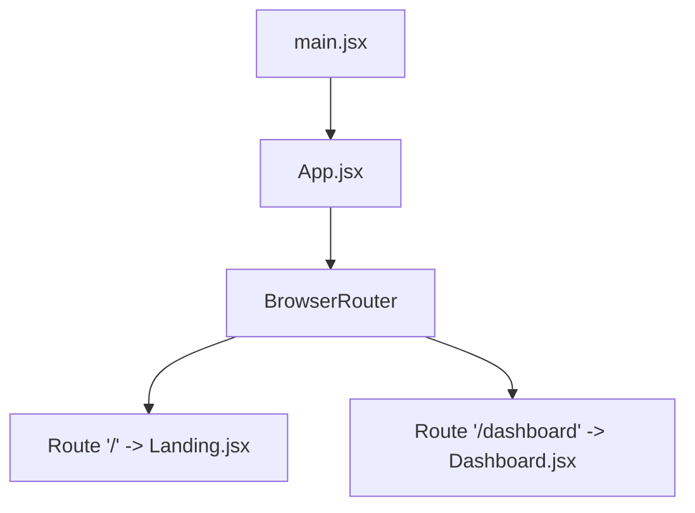
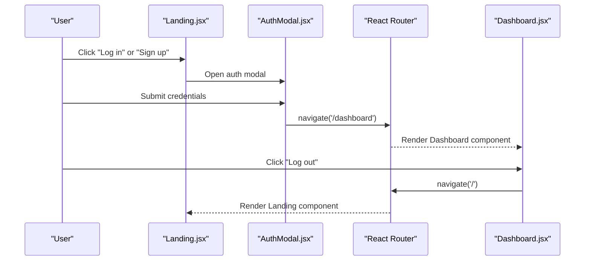
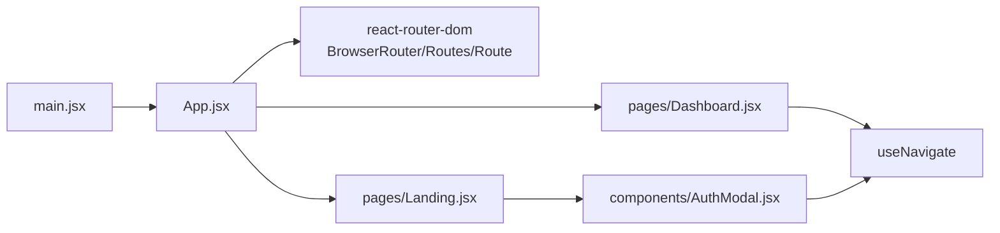

# Routing and Navigation

<cite>
**Referenced Files in This Document**
- [App.jsx](file://scholarpath-frontend (2)/scholarpath/src/App.jsx)
- [main.jsx](file://scholarpath-frontend (2)/scholarpath/src/main.jsx)
- [Landing.jsx](file://scholarpath-frontend (2)/scholarpath/src/pages/Landing.jsx)
- [Dashboard.jsx](file://scholarpath-frontend (2)/scholarpath/src/pages/Dashboard.jsx)
- [AuthModal.jsx](file://scholarpath-frontend (2)/scholarpath/src/components/AuthModal.jsx)
- [package.json](file://scholarpath-frontend (2)/scholarpath/package.json)
</cite>

## Table of Contents
1. Introduction
2. Project Structure
3. Core Components
4. Architecture Overview
5. Detailed Component Analysis
6. Dependency Analysis
7. Performance Considerations
8. Troubleshooting Guide
9. Conclusion
10. Appendices

## Introduction
This document explains the routing and navigation system in ScholarPathAI’s frontend. It covers the React Router setup, route definitions, navigation flows between the Landing page and Dashboard, current authentication behavior, and practical guidance for adding routes, implementing nested routing for dashboard tabs, and introducing protected routes with navigation guards. It also addresses browser history management, route-based code splitting considerations, and strategies to persist navigation state across reloads.

## Project Structure
The application uses React Router v7 with a single top-level router that defines two primary routes:
- Root path for the public landing experience
- A dashboard route for authenticated features

**Diagram sources**
- [main.jsx:6-10](file://scholarpath-frontend (2)/scholarpath/src/main.jsx#L6-L10)
- [App.jsx:5-14](file://scholarpath-frontend (2)/scholarpath/src/App.jsx#L5-L14)

**Section sources**
- [main.jsx:1-11](file://scholarpath-frontend (2)/scholarpath/src/main.jsx#L1-L11)
- [App.jsx:1-15](file://scholarpath-frontend (2)/scholarpath/src/App.jsx#L1-L15)

## Core Components
- App.jsx: Defines the root router and maps URL paths to page components.
- main.jsx: Bootstraps the React app and renders App inside StrictMode.
- Landing.jsx: Public-facing page; opens an authentication modal that navigates to the dashboard upon submission.
- Dashboard.jsx: Protected area with internal tabbed UI; includes programmatic navigation to log out.
- AuthModal.jsx: Handles login/signup flow and performs programmatic navigation to /dashboard after form submission.

Key behaviors:
- Programmatic navigation is performed via useNavigate from react-router-dom.
- The current implementation does not enforce access control at the route level; any user can navigate to /dashboard.

**Section sources**
- [App.jsx:1-15](file://scholarpath-frontend (2)/scholarpath/src/App.jsx#L1-L15)
- [Landing.jsx:32-63](file://scholarpath-frontend (2)/scholarpath/src/pages/Landing.jsx#L32-L63)
- [Dashboard.jsx:128-186](file://scholarpath-frontend (2)/scholarpath/src/pages/Dashboard.jsx#L128-L186)
- [AuthModal.jsx:5-16](file://scholarpath-frontend (2)/scholarpath/src/components/AuthModal.jsx#L5-L16)

## Architecture Overview
The routing architecture centers on a single BrowserRouter instance that declares two top-level routes. Navigation between pages is handled through both declarative links and programmatic navigation.

**Diagram sources**
- [Landing.jsx:32-63](file://scholarpath-frontend (2)/scholarpath/src/pages/Landing.jsx#L32-L63)
- [AuthModal.jsx:11-16](file://scholarpath-frontend (2)/scholarpath/src/components/AuthModal.jsx#L11-L16)
- [Dashboard.jsx:154-169](file://scholarpath-frontend (2)/scholarpath/src/pages/Dashboard.jsx#L154-L169)
- [App.jsx:7-12](file://scholarpath-frontend (2)/scholarpath/src/App.jsx#L7-L12)

## Detailed Component Analysis

### Router Configuration (App.jsx)
- Uses BrowserRouter to enable HTML5 history-based routing.
- Declares two routes:
  - "/" renders the Landing page.
  - "/dashboard" renders the Dashboard page.
- No nested routes are defined at this level; nested navigation is implemented internally within Dashboard using local state.

Implementation notes:
- Route elements are directly mapped to page components.
- There is no route-level protection currently; access control is not enforced by the router.

**Section sources**
- [App.jsx:1-15](file://scholarpath-frontend (2)/scholarpath/src/App.jsx#L1-L15)

### Landing Page Navigation
- Provides UI to open an authentication modal for login/signup.
- Does not perform direct programmatic navigation to /dashboard from the page itself; instead, it delegates to the modal.

Navigation triggers:
- Opening the modal via state changes.
- The modal handles successful submission and navigates to /dashboard.

**Section sources**
- [Landing.jsx:32-63](file://scholarpath-frontend (2)/scholarpath/src/pages/Landing.jsx#L32-L63)

### Authentication Modal and Programmatic Navigation
- Uses useNavigate to programmatically move to /dashboard after form submission.
- Currently implements mock authentication without backend verification.

Behavior:
- On submit, closes the modal and navigates to /dashboard.
- No validation or error handling is shown in the snippet.

**Section sources**
- [AuthModal.jsx:5-16](file://scholarpath-frontend (2)/scholarpath/src/components/AuthModal.jsx#L5-L16)

### Dashboard and Internal Tab Navigation
- Implements a sidebar with multiple tabs controlled by local state.
- Uses programmatic navigation to return to the root path for logout.
- Contains no route-based nested routing; tabs are rendered conditionally based on state.

Key points:
- Tabs: overview, profile, attestation, universities, scholarships, buildcv, faq.
- Logout button navigates to "/" using useNavigate.

**Section sources**
- [Dashboard.jsx:13-21](file://scholarpath-frontend (2)/scholarpath/src/pages/Dashboard.jsx#L13-L21)
- [Dashboard.jsx:128-186](file://scholarpath-frontend (2)/scholarpath/src/pages/Dashboard.jsx#L128-L186)

### Protected Routes and Access Control
Current state:
- No route-level protection exists. Any visitor can navigate to /dashboard.

Recommended approach:
- Introduce a wrapper component (e.g., ProtectedRoute) that checks authentication state before rendering target routes.
- Redirect unauthenticated users to "/" when attempting to access "/dashboard".
- Store authentication state in a global context or service and read it within the guard.

Note: This section outlines recommended practices; the repository currently lacks explicit route guards.

[No sources needed since this section provides general guidance]

### URL Patterns and Route Parameters
Current patterns:
- "/" for Landing
- "/dashboard" for Dashboard

Parameters:
- None are used in the current routes.

Future considerations:
- If you add dynamic segments (e.g., "/dashboard/profile/:id"), ensure corresponding components consume params via useSearchParams or useParams depending on your design.

[No sources needed since this section provides general guidance]

### Adding New Routes
Steps:
1. Create a new page component under src/pages/.
2. Import the component in App.jsx.
3. Add a new <Route> entry with the desired path and element.
4. Optionally wrap with a ProtectedRoute if the route requires authentication.

Example pattern:
- Define a new route like "/settings" and render a Settings component.

[No sources needed since this section provides general guidance]

### Nested Routing for Dashboard Tabs
Current implementation:
- Tabs are managed via local state within Dashboard.jsx.

Alternative with nested routes:
- Use nested <Routes> inside Dashboard to map subpaths (e.g., "/dashboard/overview", "/dashboard/profile").
- Use <Link> or <NavLink> for tab navigation to update the URL while keeping the dashboard layout intact.
- Benefits include shareable URLs per tab and better integration with browser history.

[No sources needed since this section provides general guidance]

### Navigation Guards
To implement guards:
- Create a higher-order component or wrapper that verifies authentication.
- Wrap protected routes with this wrapper in App.jsx.
- Redirect to "/" if not authenticated.

[No sources needed since this section provides general guidance]

### Browser History Management
- BrowserRouter manages the browser’s history stack automatically.
- Programmatic navigation via useNavigate supports forward/back actions and pushing/replacing entries.
- Ensure deep linking works by mapping meaningful URLs to components if you adopt nested routing.

[No sources needed since this section provides general guidance]

### Route-Based Code Splitting
Considerations:
- For large applications, split route components using React.lazy and Suspense to reduce initial bundle size.
- Lazy-load heavy pages (e.g., Dashboard) to improve first paint performance.
- Keep lightweight pages (e.g., Landing) eagerly loaded.

[No sources needed since this section provides general guidance]

### Navigation State Persistence Across Reloads
Current state:
- No persistence mechanism is present for navigation state.

Recommendations:
- Persist authentication state in localStorage or a secure cookie to maintain session across reloads.
- Sync UI state (like active tab) with URL query parameters or hash fragments so reloading preserves context.
- For complex state, consider a global store (e.g., Context API or external library) and hydrate it on app start.

[No sources needed since this section provides general guidance]

## Dependency Analysis
The routing dependency chain is straightforward:
- main.jsx renders App.
- App sets up BrowserRouter and declares routes.
- Pages import and use react-router hooks for navigation.

**Diagram sources**
- [main.jsx:6-10](file://scholarpath-frontend (2)/scholarpath/src/main.jsx#L6-L10)
- [App.jsx:1-15](file://scholarpath-frontend (2)/scholarpath/src/App.jsx#L1-L15)
- [Dashboard.jsx:1-11](file://scholarpath-frontend (2)/scholarpath/src/pages/Dashboard.jsx#L1-L11)
- [AuthModal.jsx:1-16](file://scholarpath-frontend (2)/scholarpath/src/components/AuthModal.jsx#L1-L16)

**Section sources**
- [package.json:12-16](file://scholarpath-frontend (2)/scholarpath/package.json#L12-L16)

## Performance Considerations
- Keep the root router minimal and avoid unnecessary re-renders by memoizing route elements where appropriate.
- Use lazy loading for heavy pages to reduce initial load time.
- Prefer programmatic navigation for transitions that require side effects (e.g., closing modals).
- Avoid excessive state updates during navigation; batch updates where possible.

[No sources needed since this section provides general guidance]

## Troubleshooting Guide
Common issues and resolutions:
- Navigating to /dashboard without authentication:
  - Implement a ProtectedRoute wrapper to enforce access control.
- Links not updating the URL:
  - Ensure you are using Link/NavLink for declarative navigation or useNavigate for programmatic navigation.
- Deep links not working:
  - Verify server configuration serves index.html for all routes when using BrowserRouter.
- State lost on reload:
  - Persist critical state in localStorage or sync with URL parameters.

[No sources needed since this section provides general guidance]

## Conclusion
ScholarPathAI’s routing is built on React Router v7 with a simple two-route structure. Navigation between Landing and Dashboard is achieved via programmatic navigation from the authentication modal and within the Dashboard. The current implementation does not enforce route-level protection; adding protected routes and nested routing will enhance security and usability. Adopting lazy loading and state persistence will further improve performance and user experience.

[No sources needed since this section summarizes without analyzing specific files]

## Appendices

### Example: Adding a Protected Route
- Create a ProtectedRoute component that checks authentication state.
- Wrap the /dashboard route with ProtectedRoute in App.jsx.
- Redirect unauthenticated users to "/" when accessing protected routes.

[No sources needed since this section provides general guidance]

### Example: Nested Routing for Dashboard Tabs
- Replace local tab state with URL-based routing under /dashboard/* paths.
- Use NavLink for active tab styling and <Link> for navigation.
- Maintain a shared layout component for the dashboard shell.

[No sources needed since this section provides general guidance]