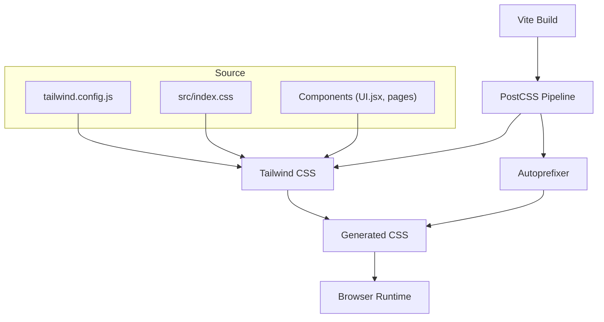
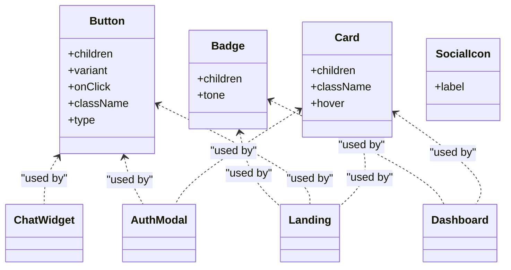
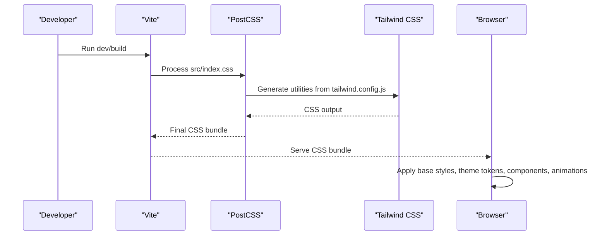
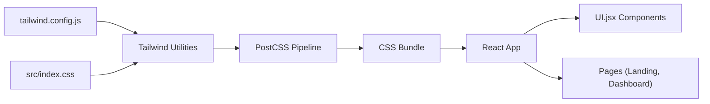

# Styling and Theming

<cite>
**Referenced Files in This Document**
- [tailwind.config.js](file://scholarpath-frontend (2)\scholarpath\tailwind.config.js)
- [index.css](file://scholarpath-frontend (2)\scholarpath\src\index.css)
- [postcss.config.js](file://scholarpath-frontend (2)\scholarpath\postcss.config.js)
- [vite.config.js](file://scholarpath-frontend (2)\scholarpath\vite.config.js)
- [package.json](file://scholarpath-frontend (2)\scholarpath\package.json)
- [UI.jsx](file://scholarpath-frontend (2)\scholarpath\src\components\UI.jsx)
- [Landing.jsx](file://scholarpath-frontend (2)\scholarpath\src\pages\Landing.jsx)
- [Dashboard.jsx](file://scholarpath-frontend (2)\scholarpath\src\pages\Dashboard.jsx)
- [AuthModal.jsx](file://scholarpath-frontend (2)\scholarpath\src\components\AuthModal.jsx)
- [ChatWidget.jsx](file://scholarpath-frontend (2)\scholarpath\src\components\ChatWidget.jsx)
</cite>

## Update Summary
**Changes Made**
- Updated Global Styles and Animations section to document comprehensive animation system
- Added new Custom Scrollbar Styling section
- Enhanced Animation System section with six distinct keyframes and easing curves
- Added Staggered Delay Utilities section
- Updated Card Hover Effects section with smooth lift animations
- Added Accordion Styling section with chevron rotation
- Enhanced Accessibility Support section with reduced motion preferences
- Updated Performance Considerations with animation performance guidance

## Table of Contents
1. [Introduction](#introduction)
2. [Project Structure](#project-structure)
3. [Core Components](#core-components)
4. [Architecture Overview](#architecture-overview)
5. [Detailed Component Analysis](#detailed-component-analysis)
6. [Dependency Analysis](#dependency-analysis)
7. [Performance Considerations](#performance-considerations)
8. [Troubleshooting Guide](#troubleshooting-guide)
9. [Conclusion](#conclusion)
10. [Appendices](#appendices)

## Introduction
This document explains the styling system and theming approach used in ScholarPathAI. It covers Tailwind CSS configuration, global styles, PostCSS setup, mobile-first responsive patterns, utility class usage, component-specific styling, guidelines for design consistency, extending themes (including dark mode), and performance considerations for CSS bundling and runtime style calculations.

## Project Structure
The styling system is centered around:
- Tailwind CSS configuration for theme extensions and custom tokens
- Global base styles and animations in index.css
- PostCSS pipeline with Tailwind and Autoprefixer
- Vite build tooling that integrates React and CSS processing
- Reusable UI components encapsulating consistent styling patterns

**Diagram sources**
- [postcss.config.js:1-7](file://scholarpath-frontend (2)\scholarpath\postcss.config.js#L1-L7)
- [tailwind.config.js:1-31](file://scholarpath-frontend (2)\scholarpath\tailwind.config.js#L1-L31)
- [index.css:1-134](file://scholarpath-frontend (2)\scholarpath\src\index.css#L1-L134)
- [vite.config.js:1-8](file://scholarpath-frontend (2)\scholarpath\vite.config.js#L1-L8)

**Section sources**
- [tailwind.config.js:1-31](file://scholarpath-frontend (2)\scholarpath\tailwind.config.js#L1-L31)
- [index.css:1-134](file://scholarpath-frontend (2)\scholarpath\src\index.css#L1-L134)
- [postcss.config.js:1-7](file://scholarpath-frontend (2)\scholarpath\postcss.config.js#L1-L7)
- [vite.config.js:1-8](file://scholarpath-frontend (2)\scholarpath\vite.config.js#L1-L8)

## Core Components
ScholarPathAI defines a small set of reusable UI primitives that centralize styling decisions and ensure consistency across the app.

- Card: Provides a consistent container with border, rounded corners, background, and a custom shadow token with optional hover lift effect.
- Button: Offers multiple variants (primary, secondary, ghost) using theme colors and transitions.
- Badge: Displays status or category labels with tone-based color schemes.
- SocialIcon: Consistent icon container with hover states and borders.

These components use Tailwind utilities and custom theme tokens to maintain visual coherence.

**Diagram sources**
- [UI.jsx:1-106](file://scholarpath-frontend (2)\scholarpath\src\components\UI.jsx#L1-L106)
- [Landing.jsx:1-390](file://scholarpath-frontend (2)\scholarpath\src\pages\Landing.jsx#L1-L390)
- [AuthModal.jsx:1-284](file://scholarpath-frontend (2)\scholarpath\src\components\AuthModal.jsx#L1-L284)
- [Dashboard.jsx:1-444](file://scholarpath-frontend (2)\scholarpath\src\pages\Dashboard.jsx#L1-L444)
- [ChatWidget.jsx:1-101](file://scholarpath-frontend (2)\scholarpath\src\components\ChatWidget.jsx#L1-L101)

**Section sources**
- [UI.jsx:1-106](file://scholarpath-frontend (2)\scholarpath\src\components\UI.jsx#L1-L106)
- [Landing.jsx:1-390](file://scholarpath-frontend (2)\scholarpath\src\pages\Landing.jsx#L1-L390)
- [AuthModal.jsx:1-284](file://scholarpath-frontend (2)\scholarpath\src\components\AuthModal.jsx#L1-L284)
- [Dashboard.jsx:1-444](file://scholarpath-frontend (2)\scholarpath\src\pages\Dashboard.jsx#L1-L444)
- [ChatWidget.jsx:1-101](file://scholarpath-frontend (2)\scholarpath\src\components\ChatWidget.jsx#L1-L101)

## Architecture Overview
The styling architecture follows a layered approach:
- Theme layer: Custom colors, fonts, shadows defined in Tailwind config.
- Base layer: Global resets, typography, selection, and comprehensive animation system in index.css.
- Component layer: Reusable primitives in UI.jsx that compose utilities and theme tokens.
- Page layer: Pages assemble components and apply layout utilities for responsive behavior.
- Build layer: PostCSS processes CSS through Tailwind and Autoprefixer; Vite orchestrates the build.

**Diagram sources**
- [vite.config.js:1-8](file://scholarpath-frontend (2)\scholarpath\vite.config.js#L1-L8)
- [postcss.config.js:1-7](file://scholarpath-frontend (2)\scholarpath\postcss.config.js#L1-L7)
- [tailwind.config.js:1-31](file://scholarpath-frontend (2)\scholarpath\tailwind.config.js#L1-L31)
- [index.css:1-134](file://scholarpath-frontend (2)\scholarpath\src\index.css#L1-L134)

## Detailed Component Analysis

### Tailwind Configuration and Theme Extensions
- Content scanning: Config scans HTML and JSX files to generate only used utilities.
- Colors: Custom brand palette includes blues, navy, slate, borders, backgrounds, greens, and ambers.
- Typography: Sans font stack prioritizes Inter with system fallbacks.
- Shadows: Custom card shadows provide consistent elevation.

Guidelines:
- Use sp-* tokens for all brand-related colors to maintain consistency.
- Prefer theme-defined shadows over ad-hoc values.
- Extend theme via the extend block to avoid overriding defaults unintentionally.

**Section sources**
- [tailwind.config.js:1-31](file://scholarpath-frontend (2)\scholarpath\tailwind.config.js#L1-L31)

### Global Styles and Smooth Scroll Behavior
- Base imports: Tailwind layers are included to inject base, components, and utilities.
- Body: Sets background, font family, and antialiasing for crisp text.
- Selection: Brand-colored selection highlight improves UX.
- Smooth scrolling: Global smooth scroll behavior enhances navigation experience.

Guidelines:
- Keep global styles minimal; prefer component-level classes where possible.
- Smooth scrolling provides better user experience but should be disabled for users with motion sensitivity.

**Section sources**
- [index.css:1-24](file://scholarpath-frontend (2)\scholarpath\src\index.css#L1-L24)
- [index.css:10-12](file://scholarpath-frontend (2)\scholarpath\src\index.css#L10-L12)

### Custom Scrollbar Styling
- WebKit scrollbar customization provides a sleek, modern appearance.
- Thin 6px width maintains unobtrusive presence while providing clear scroll indication.
- Transparent track keeps focus on content rather than scroll controls.
- Subtle gray thumb with hover state provides clear interaction feedback.

Implementation details:
- `::-webkit-scrollbar`: Sets scrollbar width to 6px for modern browsers.
- `::-webkit-scrollbar-track`: Transparent background keeps interface clean.
- `::-webkit-scrollbar-thumb`: Light gray (#cbd5e1) with rounded corners for subtle visibility.
- Hover state: Darker gray (#94a3b8) provides clear interaction feedback.

**Section sources**
- [index.css:26-39](file://scholarpath-frontend (2)\scholarpath\src\index.css#L26-L39)

### Comprehensive Animation System
The application features a sophisticated animation system with six distinct keyframe animations, each optimized for specific use cases:

#### Animation Keyframes
1. **fade-up**: Smooth upward entrance with opacity transition (0.5s duration)
2. **fade-in**: Simple opacity fade (0.4s duration) 
3. **slide-in-right**: Horizontal slide entrance from right (0.4s duration)
4. **scale-in**: Subtle scale-up entrance (0.3s duration)
5. **count-up**: Animated number counting effect (0.6s duration)
6. **pulse-soft**: Gentle pulsing effect for attention indicators (2s infinite loop)

#### Easing Curves
All animations use carefully selected cubic-bezier curves for natural motion:
- Primary easing: `cubic-bezier(0.4, 0, 0.2, 1)` - Material Design standard curve
- Alternative easing: `ease-out` for simpler animations
- Infinite animations: `ease-in-out` for smooth looping

#### Animation Classes
Each keyframe has corresponding utility classes:
- `.animate-fade-up`, `.animate-fade-in`, `.animate-slide-in-right`
- `.animate-scale-in`, `.animate-count-up`, `.animate-pulse-soft`

Usage examples:
- Hero sections use fade-up with staggered delays
- Feature cards use slide-in-right for sequential reveals
- Statistics use count-up for engaging number displays
- Interactive elements use pulse-soft for attention indicators

**Section sources**
- [index.css:41-84](file://scholarpath-frontend (2)\scholarpath\src\index.css#L41-L84)

### Staggered Delay Utilities
Enhanced animation system includes precise timing control through delay utility classes:

#### Delay Classes
- `.delay-100`: 0.1s delay for subtle stagger effects
- `.delay-200`: 0.2s delay for moderate timing separation
- `.delay-300`: 0.3s delay for clear sequence progression
- `.delay-400`: 0.4s delay for dramatic reveal sequences
- `.delay-500`: 0.5s delay for maximum impact timing

#### Implementation Patterns
- Sequential list items: Combine slide-in-right with incremental delays
- Hero content: Fade-up with 200ms delay for secondary elements
- Feature grids: Staggered reveals for improved visual hierarchy
- Modal entrances: Coordinated timing for multi-element animations

**Section sources**
- [index.css:86-91](file://scholarpath-frontend (2)\scholarpath\src\index.css#L86-L91)

### Card Hover Effects with Smooth Lift Animations
Interactive card components feature sophisticated hover states that enhance user engagement:

#### Card Lift Effect
- Smooth vertical translation (-2px) creates subtle floating effect
- Dual-layer box-shadow system provides depth and dimension
- Cubic-bezier easing ensures natural motion feel
- Optimized for GPU acceleration with transform properties

#### Shadow System
- Primary shadow: `0 4px 12px -2px rgba(0,0,0,0.08)` - Main elevation
- Secondary shadow: `0 2px 6px -2px rgba(0,0,0,0.04)` - Ambient light effect
- Combined effect creates realistic depth perception

#### Usage Pattern
- Applied via `.card-lift` class on interactive cards
- Toggle via `hover` prop in Card component
- Consistent across all interactive card elements

**Section sources**
- [index.css:93-100](file://scholarpath-frontend (2)\scholarpath\src\index.css#L93-L100)
- [UI.jsx:12-17](file://scholarpath-frontend (2)\scholarpath\src\components\UI.jsx#L12-L17)

### Accordion Styling with Chevron Rotation
Interactive accordion components feature smooth chevron rotation for intuitive expand/collapse behavior:

#### Chevron Animation
- Smooth 180-degree rotation when accordion is open
- 0.2s ease transition for natural movement
- Consistent positioning and sizing across all accordions
- Visual feedback reinforces state changes

#### Implementation Details
- Native `
` element for accessibility
- Custom styling removes default browser markers
- CSS transforms handle rotation without layout shifts
- Group selectors manage open/close states efficiently

#### Accessibility Features
- Semantic HTML structure supports screen readers
- Keyboard navigation works out of the box
- Focus management maintained during interactions
- Reduced motion support respects user preferences

**Section sources**
- [index.css:102-115](file://scholarpath-frontend (2)\scholarpath\src\index.css#L102-L115)
- [Landing.jsx:312-322](file://scholarpath-frontend (2)\scholarpath\src\pages\Landing.jsx#L312-L322)

### Full Accessibility Support
Comprehensive accessibility implementation ensures inclusive user experience:

#### Reduced Motion Preferences
- Detects `prefers-reduced-motion: reduce` user preference
- Disables all animations when motion sensitivity is detected
- Maintains functionality while removing visual effects
- Overrides smooth scrolling for users who prefer static navigation

#### Implementation Strategy
- Media query targets all animation classes systematically
- Transform animations disabled for hover effects
- Scroll behavior reverts to instant for accessibility
- Graceful degradation maintains usability

#### User Experience Benefits
- Respects individual accessibility needs
- Reduces cognitive load for users with motion sensitivity
- Maintains full functionality regardless of motion preferences
- Complies with WCAG guidelines for motion sensitivity

**Section sources**
- [index.css:117-133](file://scholarpath-frontend (2)\scholarpath\src\index.css#L117-L133)

### PostCSS Configuration
- Plugins: Tailwind CSS and Autoprefixer are configured to process CSS during builds.
- Purpose: Ensures cross-browser compatibility and generates optimized CSS based on content scanning.

Guidelines:
- Keep plugins minimal to reduce build overhead.
- Add new PostCSS plugins only when necessary.

**Section sources**
- [postcss.config.js:1-7](file://scholarpath-frontend (2)\scholarpath\postcss.config.js#L1-L7)

### Vite Integration
- React plugin: Enables JSX transformation and fast refresh.
- Build scripts: Standard dev/build/preview commands integrate with PostCSS and Tailwind.

Guidelines:
- Leverage Vite's fast refresh for rapid development.
- Use production builds to optimize CSS and assets.

**Section sources**
- [vite.config.js:1-8](file://scholarpath-frontend (2)\scholarpath\vite.config.js#L1-L8)
- [package.json:1-28](file://scholarpath-frontend (2)\scholarpath\package.json#L1-L28)

### Mobile-First Responsive Design Patterns
- Utility-driven breakpoints: Classes like hidden md:flex and sm:inline-block demonstrate progressive enhancement from mobile to desktop.
- Grid layouts: Grid columns adapt via sm:grid-cols-* to scale content density.
- Spacing and sizing: Consistent padding/margins and max-width containers improve readability across devices.

Examples in codebase:
- Navigation visibility toggles at medium breakpoint.
- Feature grids switch from single column to multi-column on small screens.
- Cards and badges scale gracefully with spacing utilities.

**Section sources**
- [Landing.jsx:1-390](file://scholarpath-frontend (2)\scholarpath\src\pages\Landing.jsx#L1-L390)
- [Dashboard.jsx:1-444](file://scholarpath-frontend (2)\scholarpath\src\pages\Dashboard.jsx#L1-L444)

### Utility Class Usage and Component-Specific Styling
- Buttons: Variants map to theme colors and hover states; transitions ensure smooth interactions.
- Cards: Combine background, border, radius, and custom shadow tokens for consistent elevation with optional hover effects.
- Badges: Tone-based color mapping provides semantic visual cues.
- Inputs and focus states: Focus rings and borders use theme colors for clear affordance.

Best practices:
- Centralize variant logic in components rather than scattering classes in pages.
- Use className composition to allow overrides while preserving defaults.

**Section sources**
- [UI.jsx:1-106](file://scholarpath-frontend (2)\scholarpath\src\components\UI.jsx#L1-L106)
- [AuthModal.jsx:1-284](file://scholarpath-frontend (2)\scholarpath\src\components\AuthModal.jsx#L1-L284)
- [ChatWidget.jsx:1-101](file://scholarpath-frontend (2)\scholarpath\src\components\ChatWidget.jsx#L1-L101)

### Dark Mode and Theme Variations
Current state:
- No explicit dark mode configuration is present in Tailwind config or global styles.
- Theme tokens are light-focused; adding dark variants would require extending the theme with dark mode strategies.

Recommended approach:
- Enable dark mode strategy in Tailwind config (e.g., class-based).
- Define dark variants for background, text, and border tokens.
- Use dark: prefixes in components to toggle themes conditionally.
- Ensure sufficient contrast and test accessibility under both modes.

[No sources needed since this section proposes future enhancements not currently implemented]

## Dependency Analysis
Styling dependencies flow from configuration to generated CSS and finally to components/pages.

**Diagram sources**
- [tailwind.config.js:1-31](file://scholarpath-frontend (2)\scholarpath\tailwind.config.js#L1-L31)
- [index.css:1-134](file://scholarpath-frontend (2)\scholarpath\src\index.css#L1-L134)
- [postcss.config.js:1-7](file://scholarpath-frontend (2)\scholarpath\postcss.config.js#L1-L7)
- [UI.jsx:1-106](file://scholarpath-frontend (2)\scholarpath\src\components\UI.jsx#L1-L106)
- [Landing.jsx:1-390](file://scholarpath-frontend (2)\scholarpath\src\pages\Landing.jsx#L1-L390)
- [Dashboard.jsx:1-444](file://scholarpath-frontend (2)\scholarpath\src\pages\Dashboard.jsx#L1-L444)

**Section sources**
- [tailwind.config.js:1-31](file://scholarpath-frontend (2)\scholarpath\tailwind.config.js#L1-L31)
- [index.css:1-134](file://scholarpath-frontend (2)\scholarpath\src\index.css#L1-L134)
- [postcss.config.js:1-7](file://scholarpath-frontend (2)\scholarpath\postcss.config.js#L1-L7)
- [UI.jsx:1-106](file://scholarpath-frontend (2)\scholarpath\src\components\UI.jsx#L1-L106)
- [Landing.jsx:1-390](file://scholarpath-frontend (2)\scholarpath\src\pages\Landing.jsx#L1-L390)
- [Dashboard.jsx:1-444](file://scholarpath-frontend (2)\scholarpath\src\pages\Dashboard.jsx#L1-L444)

## Performance Considerations
- Content scanning: Tailwind's content configuration ensures only used utilities are generated, minimizing CSS size.
- PostCSS plugins: Using Tailwind and Autoprefixer keeps the pipeline lean; avoid unnecessary plugins.
- Critical CSS: For initial render optimization, consider extracting critical above-the-fold styles (e.g., header, hero) into inline or critical CSS.
- Runtime style calculations: Prefer static utility classes over dynamic inline styles for performance; use computed widths sparingly (e.g., progress bars) and keep calculations minimal.
- Font loading: Google Fonts import is used; consider preloading or self-hosting fonts to reduce latency.
- Animation performance: The comprehensive animation system uses GPU-accelerated transforms and respects reduced motion preferences; keep animations short and efficient.
- Scrollbar optimization: Custom scrollbar styling uses minimal CSS properties for optimal rendering performance.
- Animation timing: Staggered delays prevent simultaneous animation bursts and distribute rendering load.

[No sources needed since this section provides general guidance]

## Troubleshooting Guide
Common issues and resolutions:
- Missing utilities: Verify file paths in Tailwind content configuration include all source files that use utilities.
- Unexpected styles: Check for conflicting global styles in index.css; ensure base resets do not override component styles unintentionally.
- Focus states not visible: Confirm focus ring and border utilities are applied consistently; verify theme colors for focus states.
- Animation not playing: Ensure keyframes are defined and not disabled by reduced motion settings; check browser support.
- Smooth scroll not working: Verify smooth scroll behavior is enabled globally and not overridden by reduced motion preferences.
- Custom scrollbar not appearing: Check browser compatibility (WebKit-based browsers) and ensure proper vendor prefix usage.
- Build errors: Validate PostCSS configuration and ensure required plugins are installed.

**Section sources**
- [tailwind.config.js:1-31](file://scholarpath-frontend (2)\scholarpath\tailwind.config.js#L1-L31)
- [index.css:1-134](file://scholarpath-frontend (2)\scholarpath\src\index.css#L1-L134)
- [postcss.config.js:1-7](file://scholarpath-frontend (2)\scholarpath\postcss.config.js#L1-L7)

## Conclusion
ScholarPathAI employs a clean, scalable styling system built on Tailwind CSS with custom theme tokens, comprehensive animation system, global base styles, and reusable components. The mobile-first approach leverages utility classes for responsive layouts, while PostCSS and Vite streamline the build process. The enhanced animation system provides smooth, accessible interactions with full support for user preferences. Following the guidelines in this document will help maintain design consistency, simplify theming (including future dark mode), and optimize performance.

[No sources needed since this section summarizes without analyzing specific files]

## Appendices

### Guidelines for Maintaining Design Consistency
- Use theme tokens exclusively for brand colors, fonts, and shadows.
- Encapsulate shared styles in UI components; avoid duplicating classes across pages.
- Adopt consistent spacing, typography scales, and interaction states (hover, focus, active).
- Document new tokens or components in a shared style guide.
- Utilize the comprehensive animation system for consistent motion design.

[No sources needed since this section provides general guidance]

### Creating Custom Components with Proper Styling
- Start with a base component that composes utilities and theme tokens.
- Provide props for variants and optional overrides via className.
- Keep component-specific logic (like variant mapping) centralized within the component.
- Test responsiveness and accessibility (focus states, keyboard navigation).
- Integrate with the animation system using appropriate keyframes and delays.

**Section sources**
- [UI.jsx:1-106](file://scholarpath-frontend (2)\scholarpath\src\components\UI.jsx#L1-L106)

### Implementing Dark Mode or Theme Variations
- Configure Tailwind dark mode strategy.
- Define dark variants for core tokens (background, text, borders).
- Apply dark: prefixes in components to toggle themes conditionally.
- Validate contrast ratios and user experience across modes.
- Ensure animations work appropriately in both light and dark modes.

[No sources needed since this section proposes future enhancements not currently implemented]

### Animation Best Practices
- Use appropriate animation durations (0.3s-0.6s for most interactions).
- Apply cubic-bezier easing curves for natural motion feel.
- Implement staggered delays for sequential reveals.
- Respect user motion preferences with reduced motion support.
- Optimize animations for GPU acceleration using transforms.
- Test animations across different devices and performance capabilities.

**Section sources**
- [index.css:41-133](file://scholarpath-frontend (2)\scholarpath\src\index.css#L41-L133)
- [Landing.jsx:160-191](file://scholarpath-frontend (2)\scholarpath\src\pages\Landing.jsx#L160-L191)
- [Dashboard.jsx:99-126](file://scholarpath-frontend (2)\scholarpath\src\pages\Dashboard.jsx#L99-L126)