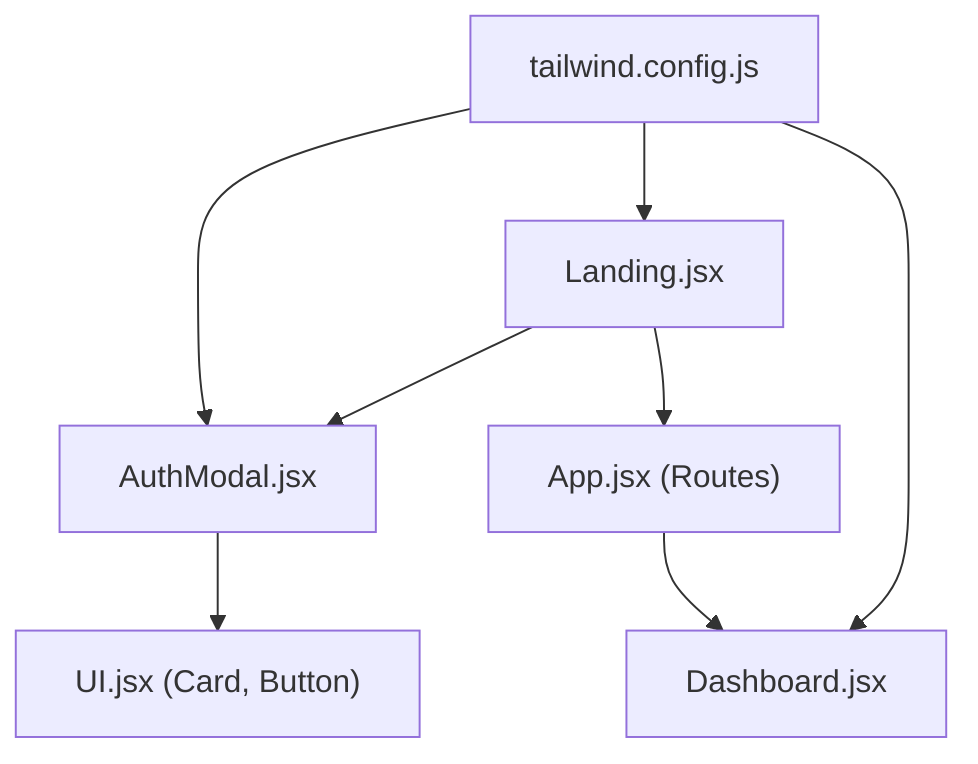
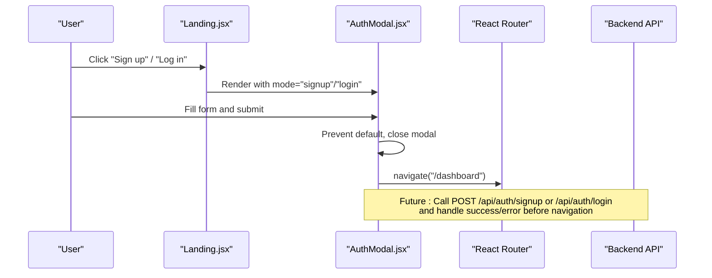
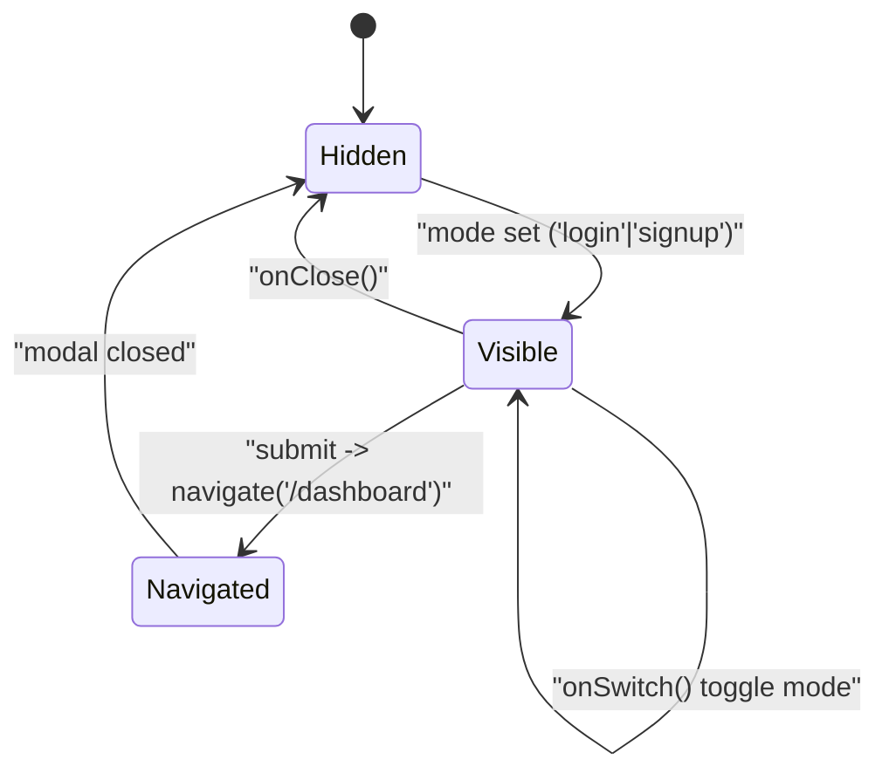
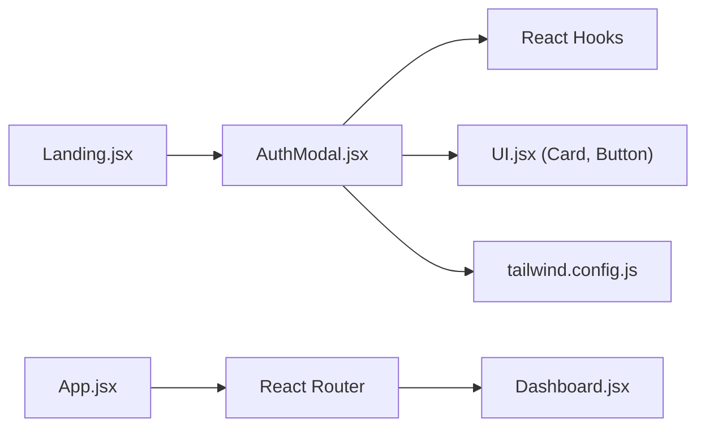

# AuthModal Component

<cite>
**Referenced Files in This Document**
- [AuthModal.jsx](file://scholarpath-frontend (2)/scholarpath/src/components/AuthModal.jsx)
- [UI.jsx](file://scholarpath-frontend (2)/scholarpath/src/components/UI.jsx)
- [Landing.jsx](file://scholarpath-frontend (2)/scholarpath/src/pages/Landing.jsx)
- [Dashboard.jsx](file://scholarpath-frontend (2)/scholarpath/src/pages/Dashboard.jsx)
- [App.jsx](file://scholarpath-frontend (2)/scholarpath/src/App.jsx)
- [tailwind.config.js](file://scholarpath-frontend (2)/scholarpath/tailwind.config.js)
- [index.js](file://aischolarpath-backend-main/aischolarpath-backend-main/index.js)
</cite>

## Table of Contents
1. [Introduction](#introduction)
2. [Project Structure](#project-structure)
3. [Core Components](#core-components)
4. [Architecture Overview](#architecture-overview)
5. [Detailed Component Analysis](#detailed-component-analysis)
6. [Dependency Analysis](#dependency-analysis)
7. [Performance Considerations](#performance-considerations)
8. [Troubleshooting Guide](#troubleshooting-guide)
9. [Conclusion](#conclusion)
10. [Appendices](#appendices)

## Introduction
This document provides comprehensive documentation for the AuthModal component that handles user authentication flows within the ScholarPath AI application. It covers login and registration form implementations, state management, event handling, styling with Tailwind CSS, responsive behavior, accessibility features, and integration points with the backend authentication API. It also includes usage examples for embedding the modal across pages, handling authentication state changes, and extending functionality such as social login providers.

## Project Structure
The AuthModal is a reusable React component used primarily on the Landing page to present login or signup forms in a modal overlay. The application uses React Router for navigation between the landing and dashboard views. Styling is implemented via Tailwind CSS with custom theme tokens defined in the configuration file.

**Diagram sources**
- [Landing.jsx:1-211](file://scholarpath-frontend (2)/scholarpath/src/pages/Landing.jsx#L1-L211)
- [AuthModal.jsx:1-84](file://scholarpath-frontend (2)/scholarpath/src/components/AuthModal.jsx#L1-L84)
- [UI.jsx:1-47](file://scholarpath-frontend (2)/scholarpath/src/components/UI.jsx#L1-L47)
- [App.jsx:1-15](file://scholarpath-frontend (2)/scholarpath/src/App.jsx#L1-L15)
- [Dashboard.jsx:1-187](file://scholarpath-frontend (2)/scholarpath/src/pages/Dashboard.jsx#L1-L187)
- [tailwind.config.js:1-31](file://scholarpath-frontend (2)/scholarpath/tailwind.config.js#L1-L31)

**Section sources**
- [Landing.jsx:1-211](file://scholarpath-frontend (2)/scholarpath/src/pages/Landing.jsx#L1-L211)
- [App.jsx:1-15](file://scholarpath-frontend (2)/scholarpath/src/App.jsx#L1-L15)
- [tailwind.config.js:1-31](file://scholarpath-frontend (2)/scholarpath/tailwind.config.js#L1-L31)

## Core Components
- AuthModal: Renders a modal overlay with login/signup forms, toggles password visibility, and navigates to the dashboard upon submission.
- UI primitives: Card and Button components provide consistent visual styling and interaction patterns.
- Pages: Landing orchestrates modal state; Dashboard represents authenticated content.

Key responsibilities:
- Manage local state for password visibility and mode switching between login and signup.
- Provide accessible controls (close button with aria-label).
- Use Tailwind utility classes for layout, spacing, colors, and focus states.
- Navigate to protected routes after successful submission.

**Section sources**
- [AuthModal.jsx:1-84](file://scholarpath-frontend (2)/scholarpath/src/components/AuthModal.jsx#L1-L84)
- [UI.jsx:1-47](file://scholarpath-frontend (2)/scholarpath/src/components/UI.jsx#L1-L47)
- [Landing.jsx:1-211](file://scholarpath-frontend (2)/scholarpath/src/pages/Landing.jsx#L1-L211)

## Architecture Overview
The AuthModal integrates into the application through the Landing page, which manages the modal’s open/close state and mode (login/signup). On form submission, the component currently performs a mock flow by closing the modal and navigating to the dashboard. In production, this would call backend endpoints for authentication and handle responses accordingly.

**Diagram sources**
- [Landing.jsx:32-41](file://scholarpath-frontend (2)/scholarpath/src/pages/Landing.jsx#L32-L41)
- [AuthModal.jsx:5-16](file://scholarpath-frontend (2)/scholarpath/src/components/AuthModal.jsx#L5-L16)
- [index.js:518-573](file://aischolarpath-backend-main/aischolarpath-backend-main/index.js#L518-L573)

## Detailed Component Analysis

### Props Interface
- mode: string — Determines whether the modal shows login or signup. Expected values include 'login' and 'signup'. When falsy, the modal does not render.
- onClose: function — Callback to close the modal and reset its state in the parent.
- onSwitch: function — Callback to toggle between login and signup modes.

Usage example in Landing:
- State variable authMode controls rendering and mode.
- onClose resets authMode to null.
- onSwitch toggles between 'login' and 'signup'.

**Section sources**
- [AuthModal.jsx:5-16](file://scholarpath-frontend (2)/scholarpath/src/components/AuthModal.jsx#L5-L16)
- [Landing.jsx:32-41](file://scholarpath-frontend (2)/scholarpath/src/pages/Landing.jsx#L32-L41)

### Form Implementation and Validation
- Fields:
  - Signup: Full name, Email, Password.
  - Login: Email, Password.
- Validation:
  - No explicit client-side validation is implemented in the current codebase.
  - Backend enforces required fields and returns error responses for invalid input.
- Submission:
  - Prevents default form behavior.
  - Currently mocks authentication by closing the modal and navigating to the dashboard.
  - Recommended enhancement: integrate with backend endpoints and handle errors.

Recommended backend integration:
- POST /api/auth/signup with body { full_name, email, password }
- POST /api/auth/login with body { email, password }
- Handle success by storing token and navigating to dashboard.
- Handle errors by displaying messages to the user.

**Section sources**
- [AuthModal.jsx:11-16](file://scholarpath-frontend (2)/scholarpath/src/components/AuthModal.jsx#L11-L16)
- [index.js:518-573](file://aischolarpath-backend-main/aischolarpath-backend-main/index.js#L518-L573)

### Error Handling
- Current implementation does not display errors from the backend because it uses a mock flow.
- To implement robust error handling:
  - Capture network errors and server error responses.
  - Display user-friendly messages near relevant fields or at the top of the form.
  - Disable submit button during requests to prevent duplicate submissions.

**Section sources**
- [AuthModal.jsx:11-16](file://scholarpath-frontend (2)/scholarpath/src/components/AuthModal.jsx#L11-L16)
- [index.js:518-573](file://aischolarpath-backend-main/aischolarpath-backend-main/index.js#L518-L573)

### State Management
- Local state: showPassword toggles password field visibility.
- Parent state: authMode in Landing controls modal visibility and mode.
- Navigation: useNavigate from React Router triggers route change to /dashboard.

State diagram:

**Diagram sources**
- [AuthModal.jsx:5-16](file://scholarpath-frontend (2)/scholarpath/src/components/AuthModal.jsx#L5-L16)
- [Landing.jsx:32-41](file://scholarpath-frontend (2)/scholarpath/src/pages/Landing.jsx#L32-L41)

**Section sources**
- [AuthModal.jsx:5-16](file://scholarpath-frontend (2)/scholarpath/src/components/AuthModal.jsx#L5-L16)
- [Landing.jsx:32-41](file://scholarpath-frontend (2)/scholarpath/src/pages/Landing.jsx#L32-L41)

### Event Handlers
- handleSubmit: Prevents default form submission, closes modal, and navigates to dashboard.
- Close button: Calls onClose to hide the modal.
- Switch link: Calls onSwitch to toggle between login and signup modes.
- Password visibility toggle: Updates local state to show/hide password.

**Section sources**
- [AuthModal.jsx:11-16](file://scholarpath-frontend (2)/scholarpath/src/components/AuthModal.jsx#L11-L16)
- [AuthModal.jsx:21-27](file://scholarpath-frontend (2)/scholarpath/src/components/AuthModal.jsx#L21-L27)
- [AuthModal.jsx:74-79](file://scholarpath-frontend (2)/scholarpath/src/components/AuthModal.jsx#L74-L79)
- [AuthModal.jsx:55-68](file://scholarpath-frontend (2)/scholarpath/src/components/AuthModal.jsx#L55-L68)

### Styling Approach with Tailwind CSS
- Layout: Fixed overlay with centered card using flexbox utilities.
- Colors: Custom tokens sp-blue, sp-navy, sp-slate, sp-border, sp-bg define brand palette.
- Focus states: Inputs have focus border and ring utilities for clear interactive feedback.
- Responsive behavior: Uses responsive prefixes (e.g., sm:) where applicable; modal adapts to screen sizes via width and padding utilities.
- Shadows and borders: Card component applies rounded corners, borders, and shadow tokens.

Tailwind configuration highlights:
- Extended color palette and font family.
- Custom shadows for cards.

**Section sources**
- [AuthModal.jsx:18-81](file://scholarpath-frontend (2)/scholarpath/src/components/AuthModal.jsx#L18-L81)
- [UI.jsx:1-24](file://scholarpath-frontend (2)/scholarpath/src/components/UI.jsx#L1-L24)
- [tailwind.config.js:1-31](file://scholarpath-frontend (2)/scholarpath/tailwind.config.js#L1-L31)

### Accessibility Features
- Close button includes an aria-label for screen readers.
- Labels are associated with inputs for proper semantics.
- Focus styles ensure keyboard users can see active elements.
- Modal overlay uses high contrast background to emphasize focus.

Recommendations:
- Add role="dialog" and aria-modal="true" to the modal container.
- Trap focus within the modal while open.
- Ensure keyboard escape closes the modal.

**Section sources**
- [AuthModal.jsx:21-27](file://scholarpath-frontend (2)/scholarpath/src/components/AuthModal.jsx#L21-L27)
- [AuthModal.jsx:34-73](file://scholarpath-frontend (2)/scholarpath/src/components/AuthModal.jsx#L34-L73)

### Integration with Backend Authentication API
Current state:
- Frontend uses a mock flow without calling backend endpoints.

Production integration plan:
- On submit, send POST requests to:
  - /api/auth/signup with { full_name, email, password }
  - /api/auth/login with { email, password }
- Handle responses:
  - Success: Store token (e.g., in secure storage), update app state, navigate to /dashboard.
  - Error: Show appropriate messages based on server response.

Backend endpoints reference:
- Signup: POST /api/auth/signup
- Login: POST /api/auth/login

**Section sources**
- [AuthModal.jsx:11-16](file://scholarpath-frontend (2)/scholarpath/src/components/AuthModal.jsx#L11-L16)
- [index.js:518-573](file://aischolarpath-backend-main/aischolarpath-backend-main/index.js#L518-L573)

## Dependency Analysis
The AuthModal depends on:
- React hooks: useState for local state, useNavigate for routing.
- UI components: Card and Button for consistent presentation.
- Tailwind CSS: Utility classes and theme tokens for styling.
- Parent component: Landing manages modal state and lifecycle.

**Diagram sources**
- [AuthModal.jsx:1-84](file://scholarpath-frontend (2)/scholarpath/src/components/AuthModal.jsx#L1-L84)
- [UI.jsx:1-47](file://scholarpath-frontend (2)/scholarpath/src/components/UI.jsx#L1-L47)
- [Landing.jsx:1-211](file://scholarpath-frontend (2)/scholarpath/src/pages/Landing.jsx#L1-L211)
- [App.jsx:1-15](file://scholarpath-frontend (2)/scholarpath/src/App.jsx#L1-L15)
- [Dashboard.jsx:1-187](file://scholarpath-frontend (2)/scholarpath/src/pages/Dashboard.jsx#L1-L187)
- [tailwind.config.js:1-31](file://scholarpath-frontend (2)/scholarpath/tailwind.config.js#L1-L31)

**Section sources**
- [AuthModal.jsx:1-84](file://scholarpath-frontend (2)/scholarpath/src/components/AuthModal.jsx#L1-L84)
- [Landing.jsx:1-211](file://scholarpath-frontend (2)/scholarpath/src/pages/Landing.jsx#L1-L211)
- [App.jsx:1-15](file://scholarpath-frontend (2)/scholarpath/src/App.jsx#L1-L15)

## Performance Considerations
- Minimal re-renders: Local state is limited to password visibility; modal renders conditionally based on mode prop.
- Lightweight UI: Uses simple form elements and Tailwind utilities without heavy libraries.
- Network calls: When integrating backend, debounce rapid submissions and disable buttons during requests to avoid redundant calls.

[No sources needed since this section provides general guidance]

## Troubleshooting Guide
Common issues and resolutions:
- Modal not appearing:
  - Ensure mode prop is set to 'login' or 'signup' in the parent component.
  - Verify parent state updates onClose and onSwitch correctly.
- Form submission does nothing:
  - Confirm handleSubmit prevents default and calls navigation.
  - Integrate backend calls if moving beyond mock flow.
- Styling inconsistencies:
  - Check Tailwind configuration for custom tokens and ensure PostCSS is configured.
- Accessibility problems:
  - Add dialog roles and focus trapping for improved keyboard navigation.

**Section sources**
- [AuthModal.jsx:5-16](file://scholarpath-frontend (2)/scholarpath/src/components/AuthModal.jsx#L5-L16)
- [Landing.jsx:32-41](file://scholarpath-frontend (2)/scholarpath/src/pages/Landing.jsx#L32-L41)
- [tailwind.config.js:1-31](file://scholarpath-frontend (2)/scholarpath/tailwind.config.js#L1-L31)

## Conclusion
The AuthModal component provides a clean, accessible, and responsive authentication interface integrated into the ScholarPath AI application. While currently using a mock authentication flow, it is structured to support future integration with backend APIs for secure login and registration. With enhancements to validation, error handling, and accessibility, it can serve as a robust foundation for user authentication experiences across embedded modals and full-screen views.

[No sources needed since this section summarizes without analyzing specific files]

## Appendices

### Usage Examples
- Embedded modal on Landing:
  - Manage authMode state and pass props to AuthModal.
  - Trigger modal via buttons in header and hero sections.
- Full-screen authentication view:
  - Render AuthModal as a standalone page by controlling visibility and disabling other content.
- Social login providers:
  - Extend the form with additional buttons for OAuth flows.
  - Implement handlers to initiate provider-specific authentication and handle callbacks.

**Section sources**
- [Landing.jsx:32-41](file://scholarpath-frontend (2)/scholarpath/src/pages/Landing.jsx#L32-L41)
- [AuthModal.jsx:18-81](file://scholarpath-frontend (2)/scholarpath/src/components/AuthModal.jsx#L18-L81)

### Backend API Reference
- POST /api/auth/signup
  - Body: { full_name, email, password }
  - Response: { success, user, token }
- POST /api/auth/login
  - Body: { email, password }
  - Response: { success, user, token }

**Section sources**
- [index.js:518-573](file://aischolarpath-backend-main/aischolarpath-backend-main/index.js#L518-L573)