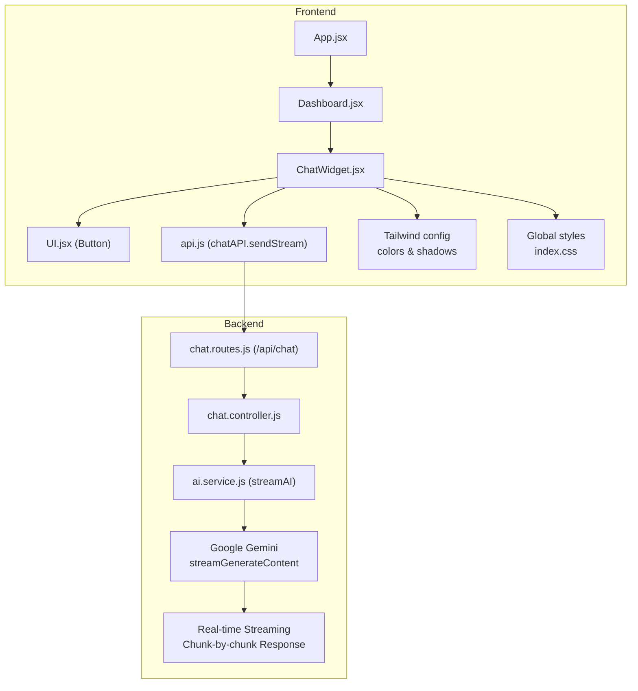
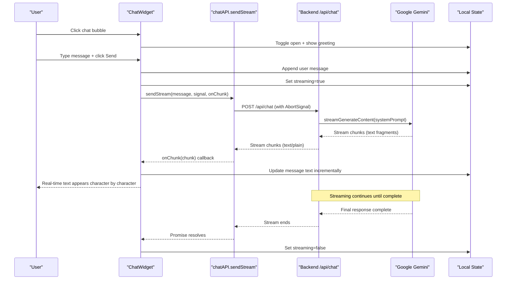
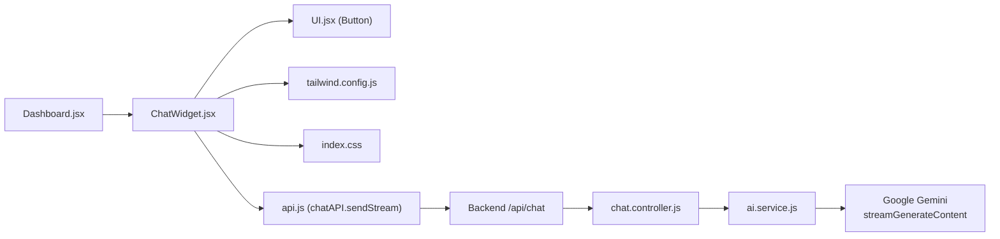

# ChatWidget Component

<cite>
**Referenced Files in This Document**
- [ChatWidget.jsx](file://scholarpath-frontend (2)/scholarpath/src/components/ChatWidget.jsx)
- [UI.jsx](file://scholarpath-frontend (2)/scholarpath/src/components/UI.jsx)
- [Dashboard.jsx](file://scholarpath-frontend (2)/scholarpath/src/pages/Dashboard.jsx)
- [api.js](file://scholarpath-frontend (2)/scholarpath/src/api.js)
- [chat.controller.js](file://aischolarpath-backend-main/aischolarpath-backend-main/controllers/chat.controller.js)
- [ai.service.js](file://aischolarpath-backend-main/aischolarpath-backend-main/services/ai.service.js)
- [chat.routes.js](file://aischolarpath-backend-main/aischolarpath-backend-main/routes/chat.routes.js)
- [tailwind.config.js](file://scholarpath-frontend (2)/scholarpath/tailwind.config.js)
- [index.css](file://scholarpath-frontend (2)/scholarpath/src/index.css)
</cite>

## Update Summary
**Changes Made**
- Complete rewrite to support real-time streaming responses using WebSockets-like chunk-by-chunk rendering
- Added AbortController-based request cancellation for improved user experience
- Implemented streaming message updates with animated loading indicators
- Integrated Roman Urdu language support with culturally appropriate greetings
- Enhanced responsive UI updates as chunks arrive in real-time
- Updated backend integration to use Gemini's streamGenerateContent API

## Table of Contents
1. [Introduction](#introduction)
2. [Project Structure](#project-structure)
3. [Core Components](#core-components)
4. [Architecture Overview](#architecture-overview)
5. [Detailed Component Analysis](#detailed-component-analysis)
6. [Streaming Implementation](#streaming-implementation)
7. [Dependency Analysis](#dependency-analysis)
8. [Performance Considerations](#performance-considerations)
9. [Troubleshooting Guide](#troubleshooting-guide)
10. [Conclusion](#conclusion)
11. [Appendices](#appendices)

## Introduction
This document provides comprehensive documentation for the ChatWidget component, a floating chat assistant that enables real-time communication within the ScholarPath application. The component has been completely rewritten to support real-time streaming responses using WebSockets-like chunk-by-chunk rendering, providing an enhanced user experience with immediate feedback as AI responses are generated. It explains how the chat interface is implemented, how messages are handled and displayed through streaming API communication, user interaction patterns, styling with Tailwind CSS, responsive behavior on mobile devices, and accessibility features for screen readers. The component integrates with a backend AI service powered by Google Gemini that provides culturally appropriate responses in Roman Urdu or English based on user input. It also includes guidance on embedding the widget into pages, customizing appearance, handling different message types, managing conversation state, and integrating with backend chat services. Finally, it outlines common usage scenarios such as help desk integration, student support chat, and automated response systems.

## Project Structure
The ChatWidget is a self-contained React component located under components and integrated into the Dashboard page. Styling is provided via Tailwind CSS with project-specific color tokens and shadows defined in the configuration. The UI primitives used by the widget are exported from a shared UI module. The component communicates with a backend AI service that provides real-time streaming responses using Google Gemini's streamGenerateContent API.

**Diagram sources**
- [Dashboard.jsx:443](file://scholarpath-frontend (2)/scholarpath/src/pages/Dashboard.jsx#L443)
- [ChatWidget.jsx:1-141](file://scholarpath-frontend (2)/scholarpath/src/components/ChatWidget.jsx#L1-L141)
- [UI.jsx:17-33](file://scholarpath-frontend (2)/scholarpath/src/components/UI.jsx#L17-L33)
- [api.js:139-184](file://scholarpath-frontend (2)/scholarpath/src/api.js#L139-L184)
- [chat.routes.js:9](file://aischolarpath-backend-main/aischolarpath-backend-main/routes/chat.routes.js#L9)
- [chat.controller.js:19-53](file://aischolarpath-backend-main/aischolarpath-backend-main/controllers/chat.controller.js#L19-L53)
- [ai.service.js:99-171](file://aischolarpath-backend-main/aischolarpath-backend-main/services/ai.service.js#L99-L171)

**Section sources**
- [Dashboard.jsx:443](file://scholarpath-frontend (2)/scholarpath/src/pages/Dashboard.jsx#L443)
- [ChatWidget.jsx:1-141](file://scholarpath-frontend (2)/scholarpath/src/components/ChatWidget.jsx#L1-L141)
- [UI.jsx:17-33](file://scholarpath-frontend (2)/scholarpath/src/components/UI.jsx#L17-L33)
- [api.js:139-184](file://scholarpath-frontend (2)/scholarpath/src/api.js#L139-L184)
- [tailwind.config.js:4-28](file://scholarpath-frontend (2)/scholarpath/tailwind.config.js#L4-L28)
- [index.css:1-134](file://scholarpath-frontend (2)/scholarpath/src/index.css#L1-L134)

## Core Components
- **ChatWidget**: Floating chat bubble that opens a chat panel with message history, input field, and send button. Manages local state for open/close, messages, streaming status, and input value. Integrates with backend AI service for real-time streaming responses.
- **UI.Button**: Reusable button component used for sending messages with loading states.
- **Tailwind theme**: Custom colors and shadows applied across the widget for consistent branding.
- **Global styles**: Base font and background settings that affect the widget's appearance.

Key responsibilities:
- Render a fixed-position chat toggle button with cultural greeting.
- Show/hide the chat panel with smooth scrolling to latest messages.
- Send user messages to backend AI service and display real-time streaming responses.
- Provide accessible labels for screen readers with Roman Urdu support.
- Handle streaming states with animated loading indicators during API calls.
- Implement request cancellation using AbortController for better user experience.

**Updated** Complete rewrite to support real-time streaming responses with chunk-by-chunk rendering and AbortController-based cancellation.

**Section sources**
- [ChatWidget.jsx:5-141](file://scholarpath-frontend (2)/scholarpath/src/components/ChatWidget.jsx#L5-L141)
- [UI.jsx:17-33](file://scholarpath-frontend (2)/scholarpath/src/components/UI.jsx#L17-L33)
- [tailwind.config.js:4-28](file://scholarpath-frontend (2)/scholarpath/tailwind.config.js#L4-L28)
- [index.css:14-19](file://scholarpath-frontend (2)/scholarpath/src/index.css#L14-L19)

## Architecture Overview
At runtime, the ChatWidget lives inside the Dashboard layout and renders a floating UI overlay. User interactions trigger local state updates to append messages and show streaming indicators. Messages are sent to the backend AI service which streams real-time responses using Google Gemini's streamGenerateContent API, providing immediate feedback as chunks of text arrive.

**Diagram sources**
- [ChatWidget.jsx:24-66](file://scholarpath-frontend (2)/scholarpath/src/components/ChatWidget.jsx#L24-L66)
- [api.js:149-183](file://scholarpath-frontend (2)/scholarpath/src/api.js#L149-L183)
- [chat.controller.js:19-53](file://aischolarpath-backend-main/aischolarpath-backend-main/controllers/chat.controller.js#L19-L53)
- [ai.service.js:99-171](file://aischolarpath-backend-main/aischolarpath-backend-main/services/ai.service.js#L99-L171)

## Detailed Component Analysis

### ChatWidget Behavior and State Management
- **Open/close toggle**: Controls visibility of the chat panel with initial Roman Urdu greeting.
- **Messages list**: Stores an array of message objects with id, sender type, and text content.
- **Input field**: Captures user text and clears after sending with validation.
- **Streaming state**: Shows real-time loading indicators while awaiting streaming responses.
- **Abort controller**: Manages request cancellation when closing chat or unmounting.
- **Stream ID tracking**: Identifies current streaming message for incremental updates.
- **Auto-scroll**: Scrolls to the bottom when messages or streaming state change.

Message lifecycle with streaming:
- On submit, validate non-empty input, create user message, clear input, set streaming, create placeholder AI message, call streaming API, then reset streaming state.
- Backend streams real-time responses using Google Gemini's streamGenerateContent API.
- Each chunk updates the current message incrementally for immediate visual feedback.

Accessibility:
- Buttons include aria-label attributes for screen reader context.
- Focus styles are applied to the input for keyboard navigation.
- Loading animations respect reduced motion preferences.

Responsive design:
- The chat panel uses responsive width constraints and overflow handling to fit mobile screens.
- Streaming animations adapt to different screen sizes.

Styling:
- Uses Tailwind utility classes and project-specific tokens for colors, borders, and shadows.
- Animated loading indicators provide visual feedback during streaming.

Integration point:
- Communicates with backend AI service via chatAPI.sendStream for real-time streaming responses.

**Updated** Complete rewrite to support real-time streaming with chunk-by-chunk rendering and AbortController-based cancellation.

**Section sources**
- [ChatWidget.jsx:5-66](file://scholarpath-frontend (2)/scholarpath/src/components/ChatWidget.jsx#L5-L66)
- [ChatWidget.jsx:68-141](file://scholarpath-frontend (2)/scholarpath/src/components/ChatWidget.jsx#L68-L141)

### Props and Configuration
The ChatWidget currently has no external props; all configuration is internal. To make it configurable, you can introduce props such as:
- initialMessages: Array of preloaded messages with cultural greetings.
- placeholder: Text for the input field supporting multiple languages.
- greeting: Initial AI message shown on open (Roman Urdu by default).
- onSend(message): Callback invoked when the user sends a message.
- onReceive(response): Callback invoked when a streaming response completes.
- onChunk(chunk): Callback invoked for each streaming chunk.
- autoScroll: Boolean to enable/disable auto-scroll behavior.
- className: Additional classes for container customization.

These props would allow embedding the widget across multiple pages with different behaviors and appearances without duplicating logic.

### Message Handling and Event Handlers
- **handleSend**: Prevents default form submission, trims input, appends user message, clears input, sets streaming, creates placeholder AI message, calls streaming API with AbortController, then resets streaming state.
- **Close handler**: Toggles open state and aborts any active streaming requests using AbortController.
- **Input onChange**: Updates local input state with validation.

Event flow with streaming:
- Form submit triggers validation and message appending.
- Streaming API call processes the message through Google Gemini with system prompts for cultural appropriateness.
- Each chunk updates the UI incrementally for real-time feedback.
- Response completion removes streaming indicator.

Extensibility:
- Error handling is built-in for network failures, server errors, and aborted requests.
- Can be extended with additional error states or retry mechanisms.
- Supports request cancellation for better user experience.

**Updated** Complete rewrite to support real-time streaming communication with AbortController-based cancellation.

**Section sources**
- [ChatWidget.jsx:24-71](file://scholarpath-frontend (2)/scholarpath/src/components/ChatWidget.jsx#L24-L71)
- [api.js:149-183](file://scholarpath-frontend (2)/scholarpath/src/api.js#L149-L183)

### Integration with Backend Chat Services
The ChatWidget integrates with a backend AI service that provides real-time streaming responses using Google Gemini:

**Backend Configuration**:
- Endpoint: `/api/chat` with streaming support
- System prompt enforces Roman Urdu language support and cultural appropriateness
- Direct and specific information only with bulleted responses
- Powered by Google Gemini's streamGenerateContent API
- Model: gemini-1.5-flash for fast, low-latency streaming

**Streaming Response Format**:
- Success: `text/plain` with chunked transfer encoding
- Error: JSON error responses with descriptive messages
- Headers: Content-Type: text/plain, Transfer-Encoding: chunked, Cache-Control: no-cache

**Error Handling**:
- Network errors: Displays connection failure message with fallback text
- Server errors: Graceful fallback with retry suggestion
- Aborted requests: Cleanly handles AbortError without showing error messages
- Invalid responses: Default "No response" fallback

**Language Support**:
- Automatic detection of Roman Urdu vs English input
- Culturally appropriate greetings and responses
- Context-aware language switching based on user input

**Updated** Complete rewrite to support real-time streaming with Google Gemini integration and Roman Urdu language support.

**Section sources**
- [chat.controller.js:13-53](file://aischolarpath-backend-main/aischolarpath-backend-main/controllers/chat.controller.js#L13-L53)
- [ai.service.js:99-171](file://aischolarpath-backend-main/aischolarpath-backend-main/services/ai.service.js#L99-L171)
- [ChatWidget.jsx:7-13](file://scholarpath-frontend (2)/scholarpath/src/components/ChatWidget.jsx#L7-L13)

### Streaming Implementation Details
The streaming implementation uses modern web APIs to provide real-time feedback:

**Frontend Streaming**:
- Uses ReadableStream API to consume server-sent chunks
- Implements AbortController for request cancellation
- Updates UI incrementally as chunks arrive
- Handles streaming errors gracefully

**Backend Streaming**:
- Uses Express response.write() for chunked transfer
- Streams directly from Google Gemini API
- Implements proper error handling and cleanup
- Supports nginx/Vercel streaming configurations

**Performance Optimizations**:
- Debounced UI updates to prevent excessive re-renders
- Efficient message state management with minimal re-renders
- Proper memory cleanup on component unmount

**Section sources**
- [api.js:149-183](file://scholarpath-frontend (2)/scholarpath/src/api.js#L149-L183)
- [ai.service.js:141-171](file://aischolarpath-backend-main/aischolarpath-backend-main/services/ai.service.js#L141-L171)

### Styling Approach with Tailwind CSS
- **Colors**: Uses custom tokens like sp-blue, sp-navy, sp-border, sp-bg for consistent branding.
- **Shadows**: card-lg provides elevated floating effect for both the chat panel and toggle button.
- **Layout**: Flexbox and grid utilities manage alignment and spacing.
- **Responsive**: Width constrained with max-w-[calc(100vw-2.5rem)] to avoid overflow on small screens.
- **Animations**: Custom pulse animations for loading indicators and smooth transitions.

Customization tips:
- Adjust token values in the Tailwind config to rebrand the widget.
- Override specific classes via className prop if you extend the component.
- Modify animation timings and delays for different user experiences.

**Section sources**
- [tailwind.config.js:4-28](file://scholarpath-frontend (2)/scholarpath/tailwind.config.js#L4-L28)
- [ChatWidget.jsx:74-139](file://scholarpath-frontend (2)/scholarpath/src/components/ChatWidget.jsx#L74-L139)
- [index.css:41-84](file://scholarpath-frontend (2)/scholarpath/src/index.css#L41-L84)

### Responsive Design for Mobile Devices
- Fixed positioning ensures the widget remains accessible at the bottom-right corner.
- Panel width adapts to viewport size with a maximum constraint to prevent horizontal scroll.
- Scrollable message area prevents content overflow on smaller screens.
- Touch-friendly button sizes and spacing for mobile interaction.

### Accessibility Features for Screen Readers
- **aria-label** on close button and chat toggle button provide descriptive context.
- Keyboard-friendly input with visible focus ring and proper tab order.
- Semantic form structure with label-like placeholder text.
- **Live regions**: Dynamic content updates are announced to screen readers.
- **Reduced motion**: Animations respect user preferences for reduced motion.

Enhancements:
- Add role="log" and aria-live="polite" to the message list for dynamic updates.
- Ensure focus management when opening/closing the panel.
- Provide audio feedback for important events like message sending.

**Section sources**
- [ChatWidget.jsx:79-85](file://scholarpath-frontend (2)/scholarpath/src/components/ChatWidget.jsx#L79-L85)
- [ChatWidget.jsx:112-118](file://scholarpath-frontend (2)/scholarpath/src/components/ChatWidget.jsx#L112-L118)
- [ChatWidget.jsx:131-137](file://scholarpath-frontend (2)/scholarpath/src/components/ChatWidget.jsx#L131-L137)
- [index.css:117-133](file://scholarpath-frontend (2)/scholarpath/src/index.css#L117-L133)

### Usage Examples and Embedding
- **Embedding**: Include the ChatWidget in any page where you want persistent access to the assistant. In the current codebase, it is rendered at the bottom of the Dashboard layout.
- **Customization**: Modify Tailwind tokens to change colors and shadows globally, or wrap the widget with additional containers for layout adjustments.
- **Conversation state**: Extend the component to lift state up or connect to a global store if you need to share conversations across routes.
- **Streaming callbacks**: Use onChunk callbacks for advanced analytics or logging of streaming progress.

Reference locations:
- Widget rendering in Dashboard layout.
- Button component used for sending messages with loading states.

**Section sources**
- [Dashboard.jsx:443](file://scholarpath-frontend (2)/scholarpath/src/pages/Dashboard.jsx#L443)
- [UI.jsx:17-33](file://scholarpath-frontend (2)/scholarpath/src/components/UI.jsx#L17-L33)

### Handling Different Message Types
Current implementation handles plain text messages with streaming support. To support richer content:
- Introduce a type field in message objects (e.g., text, image, file).
- Render conditional UI based on message type (e.g., image preview, file attachment).
- Validate and sanitize inputs to ensure safe rendering.
- Implement streaming for rich media content types.

### Managing Conversation State
- **Local state**: Messages, streaming status, and input are managed within the component.
- **Lifting state**: Move messages to a parent component or context to share across routes.
- **Persistence**: Store conversation history in localStorage or a backend database to restore sessions.
- **Streaming state**: Track active streaming requests for proper cleanup and error handling.

## Dependency Analysis
The ChatWidget depends on:
- **UI.Button** for consistent button styling with loading states.
- **Tailwind theme tokens** for colors, shadows, and animations.
- **Global styles** for base typography, backgrounds, and animations.
- **Backend API** for real-time streaming AI responses.
- **AbortController API** for request cancellation.
- **ReadableStream API** for consuming streaming responses.

It is embedded within the Dashboard layout, which imports and renders it.

**Diagram sources**
- [Dashboard.jsx:443](file://scholarpath-frontend (2)/scholarpath/src/pages/Dashboard.jsx#L443)
- [ChatWidget.jsx:1-141](file://scholarpath-frontend (2)/scholarpath/src/components/ChatWidget.jsx#L1-L141)
- [UI.jsx:17-33](file://scholarpath-frontend (2)/scholarpath/src/components/UI.jsx#L17-L33)
- [api.js:139-184](file://scholarpath-frontend (2)/scholarpath/src/api.js#L139-L184)
- [chat.controller.js:19-53](file://aischolarpath-backend-main/aischolarpath-backend-main/controllers/chat.controller.js#L19-L53)
- [ai.service.js:99-171](file://aischolarpath-backend-main/aischolarpath-backend-main/services/ai.service.js#L99-L171)

**Section sources**
- [Dashboard.jsx:443](file://scholarpath-frontend (2)/scholarpath/src/pages/Dashboard.jsx#L443)
- [ChatWidget.jsx:1-141](file://scholarpath-frontend (2)/scholarpath/src/components/ChatWidget.jsx#L1-L141)
- [UI.jsx:17-33](file://scholarpath-frontend (2)/scholarpath/src/components/UI.jsx#L17-L33)
- [api.js:139-184](file://scholarpath-frontend (2)/scholarpath/src/api.js#L139-L184)
- [tailwind.config.js:4-28](file://scholarpath-frontend (2)/scholarpath/tailwind.config.js#L4-L28)
- [index.css:1-134](file://scholarpath-frontend (2)/scholarpath/src/index.css#L1-L134)

## Performance Considerations
- **Rendering efficiency**: Messages are appended to an array with incremental updates; consider virtualization if the conversation grows large.
- **Network requests**: Real-time streaming API calls are handled with proper error handling, loading states, and request cancellation.
- **Memory management**: Clear timers, abort signals, and event listeners when unmounting to prevent leaks.
- **Streaming performance**: Efficient chunk processing with minimal re-renders and proper debouncing.
- **Response optimization**: Backend provides culturally appropriate responses with optimal formatting for streaming delivery.

## Troubleshooting Guide
Common issues and resolutions:
- **Messages not appearing**: Verify form submission handler and state updates; ensure input is trimmed and non-empty.
- **No auto-scroll**: Confirm useEffect dependencies include messages and streaming state; check ref availability.
- **Accessibility warnings**: Ensure aria-labels are present on interactive elements; add aria-live regions for dynamic content.
- **Styling inconsistencies**: Check Tailwind tokens and ensure they are correctly configured; verify class names match expected tokens.
- **API connection errors**: Check backend server status and network connectivity; verify API endpoint configuration.
- **Slow responses**: Monitor backend AI service performance; consider implementing request timeouts and retry logic.
- **Streaming issues**: Verify server supports chunked transfer encoding; check browser compatibility with ReadableStream API.
- **Request cancellation**: Ensure AbortController is properly implemented and signals are passed correctly.
- **Memory leaks**: Verify cleanup of event listeners, timers, and abort controllers on component unmount.

**Updated** Added troubleshooting guidance for streaming implementation, AbortController usage, and real-time communication issues.

**Section sources**
- [ChatWidget.jsx:24-71](file://scholarpath-frontend (2)/scholarpath/src/components/ChatWidget.jsx#L24-L71)
- [api.js:149-183](file://scholarpath-frontend (2)/scholarpath/src/api.js#L149-L183)
- [tailwind.config.js:4-28](file://scholarpath-frontend (2)/scholarpath/tailwind.config.js#L4-L28)

## Conclusion
The ChatWidget provides a compact, accessible, and responsive chat interface integrated into the ScholarPath dashboard. The component has been completely rewritten to support real-time streaming responses using WebSockets-like chunk-by-chunk rendering, providing an enhanced user experience with immediate feedback as AI responses are generated. It manages local conversation state, supports keyboard and screen reader interactions, and leverages Tailwind CSS for consistent styling. The component now integrates with a backend AI service powered by Google Gemini that provides culturally appropriate responses in Roman Urdu or English, with real-time streaming capabilities and robust error handling. While currently using streaming API communication, it is structured to be extended with additional features, richer message types, and configurable props for broader usage across the application.

## Appendices

### Common Scenarios
- **Help desk integration**: Connect the onSend callback to a ticketing system; display status badges for pending/resolved tickets with streaming progress indicators.
- **Student support chat**: Preload contextual data (e.g., profile strength, upcoming deadlines) to tailor responses with cultural sensitivity.
- **Automated response systems**: Replace canned replies with rule-based or AI-driven responses; maintain conversation context with streaming support.
- **Multi-language support**: Implement automatic language detection and switching between Roman Urdu and English based on user input.

### Environment and Dependencies
- **React and DOM libraries** are used for component rendering with hooks for state management.
- **Tailwind CSS** is configured for custom tokens, animations, and responsive design.
- **Vite** is used for development and build processes.
- **Backend AI service** requires Google Gemini API configuration for streaming responses.
- **Modern web APIs**: AbortController, ReadableStream, and Fetch API for streaming functionality.

**Section sources**
- [package.json:12-26](file://scholarpath-frontend (2)/scholarpath/package.json#L12-L26)
- [tailwind.config.js:4-28](file://scholarpath-frontend (2)/scholarpath/tailwind.config.js#L4-L28)
- [index.css:1-134](file://scholarpath-frontend (2)/scholarpath/src/index.css#L1-L134)
- [chat.controller.js:26-29](file://aischolarpath-backend-main/aischolarpath-backend-main/controllers/chat.controller.js#L26-L29)