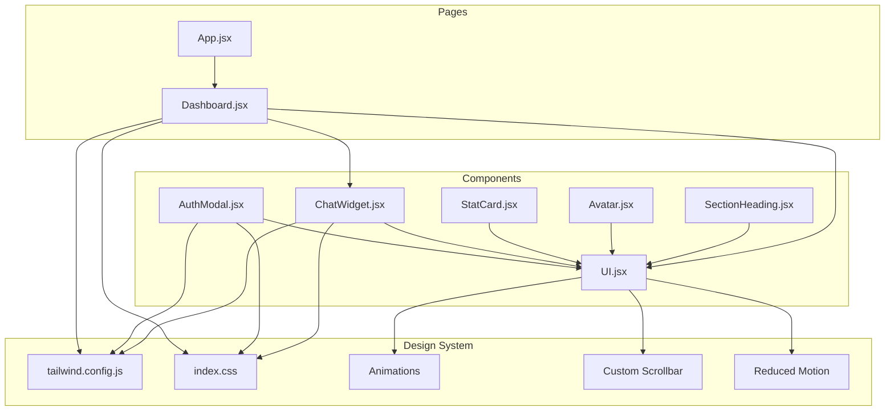
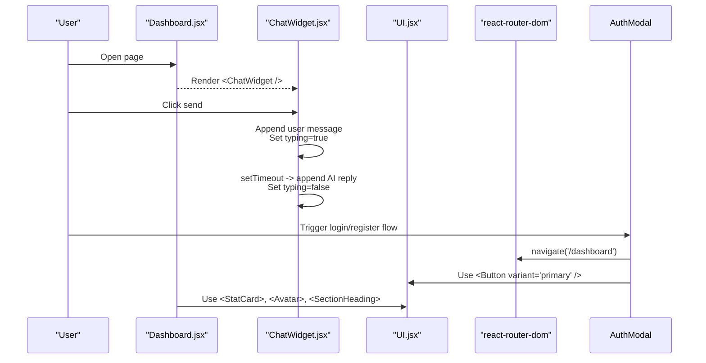
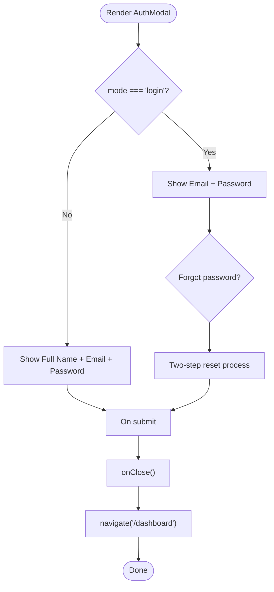
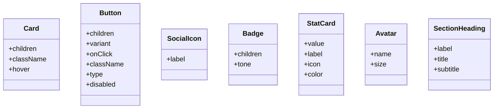
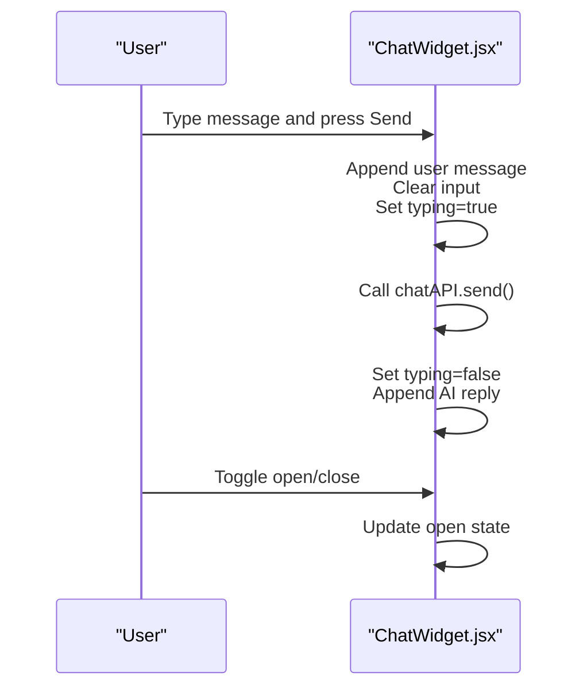
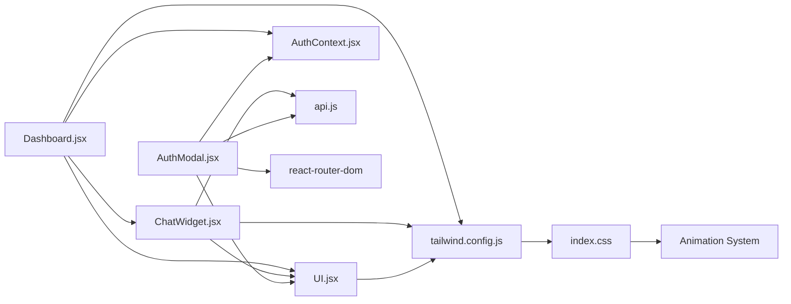

# UI Components Library

<cite>
**Referenced Files in This Document**
- [AuthModal.jsx](file://scholarpath-frontend (2)/scholarpath/src/components/AuthModal.jsx)
- [UI.jsx](file://scholarpath-frontend (2)/scholarpath/src/components/UI.jsx)
- [ChatWidget.jsx](file://scholarpath-frontend (2)/scholarpath/src/components/ChatWidget.jsx)
- [tailwind.config.js](file://scholarpath-frontend (2)/scholarpath/tailwind.config.js)
- [index.css](file://scholarpath-frontend (2)/scholarpath/src/index.css)
- [Dashboard.jsx](file://scholarpath-frontend (2)/scholarpath/src/pages/Dashboard.jsx)
- [App.jsx](file://scholarpath-frontend (2)/scholarpath/src/App.jsx)
- [package.json](file://scholarpath-frontend (2)/scholarpath/package.json)
</cite>

## Update Summary
**Changes Made**
- Added comprehensive documentation for new StatCard component with animated statistics display
- Documented new Avatar component for circular user profile displays with initials
- Added SectionHeading component for professional section titles with label, title, and subtitle support
- Enhanced Card component with hover lift effect and conditional styling
- Improved Button component with disabled state handling and enhanced accessibility
- Documented comprehensive CSS animation system with six distinct keyframe animations
- Added custom scrollbar styling and reduced motion support
- Updated design system with extended color palette and shadow utilities

## Table of Contents
1. [Introduction](#introduction)
2. [Project Structure](#project-structure)
3. [Core Components](#core-components)
4. [Architecture Overview](#architecture-overview)
5. [Detailed Component Analysis](#detailed-component-analysis)
6. [Animation System](#animation-system)
7. [Design System](#design-system)
8. [Dependency Analysis](#dependency-analysis)
9. [Performance Considerations](#performance-considerations)
10. [Troubleshooting Guide](#troubleshooting-guide)
11. [Conclusion](#conclusion)
12. [Appendices](#appendices)

## Introduction
This document describes the reusable UI components library built with Tailwind CSS for the ScholarPath application. It focuses on:
- AuthModal: a modal for login and registration flows, including form fields and navigation integration.
- UI.jsx utility components: shared building blocks such as Card, Button, SocialIcon, Badge, StatCard, Avatar, and SectionHeading that enforce consistent styling and layout patterns.
- ChatWidget: a floating chat assistant for real-time communication with AI responses.

The library includes a comprehensive animation system with smooth transitions, hover effects, and accessibility features including reduced motion support.

It also covers props interfaces, event handling, styling customization, accessibility, responsive behavior, design system principles, color schemes, typography standards, and composition patterns used across the app.

## Project Structure
The components live under src/components and are consumed by pages like Dashboard. The design system is configured via Tailwind and global styles with extensive animation support.

**Diagram sources**
- [AuthModal.jsx:1-284](file://scholarpath-frontend (2)/scholarpath/src/components/AuthModal.jsx#L1-L284)
- [UI.jsx:1-106](file://scholarpath-frontend (2)/scholarpath/src/components/UI.jsx#L1-L106)
- [ChatWidget.jsx:1-101](file://scholarpath-frontend (2)/scholarpath/src/components/ChatWidget.jsx#L1-L101)
- [Dashboard.jsx:1-444](file://scholarpath-frontend (2)/scholarpath/src/pages/Dashboard.jsx#L1-L444)
- [App.jsx:1-23](file://scholarpath-frontend (2)/scholarpath/src/App.jsx#L1-L23)
- [tailwind.config.js:1-31](file://scholarpath-frontend (2)/scholarpath/tailwind.config.js#L1-L31)
- [index.css:1-134](file://scholarpath-frontend (2)/scholarpath/src/index.css#L1-L134)

**Section sources**
- [App.jsx:1-23](file://scholarpath-frontend (2)/scholarpath/src/App.jsx#L1-L23)
- [Dashboard.jsx:1-444](file://scholarpath-frontend (2)/scholarpath/src/pages/Dashboard.jsx#L1-L444)
- [tailwind.config.js:1-31](file://scholarpath-frontend (2)/scholarpath/tailwind.config.js#L1-L31)
- [index.css:1-134](file://scholarpath-frontend (2)/scholarpath/src/index.css#L1-L134)

## Core Components
- **AuthModal**: Modal for authentication flows with mode-driven rendering for login or registration, password visibility toggle, forgot password functionality, and navigation to dashboard after submission.
- **UI.jsx utilities**:
  - **Card**: container with consistent border, rounded corners, shadow, and optional hover lift effect.
  - **Button**: primary/secondary/ghost variants with consistent sizing, transitions, and disabled state handling.
  - **SocialIcon**: circular icon placeholder with hover states.
  - **Badge**: small status indicators with multiple tones including blue, green, amber, gray, and red.
  - **StatCard**: animated card component for statistics with icon support and color variants.
  - **Avatar**: circular avatar component with initials display and configurable size.
  - **SectionHeading**: professional heading component with label, title, and subtitle support.
- **ChatWidget**: Floating chat interface with message list, typing indicator, and input form.

Key behaviors:
- Consistent use of Tailwind tokens from tailwind.config.js for colors, shadows, and fonts.
- Accessibility attributes for interactive elements (aria-label).
- Responsive layouts using Tailwind's grid and spacing utilities.
- Comprehensive animation system with staggered delays and reduced motion support.

**Section sources**
- [AuthModal.jsx:1-284](file://scholarpath-frontend (2)/scholarpath/src/components/AuthModal.jsx#L1-L284)
- [UI.jsx:1-106](file://scholarpath-frontend (2)/scholarpath/src/components/UI.jsx#L1-L106)
- [ChatWidget.jsx:1-101](file://scholarpath-frontend (2)/scholarpath/src/components/ChatWidget.jsx#L1-L101)
- [tailwind.config.js:1-31](file://scholarpath-frontend (2)/scholarpath/tailwind.config.js#L1-L31)
- [index.css:1-134](file://scholarpath-frontend (2)/scholarpath/src/index.css#L1-L134)

## Architecture Overview
The components follow a simple, composable architecture:
- UI.jsx provides atomic primitives reused across the app.
- AuthModal composes UI primitives to present forms and actions.
- ChatWidget composes UI.Button and Tailwind classes to create a floating chat experience.
- Pages (e.g., Dashboard) compose these components into full screens with enhanced visual feedback.

**Diagram sources**
- [Dashboard.jsx:176-181](file://scholarpath-frontend (2)/scholarpath/src/pages/Dashboard.jsx#L176-L181)
- [ChatWidget.jsx:28-35](file://scholarpath-frontend (2)/scholarpath/src/components/ChatWidget.jsx#L28-L35)
- [AuthModal.jsx:37-51](file://scholarpath-frontend (2)/scholarpath/src/components/AuthModal.jsx#L37-L51)
- [UI.jsx:20-36](file://scholarpath-frontend (2)/scholarpath/src/components/UI.jsx#L20-L36)

## Detailed Component Analysis

### AuthModal
Purpose:
- Presents login or registration forms based on mode prop.
- Provides password visibility toggle.
- Includes forgot password functionality with token-based reset.
- Navigates to dashboard upon submission.

Props:
- mode: string — 'login' or 'registration'. Controls which fields and copy are shown.
- onClose: function — closes the modal.
- onSwitch: function — toggles between login and registration modes.

Event handlers:
- handleSubmit: prevents default form submission, validates inputs, handles authentication, closes modal, and navigates to /dashboard.
- handleForgotPassword: manages two-step password reset process.
- handleResetPassword: completes password reset with validation.

Styling and customization:
- Uses Card and Button from UI.jsx for consistent look.
- Tailwind classes provide focus rings, borders, and spacing.
- Overlay uses fixed positioning with backdrop opacity.
- Error and success messages with appropriate color coding.

Accessibility:
- Close button includes aria-label.
- Inputs have labels and placeholders for context.
- Loading states with appropriate text updates.

Responsive behavior:
- Modal card is constrained with max-width and centered on all screen sizes.

Integration pattern:
- Composed inside pages or modals; relies on react-router-dom for navigation.

**Diagram sources**
- [AuthModal.jsx:25-26](file://scholarpath-frontend (2)/scholarpath/src/components/AuthModal.jsx#L25-L26)
- [AuthModal.jsx:28-52](file://scholarpath-frontend (2)/scholarpath/src/components/AuthModal.jsx#L28-L52)
- [AuthModal.jsx:54-104](file://scholarpath-frontend (2)/scholarpath/src/components/AuthModal.jsx#L54-L104)

**Section sources**
- [AuthModal.jsx:1-284](file://scholarpath-frontend (2)/scholarpath/src/components/AuthModal.jsx#L1-L284)

### UI.jsx Utilities
Purpose:
- Provide consistent visual primitives for cards, buttons, badges, social icons, stat cards, avatars, and section headings.

Components:
- **Card**
  - Props: children, className, hover (boolean)
  - Styling: white background, border, rounded corners, custom shadow, optional hover lift effect
- **Button**
  - Props: children, variant ('primary' | 'secondary' | 'ghost'), onClick, className, type, disabled (boolean)
  - Styling: font-semibold, text-sm, padding, rounded-lg, transition-all duration-150, variant-specific colors, disabled state handling
- **SocialIcon**
  - Props: label
  - Styling: circular container, border, hover state with color transitions
- **Badge**
  - Props: children, tone ('blue' | 'green' | 'amber' | 'gray' | 'red')
  - Styling: inline-block, rounded-full, tone-based colors
- **StatCard**
  - Props: value, label, icon, color ('blue' | 'green' | 'amber' | 'red')
  - Styling: Card wrapper with hover effect, flex layout, color-coded values
- **Avatar**
  - Props: name, size (number, default 32)
  - Styling: rounded-full, bg-sp-blue-light, dynamic sizing with proportional font size
- **SectionHeading**
  - Props: label, title, subtitle
  - Styling: text-center layout, uppercase tracking-widest label, bold title, muted subtitle

Usage examples:
- Buttons in forms and headers with loading states.
- Cards to group content sections with hover interactions.
- Badges to highlight match percentages or statuses.
- StatCards for dashboard metrics and analytics.
- Avatars for user profiles and team members.
- SectionHeadings for page sections and content organization.

Accessibility:
- Buttons expose type and click handlers with proper ARIA attributes.
- Colors and contrast follow design tokens.
- Interactive elements include appropriate focus states.

Composition:
- Used extensively in Dashboard and AuthModal to maintain consistency.
- StatCards and Avatars enhance the dashboard overview experience.

**Diagram sources**
- [UI.jsx:12-18](file://scholarpath-frontend (2)/scholarpath/src/components/UI.jsx#L12-L18)
- [UI.jsx:20-36](file://scholarpath-frontend (2)/scholarpath/src/components/UI.jsx#L20-L36)
- [UI.jsx:38-44](file://scholarpath-frontend (2)/scholarpath/src/components/UI.jsx#L38-L44)
- [UI.jsx:46-59](file://scholarpath-frontend (2)/scholarpath/src/components/UI.jsx#L46-L59)
- [UI.jsx:61-77](file://scholarpath-frontend (2)/scholarpath/src/components/UI.jsx#L61-L77)
- [UI.jsx:79-91](file://scholarpath-frontend (2)/scholarpath/src/components/UI.jsx#L79-L91)
- [UI.jsx:93-105](file://scholarpath-frontend (2)/scholarpath/src/components/UI.jsx#L93-L105)

**Section sources**
- [UI.jsx:1-106](file://scholarpath-frontend (2)/scholarpath/src/components/UI.jsx#L1-L106)

### ChatWidget
Purpose:
- Floating chat assistant with message history, typing indicator, and input form.

State:
- open: controls visibility of the chat panel.
- messages: array of message objects with id, from, and text.
- input: current input value.
- typing: boolean to show typing indicator.

Handlers:
- handleSend: validates input, appends user message, calls chatAPI, handles errors, clears input, manages typing state.

Styling:
- Fixed position bottom-right, responsive width with viewport constraints.
- Header uses brand color; messages differentiate user vs AI with distinct backgrounds.
- Input area has focus ring and border styling.
- Smooth scrolling to latest messages.

Accessibility:
- Toggle button and close button include aria-label.
- Messages are visually grouped for clarity.
- Focus management for keyboard navigation.

Responsive behavior:
- Max-width adapts to viewport width to prevent overflow.

Integration:
- Rendered at the root of Dashboard to be available across tabs.

**Diagram sources**
- [ChatWidget.jsx:18-36](file://scholarpath-frontend (2)/scholarpath/src/components/ChatWidget.jsx#L18-L36)
- [ChatWidget.jsx:38-100](file://scholarpath-frontend (2)/scholarpath/src/components/ChatWidget.jsx#L38-L100)

**Section sources**
- [ChatWidget.jsx:1-101](file://scholarpath-frontend (2)/scholarpath/src/components/ChatWidget.jsx#L1-L101)

## Animation System
The application includes a comprehensive CSS animation system providing smooth transitions and visual feedback throughout the interface.

### Keyframe Animations
Six distinct animation types are defined:
- **fade-up**: Elements fade in while moving up (0.5s duration)
- **fade-in**: Simple opacity transition (0.4s duration)
- **slide-in-right**: Elements slide in from the right (0.4s duration)
- **scale-in**: Elements scale up from 95% to 100% (0.3s duration)
- **count-up**: Numbers count up with upward movement (0.6s duration)
- **pulse-soft**: Subtle opacity pulsing for attention (2s infinite loop)

### Staggered Delays
Utility classes for creating sequential animations:
- delay-100 through delay-500 (0.1s to 0.5s increments)

### Card Hover Effects
Enhanced Card component includes smooth hover interactions:
- Transform: translateY(-2px) on hover
- Enhanced box-shadow with layered shadows
- Smooth cubic-bezier easing functions

### Custom Scrollbar
Webkit scrollbar styling for consistent appearance:
- 6px width with transparent track
- Slate-colored thumb with hover state
- Rounded corners for modern appearance

### Reduced Motion Support
Full accessibility compliance with prefers-reduced-motion media query:
- All animations disabled when reduced motion is preferred
- Card hover transforms removed
- Smooth scroll behavior disabled

**Section sources**
- [index.css:41-134](file://scholarpath-frontend (2)/scholarpath/src/index.css#L41-L134)

## Design System
The design system provides a cohesive visual language through Tailwind configuration and global styles.

### Color Palette
Extended color system with semantic naming:
- **Primary**: sp-blue (#125BC9), sp-blue-dark (#0C447C), sp-blue-light (#E6F1FB)
- **Neutral**: sp-navy (#0F172A), sp-slate (#475569), sp-border (#E2E8F0)
- **Background**: sp-bg (#F8FAFC)
- **Accent**: sp-green (#16A34A), sp-green-light (#ECFDF3)
- **Warning**: sp-amber (#B45309), sp-amber-light (#FEF3E2)

### Typography
- Font family: Inter with system-ui fallback
- Consistent font weights: 400, 500, 600, 700, 800
- System font smoothing for crisp text rendering

### Shadows
Custom shadow definitions for depth hierarchy:
- card: subtle elevation for standard cards
- card-lg: enhanced elevation for prominent elements

### Spacing and Layout
- Tailwind utilities for responsive grids and flexible layouts
- Consistent spacing scales throughout components
- Mobile-first responsive design approach

**Section sources**
- [tailwind.config.js:4-26](file://scholarpath-frontend (2)/scholarpath/tailwind.config.js#L4-L26)
- [index.css:1-19](file://scholarpath-frontend (2)/scholarpath/src/index.css#L1-L19)

## Dependency Analysis
- **AuthModal** depends on:
  - React hooks (useState)
  - react-router-dom (useNavigate)
  - UI.jsx (Card, Button)
  - AuthContext (authentication state)
  - api.js (authAPI for backend communication)
- **ChatWidget** depends on:
  - React hooks (useState, useRef, useEffect)
  - UI.jsx (Button)
  - api.js (chatAPI for AI responses)
- **Dashboard** depends on:
  - UI.jsx (Card, Button, Badge, Logo, StatCard, Avatar)
  - ChatWidget
  - Page-specific tabs and mock data
  - AuthContext (user state management)
- **Design system dependencies**:
  - Tailwind config defines custom colors, fonts, and shadows.
  - Global CSS imports Inter font and sets base styles.
  - Animation system provides visual feedback and transitions.

**Diagram sources**
- [AuthModal.jsx:1-6](file://scholarpath-frontend (2)/scholarpath/src/components/AuthModal.jsx#L1-L6)
- [ChatWidget.jsx:1-4](file://scholarpath-frontend (2)/scholarpath/src/components/ChatWidget.jsx#L1-L4)
- [Dashboard.jsx:1-13](file://scholarpath-frontend (2)/scholarpath/src/pages/Dashboard.jsx#L1-L13)
- [UI.jsx:1-106](file://scholarpath-frontend (2)/scholarpath/src/components/UI.jsx#L1-L106)
- [tailwind.config.js:1-31](file://scholarpath-frontend (2)/scholarpath/tailwind.config.js#L1-L31)
- [index.css:1-134](file://scholarpath-frontend (2)/scholarpath/src/index.css#L1-L134)

**Section sources**
- [package.json:12-16](file://scholarpath-frontend (2)/scholarpath/package.json#L12-L16)
- [tailwind.config.js:1-31](file://scholarpath-frontend (2)/scholarpath/tailwind.config.js#L1-L31)
- [index.css:1-134](file://scholarpath-frontend (2)/scholarpath/src/index.css#L1-L134)

## Performance Considerations
- **ChatWidget** uses local state for messages and efficient API calls; avoids unnecessary re-renders beyond message updates.
- **Scroll-to-bottom effect** runs on message changes and typing state; optimized with useRef for performance.
- **Modal overlay** uses fixed positioning and minimal DOM nodes to keep rendering efficient.
- **Button and Card components** are lightweight and rely on Tailwind utilities for performance-friendly styling.
- **StatCard and Avatar components** use efficient calculations for dynamic sizing and styling.
- **Animation system** leverages CSS transforms and opacity for GPU-accelerated animations.
- **Reduced motion support** ensures optimal performance for users with motion preferences.

## Troubleshooting Guide
Common issues and resolutions:
- **Modal not closing**: Ensure onClose is passed and invoked; verify z-index and overlay events do not block clicks.
- **Navigation not working**: Confirm react-router-dom is installed and routes are defined in App.jsx; ensure navigate is called after form submission.
- **Chat messages not scrolling**: Verify bottomRef is attached and useEffect triggers on message updates; check for overflow settings.
- **Styling inconsistencies**: Validate Tailwind configuration and ensure index.css includes @tailwind directives; confirm custom tokens are applied correctly.
- **Animations not working**: Check browser compatibility for CSS animations; verify reduced motion settings don't interfere with expected behavior.
- **StatCard display issues**: Ensure proper prop passing (value, label, icon, color); verify parent container has adequate space.
- **Avatar sizing problems**: Confirm size prop is a valid number; check parent container constraints.

**Section sources**
- [AuthModal.jsx:28-52](file://scholarpath-frontend (2)/scholarpath/src/components/AuthModal.jsx#L28-L52)
- [ChatWidget.jsx:14-16](file://scholarpath-frontend (2)/scholarpath/src/components/ChatWidget.jsx#L14-L16)
- [App.jsx:11-22](file://scholarpath-frontend (2)/scholarpath/src/App.jsx#L11-L22)
- [tailwind.config.js:1-31](file://scholarpath-frontend (2)/scholarpath/tailwind.config.js#L1-L31)
- [index.css:1-134](file://scholarpath-frontend (2)/scholarpath/src/index.css#L1-L134)

## Conclusion
The UI components library provides a cohesive set of primitives and higher-order components that standardize appearance and behavior across ScholarPath. The recent additions of StatCard, Avatar, and SectionHeading components enhance the dashboard experience with professional data visualization and user interface elements. The enhanced Card component with hover effects and improved Button component with disabled state handling provide better user feedback and accessibility.

The comprehensive animation system with six distinct keyframe animations, custom scrollbar styling, and full reduced motion support ensures an accessible and engaging user experience across all devices and user preferences. The design system, powered by Tailwind and global styles, enforces a clear color palette, typography, and spacing strategy, enabling scalable and maintainable UI development.

AuthModal streamlines authentication flows with robust error handling and forgot password functionality, UI.jsx ensures consistent building blocks with enhanced components, and ChatWidget offers an accessible, responsive chat experience. Together, these components create a professional, user-friendly interface that supports the educational mission of ScholarPath.

## Appendices

### Component Composition Patterns
- **Atomic design methodology**:
  - Atoms: Button, Card, Badge, SocialIcon, StatCard, Avatar, SectionHeading.
  - Molecules: AuthModal (combines inputs, Button, Card with enhanced functionality).
  - Organisms: ChatWidget (combines message list, input, Button with API integration).
  - Templates: Dashboard (composes all components into full-screen layouts).
- **Reusability**:
  - Shared props and variants enable consistent usage across pages.
  - Configurable components support diverse use cases within the design system.
- **Extensibility**:
  - Tailwind tokens allow easy theme updates without changing component internals.
  - Animation system provides consistent motion design across the application.

**Section sources**
- [UI.jsx:1-106](file://scholarpath-frontend (2)/scholarpath/src/components/UI.jsx#L1-L106)
- [AuthModal.jsx:1-284](file://scholarpath-frontend (2)/scholarpath/src/components/AuthModal.jsx#L1-L284)
- [ChatWidget.jsx:1-101](file://scholarpath-frontend (2)/scholarpath/src/components/ChatWidget.jsx#L1-L101)
- [Dashboard.jsx:1-444](file://scholarpath-frontend (2)/scholarpath/src/pages/Dashboard.jsx#L1-L444)

### Accessibility Features
- **Keyboard navigation**: All interactive elements support keyboard focus and activation.
- **Screen reader support**: Proper ARIA labels and semantic HTML structure.
- **Color contrast**: WCAG compliant color combinations for readability.
- **Motion preferences**: Full reduced motion support for users with vestibular disorders.
- **Focus management**: Logical tab order and visible focus indicators.

**Section sources**
- [index.css:117-134](file://scholarpath-frontend (2)/scholarpath/src/index.css#L117-L134)
- [UI.jsx:20-36](file://scholarpath-frontend (2)/scholarpath/src/components/UI.jsx#L20-L36)
- [AuthModal.jsx:198-204](file://scholarpath-frontend (2)/scholarpath/src/components/AuthModal.jsx#L198-L204)

### Responsive Design Principles
- **Mobile-first approach**: Base styles designed for mobile, enhanced for larger screens.
- **Flexible layouts**: CSS Grid and Flexbox for adaptive component arrangements.
- **Touch-friendly**: Adequate touch target sizes and spacing for mobile interaction.
- **Viewport constraints**: Components adapt to various screen sizes and orientations.

**Section sources**
- [Dashboard.jsx:396-443](file://scholarpath-frontend (2)/scholarpath/src/pages/Dashboard.jsx#L396-L443)
- [ChatWidget.jsx:38-100](file://scholarpath-frontend (2)/scholarpath/src/components/ChatWidget.jsx#L38-L100)
- [tailwind.config.js:1-31](file://scholarpath-frontend (2)/scholarpath/tailwind.config.js#L1-L31)