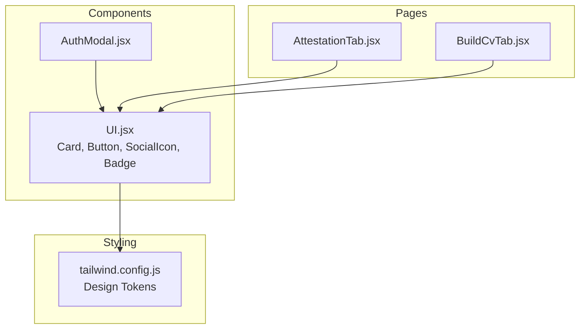
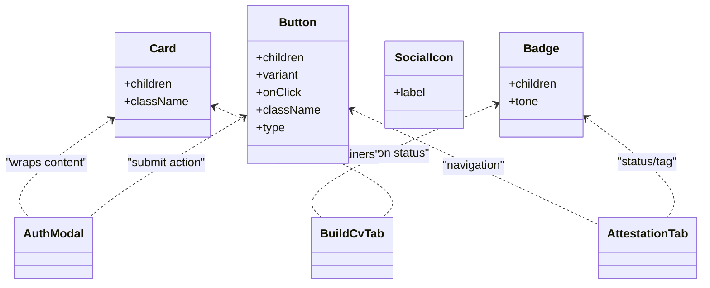
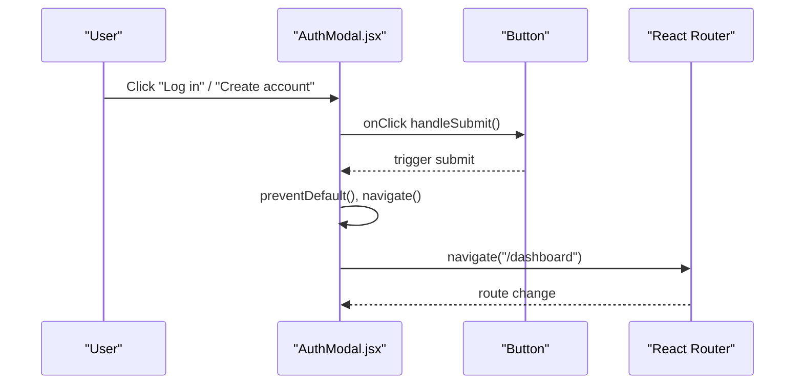
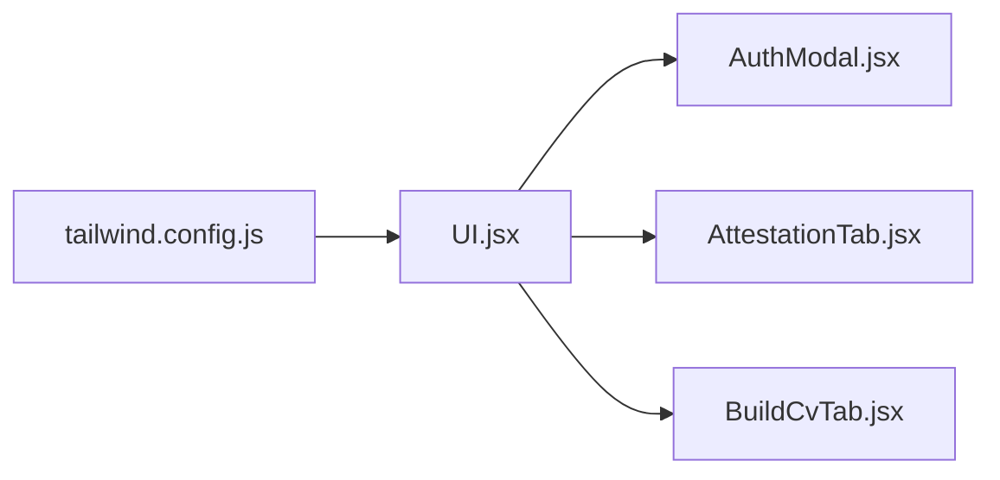

# UI Utility Components

<cite>
**Referenced Files in This Document**
- [UI.jsx](file://scholarpath-frontend (2)/scholarpath/src/components/UI.jsx)
- [tailwind.config.js](file://scholarpath-frontend (2)/scholarpath/tailwind.config.js)
- [AuthModal.jsx](file://scholarpath-frontend (2)/scholarpath/src/components/AuthModal.jsx)
- [AttestationTab.jsx](file://scholarpath-frontend (2)/scholarpath/src/pages/AttestationTab.jsx)
- [BuildCvTab.jsx](file://scholarpath-frontend (2)/scholarpath/src/pages/BuildCvTab.jsx)
</cite>

## Table of Contents
1. [Introduction](#introduction)
2. [Project Structure](#project-structure)
3. [Core Components](#core-components)
4. [Architecture Overview](#architecture-overview)
5. [Detailed Component Analysis](#detailed-component-analysis)
6. [Dependency Analysis](#dependency-analysis)
7. [Performance Considerations](#performance-considerations)
8. [Troubleshooting Guide](#troubleshooting-guide)
9. [Conclusion](#conclusion)
10. [Appendices](#appendices)

## Introduction
This document provides comprehensive documentation for the reusable UI utility components exported from UI.jsx. It covers Card, Button, SocialIcon, and Badge with prop specifications, styling customization options, responsive behavior, event handling patterns, and practical usage examples found across the application. It also includes guidelines to maintain design consistency and extend the component library.

## Project Structure
The UI utilities live in a single module and are consumed by feature components and pages:
- UI.jsx exports Card, Button, SocialIcon, and Badge.
- Tailwind configuration defines the design tokens (colors, shadows, fonts) used by these components.
- AuthModal.jsx demonstrates Card and Button usage in a modal context.
- AttestationTab.jsx demonstrates Card, Button, and Badge usage for content cards and status indicators.
- BuildCvTab.jsx demonstrates Card, Button, and Badge usage for interactive workflows and status feedback.

**Diagram sources**
- [UI.jsx:1-47](file://scholarpath-frontend (2)/scholarpath/src/components/UI.jsx#L1-L47)
- [tailwind.config.js:1-31](file://scholarpath-frontend (2)/scholarpath/tailwind.config.js#L1-L31)
- [AuthModal.jsx:1-84](file://scholarpath-frontend (2)/scholarpath/src/components/AuthModal.jsx#L1-L84)
- [AttestationTab.jsx:1-73](file://scholarpath-frontend (2)/scholarpath/src/pages/AttestationTab.jsx#L1-L73)
- [BuildCvTab.jsx:1-284](file://scholarpath-frontend (2)/scholarpath/src/pages/BuildCvTab.jsx#L1-L284)

**Section sources**
- [UI.jsx:1-47](file://scholarpath-frontend (2)/scholarpath/src/components/UI.jsx#L1-L47)
- [tailwind.config.js:1-31](file://scholarpath-frontend (2)/scholarpath/tailwind.config.js#L1-L31)

## Core Components
- Card: A container with consistent background, border, rounded corners, and shadow. Accepts children and an optional className for overrides.
- Button: A styled button with three variants (primary, secondary, ghost). Supports onClick, type, and className overrides.
- SocialIcon: A circular icon placeholder with hover effects and accessible label support via the label prop.
- Badge: A small inline indicator with a tone system (blue, green, amber, gray) for statuses or tags.

These components rely on Tailwind classes and custom theme tokens defined in tailwind.config.js.

**Section sources**
- [UI.jsx:1-47](file://scholarpath-frontend (2)/scholarpath/src/components/UI.jsx#L1-L47)
- [tailwind.config.js:1-31](file://scholarpath-frontend (2)/scholarpath/tailwind.config.js#L1-L31)

## Architecture Overview
The UI components form a lightweight, composable layer that standardizes visual language across the app. They are stateless presentational primitives that can be composed into higher-level features like modals, tabs, and forms.

**Diagram sources**
- [UI.jsx:1-47](file://scholarpath-frontend (2)/scholarpath/src/components/UI.jsx#L1-L47)
- [AuthModal.jsx:1-84](file://scholarpath-frontend (2)/scholarpath/src/components/AuthModal.jsx#L1-L84)
- [AttestationTab.jsx:1-73](file://scholarpath-frontend (2)/scholarpath/src/pages/AttestationTab.jsx#L1-L73)
- [BuildCvTab.jsx:1-284](file://scholarpath-frontend (2)/scholarpath/src/pages/BuildCvTab.jsx#L1-L284)

## Detailed Component Analysis

### Card
Purpose:
- Provides a consistent card layout with white background, subtle border, rounded corners, and a soft shadow.

Props:
- children: Node(s) rendered inside the card.
- className: Optional string to add or override styles.

Styling:
- Uses a custom box-shadow token for consistent elevation.
- Border color and spacing follow the shared design tokens.

Responsive behavior:
- The base card is flexible; wrap it with responsive utilities as needed. In practice, pages use responsive padding and grid layouts around cards.

Usage examples:
- Modal wrapper in AuthModal.jsx to contain form fields.
- Section containers in AttestationTab.jsx and BuildCvTab.jsx to group related content.

Accessibility:
- Semantic structure is preserved; pair with appropriate headings and labels within the card content.

Extensibility:
- Add new props like size, variant, or interactive states if needed, while keeping default styles consistent.

**Section sources**
- [UI.jsx:1-7](file://scholarpath-frontend (2)/scholarpath/src/components/UI.jsx#L1-L7)
- [tailwind.config.js:22-25](file://scholarpath-frontend (2)/scholarpath/tailwind.config.js#L22-L25)
- [AuthModal.jsx:18-81](file://scholarpath-frontend (2)/scholarpath/src/components/AuthModal.jsx#L18-L81)
- [AttestationTab.jsx:26-53](file://scholarpath-frontend (2)/scholarpath/src/pages/AttestationTab.jsx#L26-L53)
- [BuildCvTab.jsx:82-193](file://scholarpath-frontend (2)/scholarpath/src/pages/BuildCvTab.jsx#L82-L193)

### Button
Purpose:
- Standardized interactive element with three visual variants and consistent sizing and transitions.

Props:
- children: Button text or content.
- variant: One of primary, secondary, ghost. Defaults to primary.
- onClick: Event handler for click interactions.
- className: Optional string to add or override styles.
- type: HTML button type attribute; defaults to button.

Variants:
- primary: Solid brand color with white text; darker hover state.
- secondary: White background with border; borders and text shift to brand color on hover.
- ghost: Transparent background; text shifts to brand color on hover.

Event handling:
- Pass any function to onClick; commonly used for navigation, form submission, toggling state, or triggering actions.

Responsive behavior:
- Base sizing is compact; pages often stack buttons vertically on small screens using flex-wrap or column layouts.

Usage examples:
- Submitting login/signup in AuthModal.jsx.
- Navigating to external portals in AttestationTab.jsx.
- Triggering file operations and mode changes in BuildCvTab.jsx.

Accessibility:
- Use descriptive text for children. For icon-only buttons, consider aria-label when needed. Ensure sufficient color contrast per variant.

Extensibility:
- Add disabled state, loading state, or additional sizes while preserving existing variants.

**Diagram sources**
- [AuthModal.jsx:11-16](file://scholarpath-frontend (2)/scholarpath/src/components/AuthModal.jsx#L11-L16)
- [AuthModal.jsx:70-72](file://scholarpath-frontend (2)/scholarpath/src/components/AuthModal.jsx#L70-L72)
- [UI.jsx:9-24](file://scholarpath-frontend (2)/scholarpath/src/components/UI.jsx#L9-L24)

**Section sources**
- [UI.jsx:9-24](file://scholarpath-frontend (2)/scholarpath/src/components/UI.jsx#L9-L24)
- [AuthModal.jsx:70-72](file://scholarpath-frontend (2)/scholarpath/src/components/AuthModal.jsx#L70-L72)
- [AttestationTab.jsx:49-51](file://scholarpath-frontend (2)/scholarpath/src/pages/AttestationTab.jsx#L49-L51)
- [BuildCvTab.jsx:91-125](file://scholarpath-frontend (2)/scholarpath/src/pages/BuildCvTab.jsx#L91-L125)

### SocialIcon
Purpose:
- Displays a small, circular icon placeholder with hover effects and accessible labeling.

Props:
- label: Accessible text describing the icon’s purpose.

Styling:
- Circular shape, border, subtle background, and hover state that highlights the border and text color.

Accessibility:
- Provide a meaningful label for screen readers. If used as a link, wrap in an anchor and include aria-label.

Usage examples:
- Can be used in footers, profile sections, or social sharing areas.

Extensibility:
- Add src/icon prop for actual icons, size variants, and active/disabled states.

**Section sources**
- [UI.jsx:26-32](file://scholarpath-frontend (2)/scholarpath/src/components/UI.jsx#L26-L32)

### Badge
Purpose:
- Inline status or tag indicator with a tone system for quick visual recognition.

Props:
- children: Text content of the badge.
- tone: One of blue, green, amber, gray. Defaults to blue.

Tones:
- blue: Brand-accented light background with dark text.
- green: Success-like light background with green text.
- amber: Warning-like light background with amber text.
- gray: Neutral light background with slate text.

Usage examples:
- Tagging attestation options in AttestationTab.jsx.
- Indicating conversion or generation status in BuildCvTab.jsx.

Accessibility:
- Keep text concise and meaningful. Avoid conveying critical information solely through color; combine with text or icons where necessary.

Extensibility:
- Add size variants, outline variants, or icon support.

**Section sources**
- [UI.jsx:34-46](file://scholarpath-frontend (2)/scholarpath/src/components/UI.jsx#L34-L46)
- [AttestationTab.jsx:28-32](file://scholarpath-frontend (2)/scholarpath/src/pages/AttestationTab.jsx#L28-L32)
- [BuildCvTab.jsx:130-133](file://scholarpath-frontend (2)/scholarpath/src/pages/BuildCvTab.jsx#L130-L133)
- [BuildCvTab.jsx:263-268](file://scholarpath-frontend (2)/scholarpath/src/pages/BuildCvTab.jsx#L263-L268)

## Dependency Analysis
- UI components depend on Tailwind utility classes and custom theme tokens (colors, shadows, font family).
- Pages and feature components import UI components to build interfaces consistently.
- No runtime dependencies beyond React and Tailwind.

**Diagram sources**
- [tailwind.config.js:1-31](file://scholarpath-frontend (2)/scholarpath/tailwind.config.js#L1-L31)
- [UI.jsx:1-47](file://scholarpath-frontend (2)/scholarpath/src/components/UI.jsx#L1-L47)
- [AuthModal.jsx:1-84](file://scholarpath-frontend (2)/scholarpath/src/components/AuthModal.jsx#L1-L84)
- [AttestationTab.jsx:1-73](file://scholarpath-frontend (2)/scholarpath/src/pages/AttestationTab.jsx#L1-L73)
- [BuildCvTab.jsx:1-284](file://scholarpath-frontend (2)/scholarpath/src/pages/BuildCvTab.jsx#L1-L284)

**Section sources**
- [tailwind.config.js:1-31](file://scholarpath-frontend (2)/scholarpath/tailwind.config.js#L1-L31)
- [UI.jsx:1-47](file://scholarpath-frontend (2)/scholarpath/src/components/UI.jsx#L1-L47)

## Performance Considerations
- Components are lightweight and stateless, minimizing re-renders.
- Styling relies on Tailwind utilities; ensure unused classes are purged in production builds.
- Prefer passing stable handlers to Button to avoid unnecessary recalculations.
- For large lists using Badge or Card, consider memoization at the parent level if performance becomes a concern.

[No sources needed since this section provides general guidance]

## Troubleshooting Guide
- Button not clickable: Ensure you pass an onClick handler and that the button is not disabled by parent styles.
- Variant not applied: Verify variant value matches one of primary, secondary, ghost.
- Badge color mismatch: Confirm tone is one of blue, green, amber, gray.
- Card shadow inconsistent: Check that Tailwind config includes the custom shadow token and that no conflicting CSS overrides it.
- Accessibility issues: Provide descriptive labels for SocialIcon and ensure sufficient contrast for all variants.

**Section sources**
- [UI.jsx:9-46](file://scholarpath-frontend (2)/scholarpath/src/components/UI.jsx#L9-L46)
- [tailwind.config.js:1-31](file://scholarpath-frontend (2)/scholarpath/tailwind.config.js#L1-L31)

## Conclusion
The UI utility components provide a cohesive, accessible, and extensible foundation for building consistent interfaces. By adhering to the documented props, variants, and styling tokens, teams can maintain design consistency while scaling the application. Extend the library thoughtfully by adding new variants or props without breaking existing usage patterns.

[No sources needed since this section summarizes without analyzing specific files]

## Appendices

### Prop Specifications Summary
- Card
  - children: Node
  - className: string (optional)
- Button
  - children: Node
  - variant: "primary" | "secondary" | "ghost" (default "primary")
  - onClick: function (optional)
  - className: string (optional)
  - type: string (default "button")
- SocialIcon
  - label: string
- Badge
  - children: Node
  - tone: "blue" | "green" | "amber" | "gray" (default "blue")

**Section sources**
- [UI.jsx:1-47](file://scholarpath-frontend (2)/scholarpath/src/components/UI.jsx#L1-L47)

### Design Tokens Reference
- Colors: sp-blue, sp-blue-dark, sp-blue-light, sp-navy, sp-slate, sp-border, sp-bg, sp-green, sp-green-light, sp-amber, sp-amber-light
- Shadows: card, card-lg
- Font family: sans (Inter, system-ui, sans-serif)

**Section sources**
- [tailwind.config.js:1-31](file://scholarpath-frontend (2)/scholarpath/tailwind.config.js#L1-L31)

### Usage Examples Across the App
- Card: Wrapping forms and content sections in AuthModal.jsx, AttestationTab.jsx, BuildCvTab.jsx.
- Button: Submitting forms, navigating to external links, triggering actions in multiple pages.
- Badge: Tagging options and indicating status in AttestationTab.jsx and BuildCvTab.jsx.
- SocialIcon: Placeholder for social icons with accessible labels.

**Section sources**
- [AuthModal.jsx:18-81](file://scholarpath-frontend (2)/scholarpath/src/components/AuthModal.jsx#L18-L81)
- [AttestationTab.jsx:26-53](file://scholarpath-frontend (2)/scholarpath/src/pages/AttestationTab.jsx#L26-L53)
- [BuildCvTab.jsx:82-193](file://scholarpath-frontend (2)/scholarpath/src/pages/BuildCvTab.jsx#L82-L193)