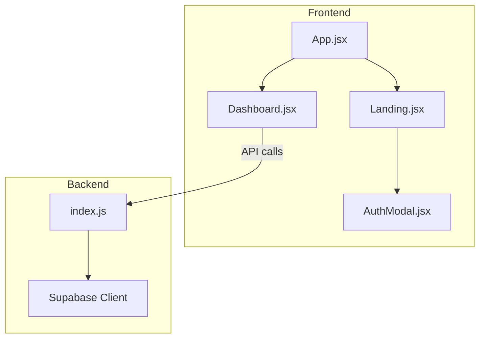
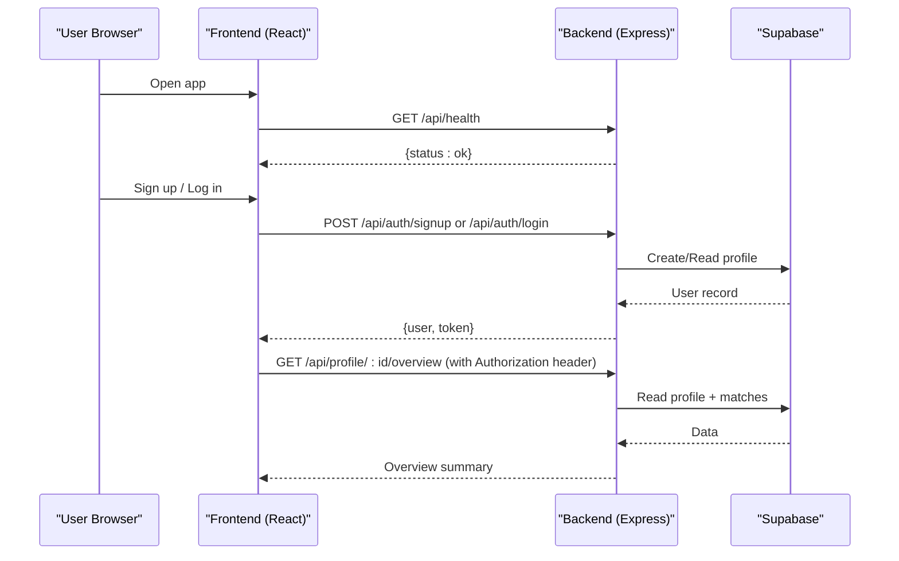
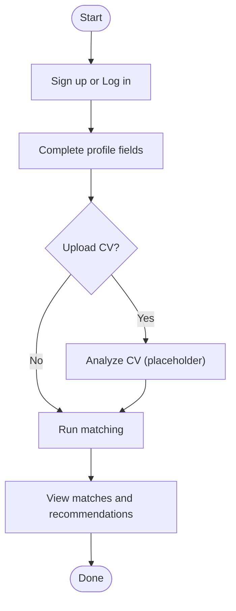
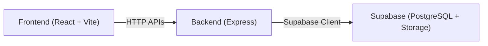

# Getting Started

<cite>
**Referenced Files in This Document**
- [package.json (backend)](file://aischolarpath-backend-main/aischolarpath-backend-main/package.json)
- [index.js (backend)](file://aischolarpath-backend-main/aischolarpath-backend-main/index.js)
- [.gitignore (backend)](file://aischolarpath-backend-main/aischolarpath-backend-main/.gitignore)
- [package.json (frontend)](file://scholarpath-frontend (2)/scholarpath/package.json)
- [vite.config.js (frontend)](file://scholarpath-frontend (2)/scholarpath/vite.config.js)
- [App.jsx (frontend)](file://scholarpath-frontend (2)/scholarpath/src/App.jsx)
- [Landing.jsx (frontend)](file://scholarpath-frontend (2)/scholarpath/src/pages/Landing.jsx)
- [AuthModal.jsx (frontend)](file://scholarpath-frontend (2)/scholarpath/src/components/AuthModal.jsx)
- [Dashboard.jsx (frontend)](file://scholarpath-frontend (2)/scholarpath/src/pages/Dashboard.jsx)
</cite>

## Table of Contents
1. Introduction
2. Project Structure
3. Core Components
4. Architecture Overview
5. Detailed Component Analysis
6. Dependency Analysis
7. Performance Considerations
8. Troubleshooting Guide
9. Conclusion
10. Appendices

## Introduction
This guide helps you set up and run ScholarPathAI locally, covering both the backend (Express + Supabase) and frontend (React + Vite). You will install dependencies, configure environment variables, start development servers with hot reload, and follow a first-time user flow from registration to your first scholarship matches. It also includes troubleshooting tips for common setup issues like CORS, database connectivity, and authentication configuration.

## Project Structure
ScholarPathAI is split into two main parts:
- Backend: Express server that handles authentication, profile management, scholarships/universities data, matching, shortlisting, and more. It uses Supabase as the database and storage provider.
- Frontend: React application built with Vite, providing a landing page, authentication modal, and dashboard tabs for profile, universities, scholarships, CV building, attestation steps, and FAQs.

**Diagram sources**
- [App.jsx (frontend):1-15](file://scholarpath-frontend (2)/scholarpath/src/App.jsx#L1-L15)
- [Landing.jsx (frontend):1-211](file://scholarpath-frontend (2)/scholarpath/src/pages/Landing.jsx#L1-L211)
- [AuthModal.jsx (frontend):1-84](file://scholarpath-frontend (2)/scholarpath/src/components/AuthModal.jsx#L1-L84)
- [Dashboard.jsx (frontend):1-187](file://scholarpath-frontend (2)/scholarpath/src/pages/Dashboard.jsx#L1-L187)
- [index.js (backend):1-800](file://aischolarpath-backend-main/aischolarpath-backend-main/index.js#L1-L800)

**Section sources**
- [package.json (backend):1-14](file://aischolarpath-backend-main/aischolarpath-backend-main/package.json#L1-L14)
- [package.json (frontend):1-28](file://scholarpath-frontend (2)/scholarpath/package.json#L1-L28)

## Core Components
- Backend API server (Express)
  - Authentication endpoints for signup/login and JWT-based authorization middleware.
  - Profile CRUD, CV upload to Supabase Storage, CV analysis placeholder.
  - Scholarship and university listing with filters.
  - Matching engine that computes eligibility and match scores.
  - Shortlist management, notifications, and language prep/attestation guides.
- Frontend UI (React + Vite)
  - Landing page with sign-up/log-in entry points.
  - Auth modal for login/signup flows.
  - Dashboard with tabs: Overview, Profile, Universities, Scholarships, Build CV, Attestation, FAQ.

Key responsibilities:
- Backend validates requests, enforces auth, interacts with Supabase, and returns JSON responses.
- Frontend renders pages and navigates between routes; currently uses mock auth for local UX but can be wired to the backend.

**Section sources**
- [index.js (backend):1-800](file://aischolarpath-backend-main/aischolarpath-backend-main/index.js#L1-L800)
- [App.jsx (frontend):1-15](file://scholarpath-frontend (2)/scholarpath/src/App.jsx#L1-L15)
- [Landing.jsx (frontend):1-211](file://scholarpath-frontend (2)/scholarpath/src/pages/Landing.jsx#L1-L211)
- [AuthModal.jsx (frontend):1-84](file://scholarpath-frontend (2)/scholarpath/src/components/AuthModal.jsx#L1-L84)
- [Dashboard.jsx (frontend):1-187](file://scholarpath-frontend (2)/scholarpath/src/pages/Dashboard.jsx#L1-L187)

## Architecture Overview
The system follows a client-server architecture:
- The React frontend runs in the browser and communicates with the Express backend via HTTP APIs.
- The backend authenticates users using JWTs, manages profiles, scholarships, universities, and stores files in Supabase Storage.
- All persistent data is stored in Supabase (PostgreSQL), accessed through the Supabase JS client.

**Diagram sources**
- [index.js (backend):51-68](file://aischolarpath-backend-main/aischolarpath-backend-main/index.js#L51-L68)
- [index.js (backend):519-573](file://aischolarpath-backend-main/aischolarpath-backend-main/index.js#L519-L573)
- [index.js (backend):694-749](file://aischolarpath-backend-main/aischolarpath-backend-main/index.js#L694-L749)

## Detailed Component Analysis

### Backend Setup and Environment
- Required environment variables at startup: SUPABASE_URL, SUPABASE_KEY, JWT_SECRET. Missing variables cause the server to exit early with an error message.
- Supabase client is initialized using these variables.
- CORS is enabled globally for cross-origin requests from the frontend.
- Authentication middleware verifies JWT tokens from the Authorization header and attaches userId to requests.

Environment file guidance:
- Create a .env file in the backend directory with the required variables.
- Ensure .env is ignored by version control (already configured).

Development server:
- Start the backend with Node.js using the project’s scripts or directly via Node.
- Default port is not explicitly set in the provided code; ensure your environment exposes the intended port if needed.

**Section sources**
- [index.js (backend):1-15](file://aischolarpath-backend-main/aischolarpath-backend-main/index.js#L1-L15)
- [index.js (backend):31-48](file://aischolarpath-backend-main/aischolarpath-backend-main/index.js#L31-L48)
- [index.js (backend):51-54](file://aischolarpath-backend-main/aischolarpath-backend-main/index.js#L51-L54)
- [.gitignore (backend):1-2](file://aischolarpath-backend-main/aischolarpath-backend-main/.gitignore#L1-L2)

### Frontend Setup and Development Server
- Dependencies include React, React Router, and Vite tooling.
- Development script runs Vite with Hot Module Replacement (HMR) enabled by default.
- Routing defines two primary routes: home (landing) and dashboard.

Port configuration:
- Vite serves on a default port (commonly 5173) unless configured otherwise. If you need a specific port, adjust the Vite config accordingly.

Hot reload:
- HMR is enabled out-of-the-box with Vite during development.

**Section sources**
- [package.json (frontend):1-28](file://scholarpath-frontend (2)/scholarpath/package.json#L1-L28)
- [vite.config.js (frontend):1-8](file://scholarpath-frontend (2)/scholarpath/vite.config.js#L1-L8)
- [App.jsx (frontend):1-15](file://scholarpath-frontend (2)/scholarpath/src/App.jsx#L1-L15)

### First-Time User Onboarding Flow
- From the landing page, users can open the auth modal to sign up or log in.
- After successful auth (currently mocked in the frontend), users are navigated to the dashboard.
- In the dashboard, users can explore tabs:
  - Overview: shows profile strength, top matches, upcoming deadlines.
  - Profile: edit personal and academic details.
  - Universities/Scholarships: browse filtered lists.
  - Build CV: upload and analyze CV (placeholder logic exists in backend).
  - Attestation: track document attestation steps.
  - FAQ: access help content.

Note: When integrating with the backend, store the returned JWT in secure storage and attach it to subsequent API requests via the Authorization header.

**Section sources**
- [Landing.jsx (frontend):1-211](file://scholarpath-frontend (2)/scholarpath/src/pages/Landing.jsx#L1-L211)
- [AuthModal.jsx (frontend):1-84](file://scholarpath-frontend (2)/scholarpath/src/components/AuthModal.jsx#L1-L84)
- [Dashboard.jsx (frontend):1-187](file://scholarpath-frontend (2)/scholarpath/src/pages/Dashboard.jsx#L1-L187)

### Basic Usage Patterns: Registration to Matching
- Register or log in to obtain a JWT token.
- Complete your profile fields (CGPA, IELTS score, target degree/department/country).
- Optionally upload a CV to enrich profile data.
- Trigger matching to compute eligibility against active scholarships and save results.
- View overview and top recommendations based on match scores.

**Diagram sources**
- [index.js (backend):519-573](file://aischolarpath-backend-main/aischolarpath-backend-main/index.js#L519-L573)
- [index.js (backend):112-188](file://aischolarpath-backend-main/aischolarpath-backend-main/index.js#L112-L188)
- [index.js (backend):575-673](file://aischolarpath-backend-main/aischolarpath-backend-main/index.js#L575-L673)
- [index.js (backend):694-749](file://aischolarpath-backend-main/aischolarpath-backend-main/index.js#L694-L749)

## Dependency Analysis
- Backend dependencies include Express, CORS, JWT, bcrypt, Multer, Cheerio, Undici, and Supabase client.
- Frontend dependencies include React, React DOM, React Router, and Vite toolchain.

**Diagram sources**
- [package.json (backend):1-14](file://aischolarpath-backend-main/aischolarpath-backend-main/package.json#L1-L14)
- [package.json (frontend):1-28](file://scholarpath-frontend (2)/scholarpath/package.json#L1-L28)
- [index.js (backend):1-28](file://aischolarpath-backend-main/aischolarpath-backend-main/index.js#L1-L28)

**Section sources**
- [package.json (backend):1-14](file://aischolarpath-backend-main/aischolarpath-backend-main/package.json#L1-L14)
- [package.json (frontend):1-28](file://scholarpath-frontend (2)/scholarpath/package.json#L1-L28)

## Performance Considerations
- Connection pooling and timeouts are configured for external HTTP requests via Undici agent settings in the backend.
- Avoid excessive re-runs of matching; cache or debounce when appropriate on the frontend.
- Use pagination or filtering on large datasets (e.g., universities/scholarships) to reduce payload sizes.
- Keep environment variables minimal and secure; rotate secrets regularly.

[No sources needed since this section provides general guidance]

## Troubleshooting Guide
Common issues and resolutions:
- Missing environment variables
  - Symptom: Backend exits immediately with an error indicating missing variables.
  - Resolution: Add SUPABASE_URL, SUPABASE_KEY, and JWT_SECRET to a .env file in the backend directory.
- CORS errors from the frontend
  - Symptom: Network errors due to blocked cross-origin requests.
  - Resolution: Ensure the backend has CORS enabled and the frontend origin is allowed. Verify network policies and proxy settings if behind a reverse proxy.
- Database connection problems
  - Symptom: Errors when testing DB connectivity or querying tables.
  - Resolution: Validate Supabase URL and key; check network access and permissions. Use the health/test endpoints to verify connectivity.
- Authentication setup issues
  - Symptom: 401/403 responses or invalid/expired token errors.
  - Resolution: Confirm JWT_SECRET matches between signup/login and protected routes; ensure Authorization header includes a valid Bearer token.

Useful endpoints for diagnostics:
- Health check: GET /api/health
- Database test: GET /api/test-db

**Section sources**
- [index.js (backend):1-15](file://aischolarpath-backend-main/aischolarpath-backend-main/index.js#L1-L15)
- [index.js (backend):31-48](file://aischolarpath-backend-main/aischolarpath-backend-main/index.js#L31-L48)
- [index.js (backend):57-68](file://aischolarpath-backend-main/aischolarpath-backend-main/index.js#L57-L68)

## Conclusion
You now have the essentials to install, configure, and run ScholarPathAI locally. Start the backend with proper environment variables, launch the frontend dev server, and follow the onboarding flow to create a profile and explore matches. Refer to the troubleshooting section if you encounter setup issues, and use the diagnostic endpoints to validate connectivity.

[No sources needed since this section summarizes without analyzing specific files]

## Appendices

### Installation Checklist
- Install Node.js (recommended LTS version).
- Backend:
  - Navigate to the backend directory.
  - Install dependencies.
  - Create a .env file with SUPABASE_URL, SUPABASE_KEY, and JWT_SECRET.
  - Start the server.
- Frontend:
  - Navigate to the frontend directory.
  - Install dependencies.
  - Start the development server.

**Section sources**
- [package.json (backend):1-14](file://aischolarpath-backend-main/aischolarpath-backend-main/package.json#L1-L14)
- [package.json (frontend):1-28](file://scholarpath-frontend (2)/scholarpath/package.json#L1-L28)
- [.gitignore (backend):1-2](file://aischolarpath-backend-main/aischolarpath-backend-main/.gitignore#L1-L2)