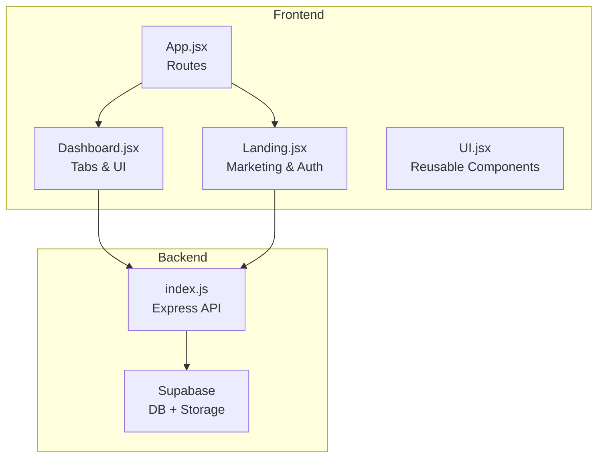
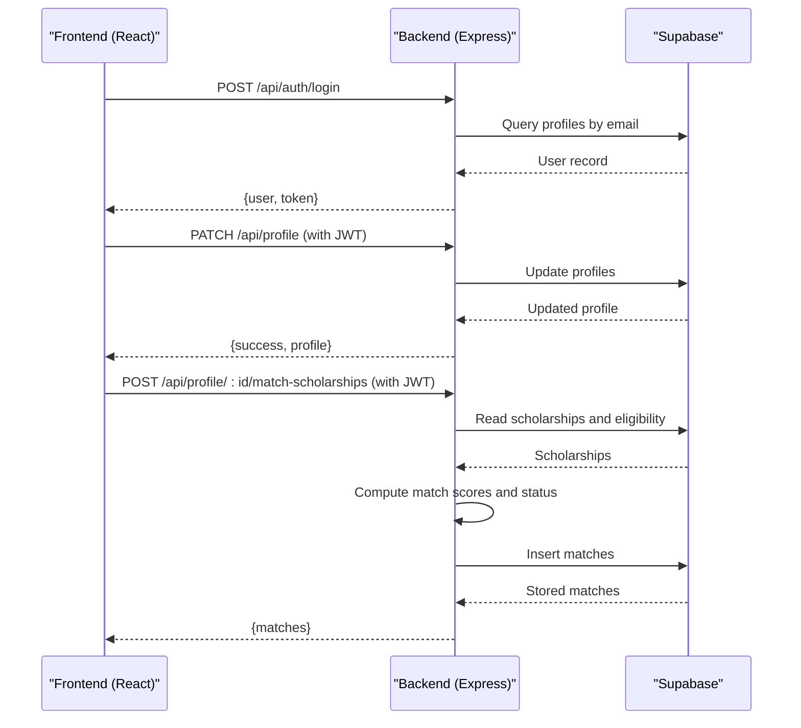
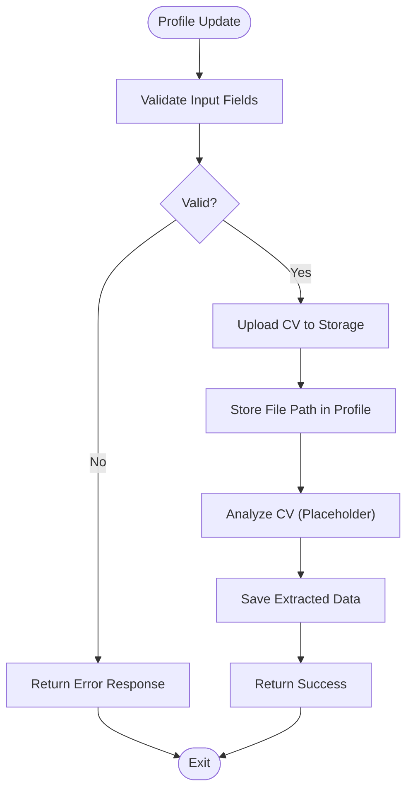
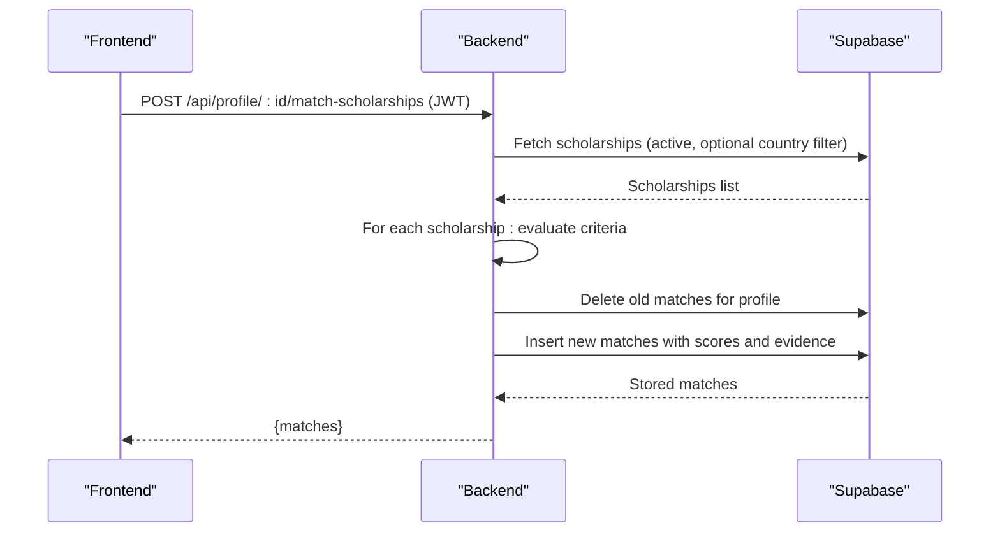
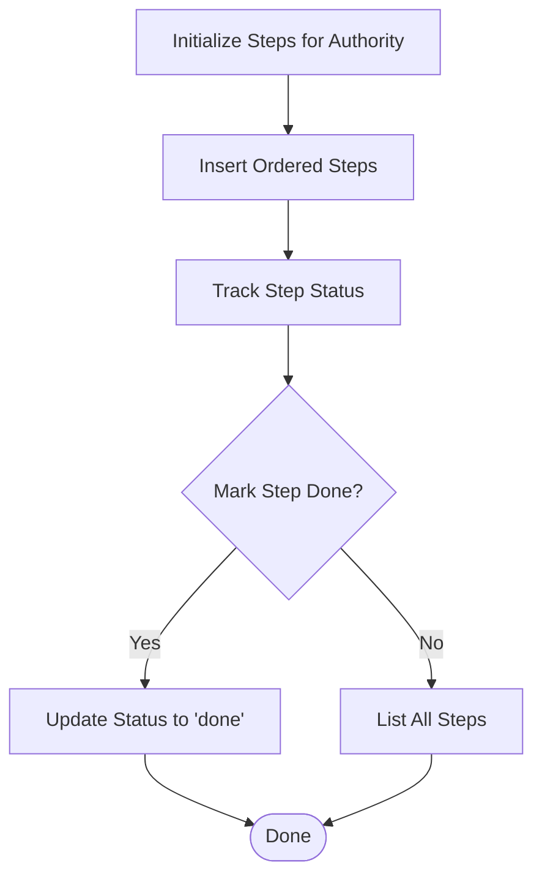
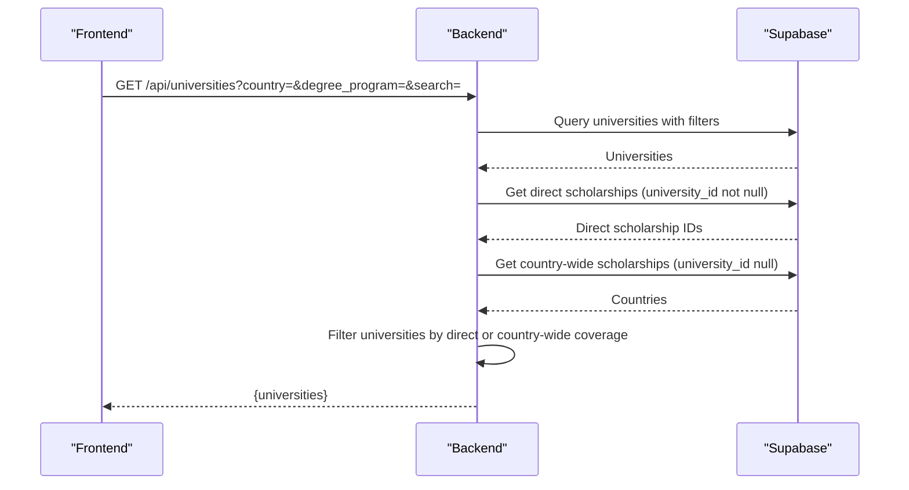
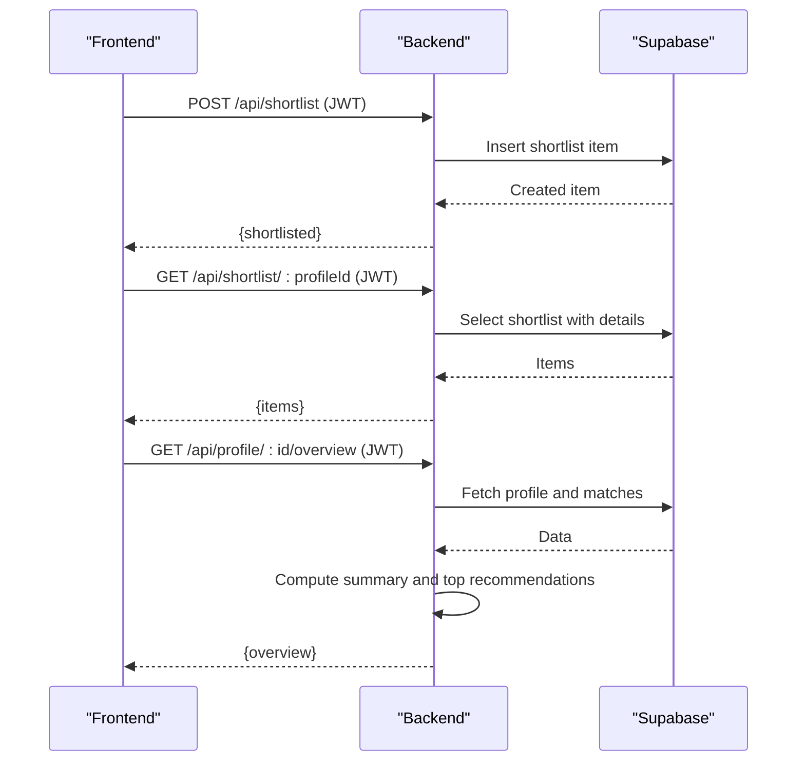
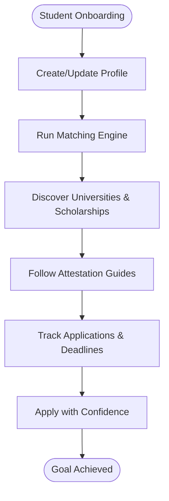
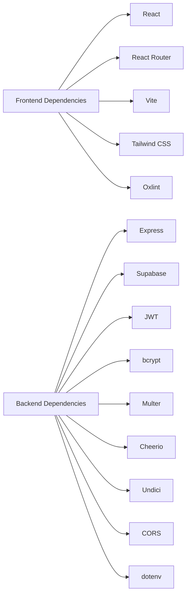

# Project Overview

<cite>
**Referenced Files in This Document**
- [package.json](file://scholarpath-frontend (2)/scholarpath/package.json)
- [vite.config.js](file://scholarpath-frontend (2)/scholarpath/vite.config.js)
- [App.jsx](file://scholarpath-frontend (2)/scholarpath/src/App.jsx)
- [Dashboard.jsx](file://scholarpath-frontend (2)/scholarpath/src/pages/Dashboard.jsx)
- [Landing.jsx](file://scholarpath-frontend (2)/scholarpath/src/pages/Landing.jsx)
- [UI.jsx](file://scholarpath-frontend (2)/scholarpath/src/components/UI.jsx)
- [index.js](file://aischolarpath-backend-main/aischolarpath-backend-main/index.js)
- [package.json](file://aischolarpath-backend-main/aischolarpath-backend-main/package.json)
</cite>

## Table of Contents
1. Introduction
2. Project Structure
3. Core Components
4. Architecture Overview
5. Detailed Component Analysis
6. Dependency Analysis
7. Performance Considerations
8. Troubleshooting Guide
9. Conclusion

## Introduction
ScholarPathAI is an AI-powered scholarship matching platform designed to help students discover and apply for educational opportunities that fit their academic background, goals, and constraints. The platform centralizes student profiles, intelligently matches them with relevant scholarships and universities, guides document attestation workflows, and tracks application progress—all in one place.

Target audience:
- Students seeking international study opportunities who need help finding suitable scholarships and universities
- Learners who want a streamlined process to manage documents, deadlines, and eligibility requirements

Core value proposition:
- One profile drives personalized university and scholarship matches
- Intelligent matching reduces search effort and improves relevance
- Centralized document management and attestation guidance
- Clear visibility into eligibility gaps and next steps
- Application tracking to keep students organized and on time

Problem addressed:
- Fragmented scholarship searches across multiple sources
- Confusion about eligibility criteria and required documents
- Difficulty keeping track of deadlines and application status
- Limited visibility into how well a student’s profile aligns with opportunities

How AI helps:
- Matching engine evaluates student profiles against scholarship eligibility criteria to compute match scores and statuses
- Personalized insights highlight missing requirements and suggest improvements
- Structured workflows guide students through language test preparation and document attestation

[No sources needed since this section provides general context]

## Project Structure
The project consists of two main parts:
- Frontend: React 19 application built with Vite, using Tailwind CSS for styling and React Router for navigation
- Backend: Node.js/Express server integrating Supabase for data persistence, authentication, and file storage

Key frontend entry points and pages:
- App routing defines landing and dashboard routes
- Dashboard organizes features via tabs: overview, profile, document attestations, universities, scholarships, build CV, FAQ
- Landing page communicates the product’s value and guides users to sign up or log in

Backend responsibilities:
- Authentication and authorization via JWT
- Profile management, CV upload, and analysis endpoints
- Scholarship and university discovery with filtering
- Matching computation and storage
- Language preparation guidance and attestation workflow tracking
- Shortlist management

**Diagram sources**
- [App.jsx:1-15](file://scholarpath-frontend (2)/scholarpath/src/App.jsx#L1-L15)
- [Dashboard.jsx:13-21](file://scholarpath-frontend (2)/scholarpath/src/pages/Dashboard.jsx#L13-L21)
- [Landing.jsx:32-63](file://scholarpath-frontend (2)/scholarpath/src/pages/Landing.jsx#L32-L63)
- [index.js:29-59](file://aischolarpath-backend-main/aischolarpath-backend-main/index.js#L29-L59)

**Section sources**
- [App.jsx:1-15](file://scholarpath-frontend (2)/scholarpath/src/App.jsx#L1-L15)
- [Dashboard.jsx:13-21](file://scholarpath-frontend (2)/scholarpath/src/pages/Dashboard.jsx#L13-L21)
- [Landing.jsx:32-63](file://scholarpath-frontend (2)/scholarpath/src/pages/Landing.jsx#L32-L63)
- [index.js:29-59](file://aischolarpath-backend-main/aischolarpath-backend-main/index.js#L29-L59)

## Core Components
- Student profile management: Create and update profiles, upload CVs, analyze CV content, and maintain personal academic details
- Intelligent scholarship matching: Compute match scores based on CGPA, IELTS, degree level, department, and country preferences; store and retrieve matches
- Document attestation workflow: Step-by-step guidance for HEC, IBCC, MOFA; track completion status per step
- University discovery: Search and filter universities by country, program, and name; include those with direct scholarships or country-wide options
- Application tracking: Shortlist scholarships and universities; view overview summaries including eligibility counts and top recommendations

Technology stack:
- Frontend: React 19, React Router, Vite, Tailwind CSS, PostCSS, Autoprefixer, Oxlint
- Backend: Express, JSON Web Tokens (JWT), bcrypt for password hashing, Multer for file uploads, Cheerio for scraping, Undici for HTTP requests, CORS, dotenv for environment variables
- Database and storage: Supabase (PostgreSQL database and object storage)

**Section sources**
- [package.json:12-26](file://scholarpath-frontend (2)/scholarpath/package.json#L12-L26)
- [package.json:1-13](file://aischolarpath-backend-main/aischolarpath-backend-main/package.json#L1-L13)
- [index.js:1-59](file://aischolarpath-backend-main/aischolarpath-backend-main/index.js#L1-L59)

## Architecture Overview
The system follows a client-server architecture:
- The React frontend renders user interfaces and navigates between pages
- The Express backend exposes RESTful APIs for authentication, profile management, matching, discovery, and workflow tracking
- Supabase serves as the persistent data layer for profiles, scholarships, universities, matches, shortlists, and files

Communication patterns:
- Frontend calls backend endpoints for data operations (e.g., profile updates, scholarship queries, matching runs)
- Backend validates tokens, enforces authorization, and interacts with Supabase for reads/writes
- File uploads are handled via Multer and stored in Supabase Storage

Data flow highlights:
- User logs in → receives JWT → includes token in subsequent requests
- Profile updates trigger CV upload and optional analysis
- Matching endpoint computes eligibility and stores results
- Discovery endpoints return filtered scholarships and universities
- Attestation endpoints initialize and track step completion

**Diagram sources**
- [index.js:518-573](file://aischolarpath-backend-main/aischolarpath-backend-main/index.js#L518-L573)
- [index.js:70-91](file://aischolarpath-backend-main/aischolarpath-backend-main/index.js#L70-L91)
- [index.js:575-673](file://aischolarpath-backend-main/aischolarpath-backend-main/index.js#L575-L673)

## Detailed Component Analysis

### Student Profile Management
- Create/update profile fields such as full name, CGPA, IELTS score, target country, degree, and department
- Upload CV to Supabase Storage and link it to the profile
- Analyze CV to extract structured data (placeholder until AI teammate integration)

Implementation notes:
- Authorization middleware ensures users can only modify their own profiles
- File upload uses memory storage and stores path references in the profile
- Analysis endpoint currently inserts mock extracted data; replace with real extraction logic when available

**Diagram sources**
- [index.js:70-91](file://aischolarpath-backend-main/aischolarpath-backend-main/index.js#L70-L91)
- [index.js:112-145](file://aischolarpath-backend-main/aischolarpath-backend-main/index.js#L112-L145)
- [index.js:147-188](file://aischolarpath-backend-main/aischolarpath-backend-main/index.js#L147-L188)

**Section sources**
- [index.js:70-91](file://aischolarpath-backend-main/aischolarpath-backend-main/index.js#L70-L91)
- [index.js:112-145](file://aischolarpath-backend-main/aischolarpath-backend-main/index.js#L112-L145)
- [index.js:147-188](file://aischolarpath-backend-main/aischolarpath-backend-main/index.js#L147-L188)

### Intelligent Scholarship Matching
- Run matching against all active scholarships, optionally filtered by target country
- Evaluate eligibility criteria (CGPA, IELTS, required degree) and compute match scores
- Store match results with evidence detailing pass/fail/missing for each criterion

Implementation notes:
- Authorization ensures only the profile owner can run matching
- Results are cleared and reinserted to ensure freshness
- Match scores reflect proportion of passed criteria

**Diagram sources**
- [index.js:575-673](file://aischolarpath-backend-main/aischolarpath-backend-main/index.js#L575-L673)

**Section sources**
- [index.js:575-673](file://aischolarpath-backend-main/aischolarpath-backend-main/index.js#L575-L673)

### Document Attestation Workflow
- Provide static step-by-step guides for authorities (HEC, IBCC, MOFA)
- Initialize tracked steps per authority for a profile
- Mark steps as completed and retrieve full step lists

Implementation notes:
- Authorization checks ensure users can only access their own attestation steps
- Steps are ordered and persisted with status tracking

**Diagram sources**
- [index.js:427-464](file://aischolarpath-backend-main/aischolarpath-backend-main/index.js#L427-L464)
- [index.js:467-517](file://aischolarpath-backend-main/aischolarpath-backend-main/index.js#L467-L517)

**Section sources**
- [index.js:427-464](file://aischolarpath-backend-main/aischolarpath-backend-main/index.js#L427-L464)
- [index.js:467-517](file://aischolarpath-backend-main/aischolarpath-backend-main/index.js#L467-L517)

### University Discovery
- Filter universities by country, degree program, and search term
- Include universities with direct scholarships or country-wide scholarships
- Limit results for performance

Implementation notes:
- Queries combine basic filters with sets of university IDs and countries derived from active scholarships
- Results are sliced to a manageable number

**Diagram sources**
- [index.js:224-271](file://aischolarpath-backend-main/aischolarpath-backend-main/index.js#L224-L271)

**Section sources**
- [index.js:224-271](file://aischolarpath-backend-main/aischolarpath-backend-main/index.js#L224-L271)

### Application Tracking and Shortlisting
- Add or remove items (scholarships or universities) from a user’s shortlist
- Retrieve full shortlist with related details
- Provide dashboard overview summarizing eligibility counts and top recommendations

Implementation notes:
- Authorization ensures users can only manage their own shortlists
- Overview aggregates matches to show eligible, missing requirements, and not eligible counts

**Diagram sources**
- [index.js:751-783](file://aischolarpath-backend-main/aischolarpath-backend-main/index.js#L751-L783)
- [index.js:694-749](file://aischolarpath-backend-main/aischolarpath-backend-main/index.js#L694-L749)

**Section sources**
- [index.js:751-783](file://aischolarpath-backend-main/aischolarpath-backend-main/index.js#L751-L783)
- [index.js:694-749](file://aischolarpath-backend-main/aischolarpath-backend-main/index.js#L694-L749)

### Conceptual Overview
ScholarPathAI streamlines the journey from profile creation to application submission:
- Build your profile once and let the matching engine find relevant opportunities
- Explore universities and scholarships with clear eligibility insights
- Organize documents and follow guided attestation steps
- Track deadlines and application status in a single dashboard

[No sources needed since this diagram shows conceptual workflow, not actual code structure]

## Dependency Analysis
Frontend dependencies:
- React and ReactDOM for UI rendering
- React Router for navigation
- Vite for development and build tooling
- Tailwind CSS and PostCSS for styling
- Oxlint for linting

Backend dependencies:
- Express for API server
- Supabase JS client for database and storage
- JWT for authentication
- bcrypt for password hashing
- Multer for file uploads
- Cheerio for web scraping
- Undici for HTTP client configuration
- CORS and dotenv for cross-origin requests and environment variables

**Diagram sources**
- [package.json:12-26](file://scholarpath-frontend (2)/scholarpath/package.json#L12-L26)
- [package.json:1-13](file://aischolarpath-backend-main/aischolarpath-backend-main/package.json#L1-L13)

**Section sources**
- [package.json:12-26](file://scholarpath-frontend (2)/scholarpath/package.json#L12-L26)
- [package.json:1-13](file://aischolarpath-backend-main/aischolarpath-backend-main/package.json#L1-L13)

## Performance Considerations
- Connection pooling: Backend configures a global HTTP agent with connection limits and timeouts to handle concurrent requests efficiently
- Query optimization: Filtering and limiting university results reduce payload size and improve response times
- Storage efficiency: CVs are uploaded to object storage with minimal metadata stored in the database
- Token-based auth: Reduces repeated credential checks and improves session handling

[No sources needed since this section provides general guidance]

## Troubleshooting Guide
Common issues and resolutions:
- Missing environment variables: Ensure SUPABASE_URL, SUPABASE_KEY, and JWT_SECRET are set before starting the server
- Authentication failures: Verify JWT token presence and validity in request headers
- Authorization errors: Confirm that profile IDs match the authenticated user’s ID
- File upload errors: Check that Multer is configured and Supabase Storage bucket exists
- Database connectivity: Use health check and test-db endpoints to verify Supabase connection

Relevant endpoints:
- Health check: GET /api/health
- Database test: GET /api/test-db
- Auth login/signup: POST /api/auth/login, POST /api/auth/signup
- Profile operations: PATCH /api/profile, GET /api/profile/:id, POST /api/profile/:id/upload-cv, POST /api/profile/:id/analyze
- Matching: POST /api/profile/:id/match-scholarships, GET /api/profile/:id/matches
- Discovery: GET /api/scholarships, GET /api/universities, GET /api/universities/:id
- Attestation: GET /api/attestation/:authority, POST /api/attestation/:authority/init/:profileId, GET /api/attestation/profile/:profileId, PATCH /api/attestation/:id/complete
- Shortlist: POST /api/shortlist, DELETE /api/shortlist/:id, GET /api/shortlist/:profileId

**Section sources**
- [index.js:1-59](file://aischolarpath-backend-main/aischolarpath-backend-main/index.js#L1-L59)
- [index.js:518-573](file://aischolarpath-backend-main/aischolarpath-backend-main/index.js#L518-L573)
- [index.js:70-91](file://aischolarpath-backend-main/aischolarpath-backend-main/index.js#L70-L91)
- [index.js:112-145](file://aischolarpath-backend-main/aischolarpath-backend-main/index.js#L112-L145)
- [index.js:147-188](file://aischolarpath-backend-main/aischolarpath-backend-main/index.js#L147-L188)
- [index.js:190-222](file://aischolarpath-backend-main/aischolarpath-backend-main/index.js#L190-L222)
- [index.js:224-288](file://aischolarpath-backend-main/aischolarpath-backend-main/index.js#L224-L288)
- [index.js:427-517](file://aischolarpath-backend-main/aischolarpath-backend-main/index.js#L427-L517)
- [index.js:575-673](file://aischolarpath-backend-main/aischolarpath-backend-main/index.js#L575-L673)
- [index.js:751-783](file://aischolarpath-backend-main/aischolarpath-backend-main/index.js#L751-L783)

## Conclusion
ScholarPathAI combines a modern React frontend with a robust Node.js/Express backend and Supabase to deliver an intelligent scholarship matching experience. By centralizing profiles, automating eligibility checks, guiding document attestation, and tracking applications, the platform reduces friction for students pursuing educational opportunities. The architecture supports scalability, security, and usability, positioning the system to grow alongside student needs and institutional offerings.

[No sources needed since this section summarizes without analyzing specific files]