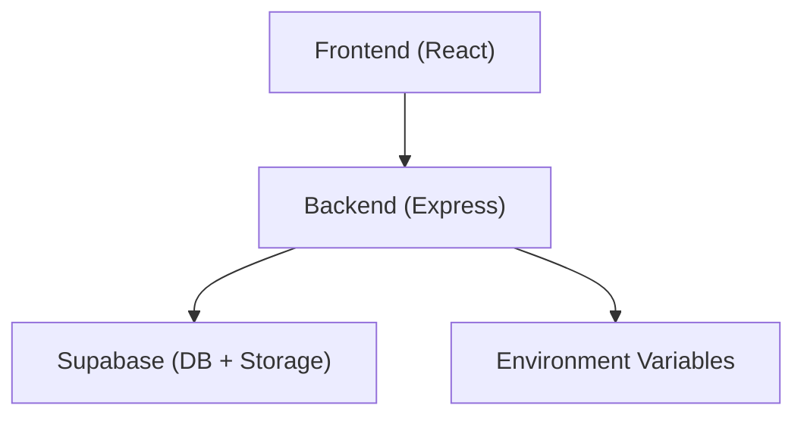
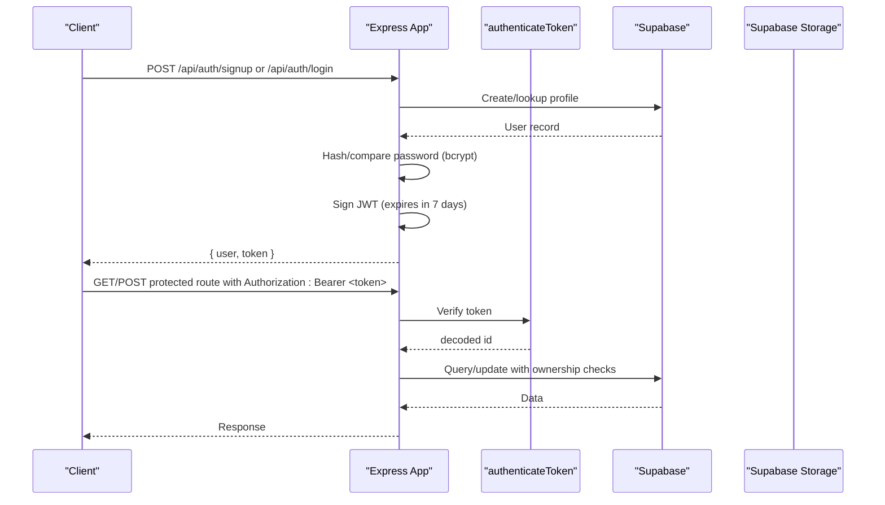
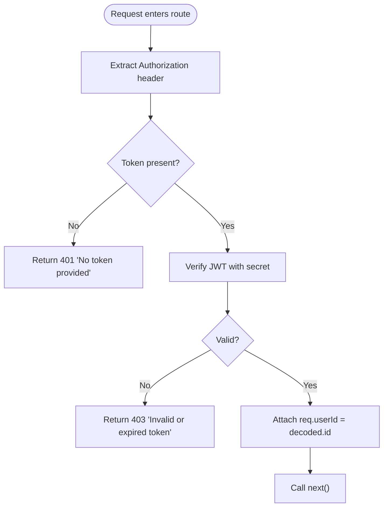
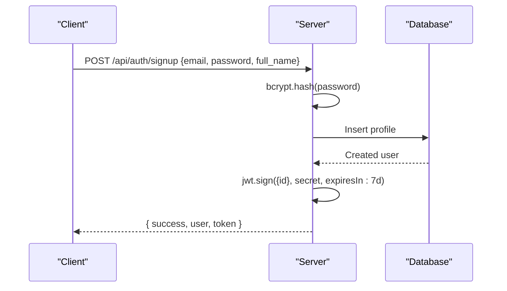
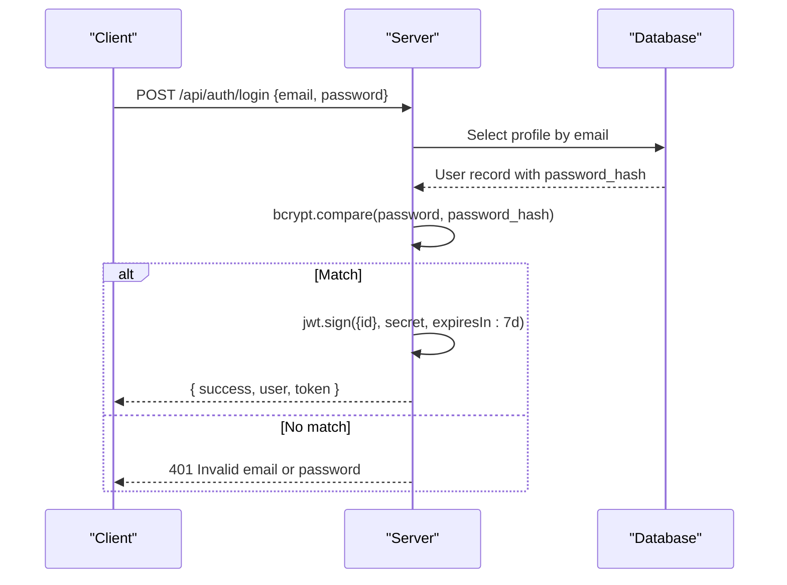
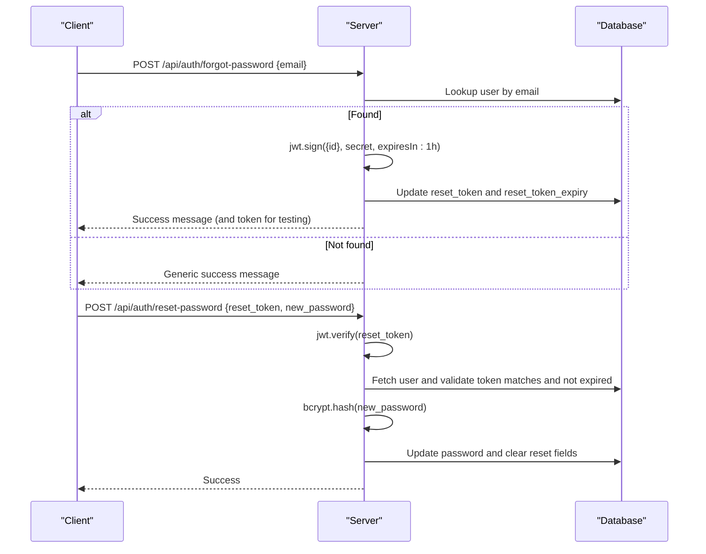
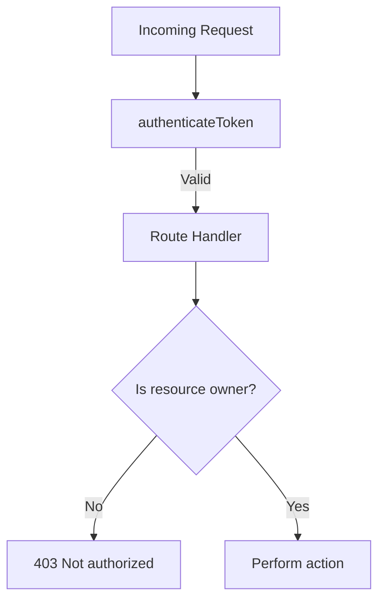
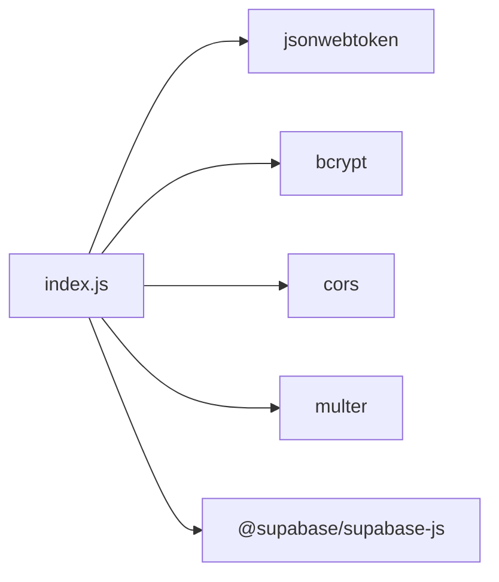

# Security & Authentication

<cite>
**Referenced Files in This Document**
- [index.js](file://aischolarpath-backend-main/aischolarpath-backend-main/index.js)
- [package.json](file://aischolarpath-backend-main/aischolarpath-backend-main/package.json)
- [AuthModal.jsx](file://scholarpath-frontend (2)/scholarpath/src/components/AuthModal.jsx)
</cite>

## Table of Contents
1. Introduction
2. Project Structure
3. Core Components
4. Architecture Overview
5. Detailed Component Analysis
6. Dependency Analysis
7. Performance Considerations
8. Troubleshooting Guide
9. Conclusion
10. Appendices

## Introduction
This document explains the security and authentication design for ScholarPathAI, focusing on:
- JWT-based authentication for user registration, login, token issuance, and protected routes
- Password hashing with bcrypt
- Input validation and sanitization practices to prevent injection and ensure integrity
- File upload security for CVs and documents
- CORS configuration between frontend and backend
- Security best practices, common vulnerabilities and mitigations, and testing approaches

The backend is an Express application that uses JSON Web Tokens for sessionless authentication, bcrypt for password hashing, and Supabase for data persistence. The frontend currently includes a mock authentication UI; integration with the backend endpoints is not yet implemented in the UI.

## Project Structure
Security-related implementation resides primarily in the backend entry file and dependencies:
- Backend: single-file Express server with middleware, routes, and utilities
- Frontend: React components with a placeholder auth modal (mock behavior)

**Diagram sources**
- [index.js:1-31](file://aischolarpath-backend-main/aischolarpath-backend-main/index.js#L1-L31)
- [package.json:1-14](file://aischolarpath-backend-main/aischolarpath-backend-main/package.json#L1-L14)

**Section sources**
- [index.js:1-31](file://aischolarpath-backend-main/aischolarpath-backend-main/index.js#L1-L31)
- [package.json:1-14](file://aischolarpath-backend-main/aischolarpath-backend-main/package.json#L1-L14)

## Core Components
- Authentication middleware: validates Authorization header and verifies JWT before allowing access to protected routes
- Registration and login: create users and issue short-lived JWTs; reset password flow with time-limited tokens
- Password hashing: bcrypt used for secure storage and comparison
- File uploads: multer memory storage for CVs and documents; stored via Supabase Storage
- CORS: enabled globally for cross-origin requests
- Environment validation: required variables enforced at startup

Key responsibilities:
- Enforce authentication on sensitive endpoints
- Validate inputs and enforce ownership checks
- Securely handle files and external requests
- Provide consistent error responses

**Section sources**
- [index.js:32-47](file://aischolarpath-backend-main/aischolarpath-backend-main/index.js#L32-L47)
- [index.js:518-573](file://aischolarpath-backend-main/aischolarpath-backend-main/index.js#L518-L573)
- [index.js:1101-1181](file://aischolarpath-backend-main/aischolarpath-backend-main/index.js#L1101-L1181)
- [index.js:112-145](file://aischolarpath-backend-main/aischolarpath-backend-main/index.js#L112-L145)
- [index.js:1-10](file://aischolarpath-backend-main/aischolarpath-backend-main/index.js#L1-L10)

## Architecture Overview
The system follows a stateless JWT model: clients send a Bearer token in the Authorization header for protected endpoints. The server verifies the token using a secret from environment variables and attaches the user ID to the request for authorization checks.

**Diagram sources**
- [index.js:32-47](file://aischolarpath-backend-main/aischolarpath-backend-main/index.js#L32-L47)
- [index.js:518-573](file://aischolarpath-backend-main/aischolarpath-backend-main/index.js#L518-L573)
- [index.js:1101-1181](file://aischolarpath-backend-main/aischolarpath-backend-main/index.js#L1101-L1181)

## Detailed Component Analysis

### JWT Authentication Middleware
- Extracts token from Authorization header
- Verifies signature and expiration using the configured secret
- Attaches user ID to request for downstream authorization checks
- Returns standardized 401/403 errors for missing or invalid tokens

**Diagram sources**
- [index.js:32-47](file://aischolarpath-backend-main/aischolarpath-backend-main/index.js#L32-L47)

**Section sources**
- [index.js:32-47](file://aischolarpath-backend-main/aischolarpath-backend-main/index.js#L32-L47)

### User Registration Flow
- Validates presence of email and password
- Hashes password with bcrypt before storing
- Creates profile in database
- Issues a JWT valid for 7 days
- Returns user info and token

**Diagram sources**
- [index.js:518-540](file://aischolarpath-backend-main/aischolarpath-backend-main/index.js#L518-L540)

**Section sources**
- [index.js:518-540](file://aischolarpath-backend-main/aischolarpath-backend-main/index.js#L518-L540)

### Login Flow
- Validates email and password presence
- Retrieves user by email
- Compares provided password with stored hash
- Issues a JWT valid for 7 days
- Returns user info and token

**Diagram sources**
- [index.js:542-573](file://aischolarpath-backend-main/aischolarpath-backend-main/index.js#L542-L573)

**Section sources**
- [index.js:542-573](file://aischolarpath-backend-main/aischolarpath-backend-main/index.js#L542-L573)

### Password Reset Flow
- Generates a short-lived reset token (1 hour)
- Stores token and expiry on the user record
- On reset, verifies token and expiry, hashes new password, clears reset fields
- Uses generic messages to avoid leaking user existence

**Diagram sources**
- [index.js:1101-1181](file://aischolarpath-backend-main/aischolarpath-backend-main/index.js#L1101-L1181)

**Section sources**
- [index.js:1101-1181](file://aischolarpath-backend-main/aischolarpath-backend-main/index.js#L1101-L1181)

### Protected Routes and Ownership Checks
- Many routes require authentication via middleware
- Additional ownership checks compare route parameters with req.userId to prevent IDOR
- Examples include profile updates, CV upload, attestation steps, applications, notifications, roadmap

**Diagram sources**
- [index.js:32-47](file://aischolarpath-backend-main/aischolarpath-backend-main/index.js#L32-L47)
- [index.js:70-110](file://aischolarpath-backend-main/aischolarpath-backend-main/index.js#L70-L110)
- [index.js:112-145](file://aischolarpath-backend-main/aischolarpath-backend-main/index.js#L112-L145)
- [index.js:437-517](file://aischolarpath-backend-main/aischolarpath-backend-main/index.js#L437-L517)
- [index.js:821-932](file://aischolarpath-backend-main/aischolarpath-backend-main/index.js#L821-L932)
- [index.js:982-1051](file://aischolarpath-backend-main/aischolarpath-backend-main/index.js#L982-L1051)
- [index.js:1545-1595](file://aischolarpath-backend-main/aischolarpath-backend-main/index.js#L1545-L1595)

**Section sources**
- [index.js:32-47](file://aischolarpath-backend-main/aischolarpath-backend-main/index.js#L32-L47)
- [index.js:70-110](file://aischolarpath-backend-main/aischolarpath-backend-main/index.js#L70-L110)
- [index.js:112-145](file://aischolarpath-backend-main/aischolarpath-backend-main/index.js#L112-L145)
- [index.js:437-517](file://aischolarpath-backend-main/aischolarpath-backend-main/index.js#L437-L517)
- [index.js:821-932](file://aischolarpath-backend-main/aischolarpath-backend-main/index.js#L821-L932)
- [index.js:982-1051](file://aischolarpath-backend-main/aischolarpath-backend-main/index.js#L982-L1051)
- [index.js:1545-1595](file://aischolarpath-backend-main/aischolarpath-backend-main/index.js#L1545-L1595)

### File Upload Security (CVs and Documents)
- Uses multer with memory storage for in-memory processing
- Uploads are sent to Supabase Storage under a scoped path including user ID and timestamp
- Updates profile with stored file path
- Some document endpoints are placeholders awaiting AI teammate integration

Recommendations to strengthen:
- Enforce allowed MIME types and extensions (e.g., PDF, DOCX)
- Enforce maximum file size limits
- Sanitize original filenames to prevent directory traversal
- Add virus scanning before storage
- Implement signed URLs for downloads instead of exposing raw paths

**Section sources**
- [index.js:11-27](file://aischolarpath-backend-main/aischolarpath-backend-main/index.js#L11-L27)
- [index.js:112-145](file://aischolarpath-backend-main/aischolarpath-backend-main/index.js#L112-L145)
- [index.js:933-967](file://aischolarpath-backend-main/aischolarpath-backend-main/index.js#L933-L967)

### Input Validation and Sanitization
- Basic presence checks for required fields in auth and business endpoints
- Ownership checks to prevent unauthorized access to resources
- For scraping endpoints, selectors and URLs are validated but should be further constrained

Recommended improvements:
- Centralized schema validation (e.g., Zod/Joi) for all inputs
- Strict allowlists for selectors and URL domains
- Rate limiting per IP/user for scraping endpoints
- Output encoding when rendering any user-supplied content

**Section sources**
- [index.js:518-573](file://aischolarpath-backend-main/aischolarpath-backend-main/index.js#L518-L573)
- [index.js:70-110](file://aischolarpath-backend-main/aischolarpath-backend-main/index.js#L70-L110)
- [index.js:1182-1243](file://aischolarpath-backend-main/aischolarpath-backend-main/index.js#L1182-L1243)
- [index.js:1258-1309](file://aischolarpath-backend-main/aischolarpath-backend-main/index.js#L1258-L1309)
- [index.js:1310-1390](file://aischolarpath-backend-main/aischolarpath-backend-main/index.js#L1310-L1390)
- [index.js:1391-1493](file://aischolarpath-backend-main/aischolarpath-backend-main/index.js#L1391-L1493)

### CORS Configuration
- CORS is enabled globally, allowing cross-origin requests from any origin
- Suitable for development; for production, restrict to known frontend origins

**Section sources**
- [index.js:1-31](file://aischolarpath-backend-main/aischolarpath-backend-main/index.js#L1-L31)

### Environment and Secrets Management
- Required environment variables are validated at startup: SUPABASE_URL, SUPABASE_KEY, JWT_SECRET
- JWT_SECRET must be strong and kept secret
- Consider rotating secrets and using a secrets manager

**Section sources**
- [index.js:1-10](file://aischolarpath-backend-main/aischolarpath-backend-main/index.js#L1-L10)

### Error Handling
- Centralized error handler returns a generic message for unhandled exceptions
- Route handlers return structured JSON with success flags and error messages

**Section sources**
- [index.js:1527-1531](file://aischolarpath-backend-main/aischolarpath-backend-main/index.js#L1527-L1531)

## Dependency Analysis
Key security-related dependencies:
- express: web framework
- jsonwebtoken: JWT signing and verification
- bcrypt: password hashing
- cors: cross-origin request handling
- multer: multipart file uploads
- @supabase/supabase-js: database and storage client

**Diagram sources**
- [package.json:1-14](file://aischolarpath-backend-main/aischolarpath-backend-main/package.json#L1-L14)
- [index.js:1-31](file://aischolarpath-backend-main/aischolarpath-backend-main/index.js#L1-L31)

**Section sources**
- [package.json:1-14](file://aischolarpath-backend-main/aischolarpath-backend-main/package.json#L1-L14)

## Performance Considerations
- JWT verification is lightweight; keep tokens small and short-lived where possible
- Avoid synchronous operations in hot paths; current flows are async
- Multer memoryStorage keeps files in RAM; consider disk storage or streaming for large files
- Scrape endpoints introduce network latency; rate-limit and add retries/backoff

[No sources needed since this section provides general guidance]

## Troubleshooting Guide
Common issues and resolutions:
- Missing environment variables: server exits at startup if required vars are absent
- 401 Unauthorized: missing or malformed Authorization header
- 403 Forbidden: invalid/expired token or insufficient permissions (ownership mismatch)
- 500 Internal Server Error: check centralized error handler and logs
- File upload failures: verify file presence and storage permissions

**Section sources**
- [index.js:1-10](file://aischolarpath-backend-main/aischolarpath-backend-main/index.js#L1-L10)
- [index.js:32-47](file://aischolarpath-backend-main/aischolarpath-backend-main/index.js#L32-L47)
- [index.js:1527-1531](file://aischolarpath-backend-main/aischolarpath-backend-main/index.js#L1527-L1531)

## Conclusion
ScholarPathAI implements a solid foundation for secure authentication and authorization:
- Stateless JWTs with middleware protect sensitive endpoints
- Passwords are hashed with bcrypt
- Ownership checks mitigate IDOR risks
- CORS is enabled for flexibility; tighten in production
- File uploads use memory storage and Supabase Storage; add strict validation and scanning

To harden further:
- Add input validation schemas and allowlists
- Enforce file type/size limits and sanitize filenames
- Restrict CORS to trusted origins
- Implement rate limiting and abuse protection
- Integrate frontend with backend auth endpoints and persist tokens securely

[No sources needed since this section summarizes without analyzing specific files]

## Appendices

### Frontend Authentication Status
- The frontend includes an authentication modal that currently performs mock actions and navigates to the dashboard without calling the backend
- Once integrated, the frontend should call /api/auth/signup and /api/auth/login, store the returned token, and attach it to subsequent requests via Authorization headers

**Section sources**
- [AuthModal.jsx:11-16](file://scholarpath-frontend (2)/scholarpath/src/components/AuthModal.jsx#L11-L16)