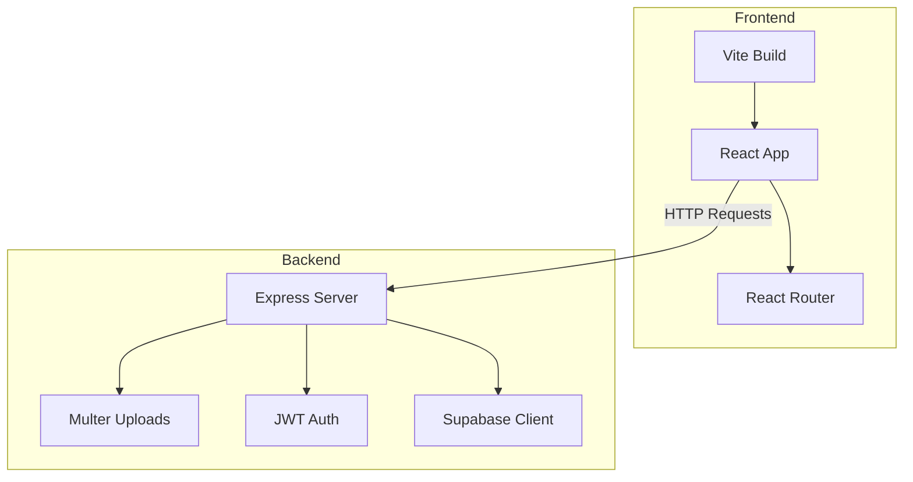
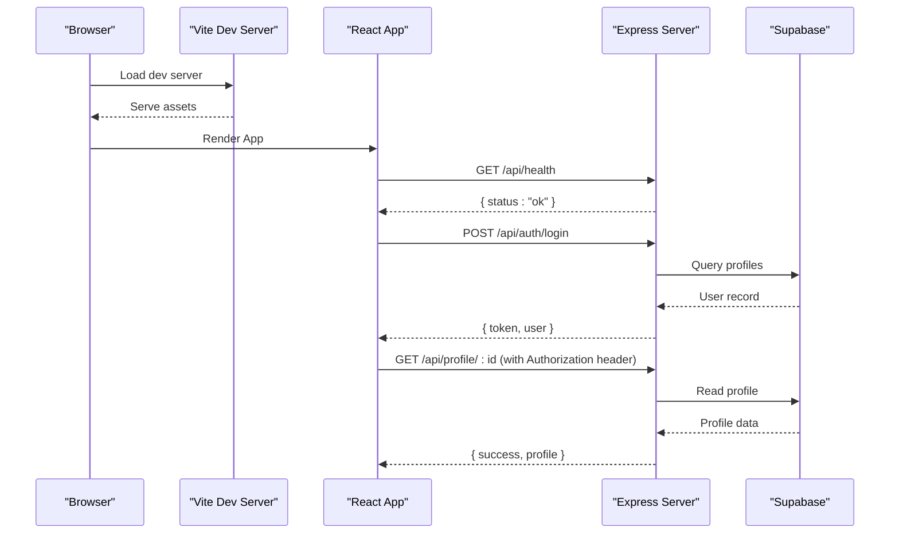

# Troubleshooting

<cite>
**Referenced Files in This Document**
- [index.js](file://aischolarpath-backend-main/aischolarpath-backend-main/index.js)
- [package.json (backend)](file://aischolarpath-backend-main/aischolarpath-backend-main/package.json)
- [.gitignore (backend)](file://aischolarpath-backend-main/aischolarpath-backend-main/.gitignore)
- [App.jsx](file://scholarpath-frontend (2)/scholarpath/src/App.jsx)
- [main.jsx](file://scholarpath-frontend (2)/scholarpath/src/main.jsx)
- [vite.config.js](file://scholarpath-frontend (2)/scholarpath/vite.config.js)
- [tailwind.config.js](file://scholarpath-frontend (2)/scholarpath/tailwind.config.js)
- [postcss.config.js](file://scholarpath-frontend (2)/scholarpath/postcss.config.js)
- [package.json (frontend)](file://scholarpath-frontend (2)/scholarpath/package.json)
</cite>

## Table of Contents
1. Introduction
2. Project Structure
3. Core Components
4. Architecture Overview
5. Detailed Component Analysis
6. Dependency Analysis
7. Performance Considerations
8. Troubleshooting Guide
9. Conclusion
10. Appendices

## Introduction
This document provides comprehensive troubleshooting guidance for ScholarPathAI, covering setup issues, frontend build problems, backend startup and database connectivity, authentication and CORS errors, file upload failures, web scraping considerations, log analysis, error interpretation, and performance diagnostics. It is designed to help both new users and experienced developers quickly identify and resolve common issues.

## Project Structure
ScholarPathAI consists of two main parts:
- Backend: Express server with Supabase integration, JWT-based authentication, file uploads, and API endpoints for profiles, scholarships, universities, matching, and more.
- Frontend: React application built with Vite, Tailwind CSS, and React Router.

**Diagram sources**
- [index.js:1-59](file://aischolarpath-backend-main/aischolarpath-backend-main/index.js#L1-L59)
- [App.jsx:1-15](file://scholarpath-frontend (2)/scholarpath/src/App.jsx#L1-L15)
- [vite.config.js:1-8](file://scholarpath-frontend (2)/scholarpath/vite.config.js#L1-L8)

**Section sources**
- [index.js:1-59](file://aischolarpath-backend-main/aischolarpath-backend-main/index.js#L1-L59)
- [package.json (backend):1-14](file://aischolarpath-backend-main/aischolarpath-backend-main/package.json#L1-L14)
- [package.json (frontend):1-28](file://scholarpath-frontend (2)/scholarpath/package.json#L1-L28)
- [vite.config.js:1-8](file://scholarpath-frontend (2)/scholarpath/vite.config.js#L1-L8)
- [App.jsx:1-15](file://scholarpath-frontend (2)/scholarpath/src/App.jsx#L1-L15)

## Core Components
- Backend entrypoint initializes environment validation, middleware (CORS, JSON parsing), Supabase client, authentication middleware, and routes for health checks, profiles, scholarships, universities, matching, shortlists, and static guides.
- Frontend entrypoint renders the React app using Vite and configures routing between Landing and Dashboard pages.

Key responsibilities:
- Environment validation at startup to ensure required variables are present.
- Authentication middleware that validates JWT tokens.
- File upload handling via Multer memory storage.
- Database interactions through Supabase client for profiles, scholarships, universities, matches, and shortlists.

**Section sources**
- [index.js:1-59](file://aischolarpath-backend-main/aischolarpath-backend-main/index.js#L1-L59)
- [index.js:32-47](file://aischolarpath-backend-main/aischolarpath-backend-main/index.js#L32-L47)
- [index.js:112-145](file://aischolarpath-backend-main/aischolarpath-backend-main/index.js#L112-L145)
- [main.jsx:1-11](file://scholarpath-frontend (2)/scholarpath/src/main.jsx#L1-L11)
- [App.jsx:1-15](file://scholarpath-frontend (2)/scholarpath/src/App.jsx#L1-L15)

## Architecture Overview
The system follows a typical SPA + API architecture:
- The React frontend communicates with the Express backend over HTTP.
- The backend uses Supabase as the data store and supports authenticated requests via JWT.
- File uploads are handled in-memory and stored via Supabase Storage.

**Diagram sources**
- [index.js:57-68](file://aischolarpath-backend-main/aischolarpath-backend-main/index.js#L57-L68)
- [index.js:543-573](file://aischolarpath-backend-main/aischolarpath-backend-main/index.js#L543-L573)
- [index.js:94-110](file://aischolarpath-backend-main/aischolarpath-backend-main/index.js#L94-L110)
- [App.jsx:1-15](file://scholarpath-frontend (2)/scholarpath/src/App.jsx#L1-L15)

## Detailed Component Analysis

### Backend Startup and Environment Validation
Common issues:
- Missing environment variables cause immediate exit.
- Incorrect Supabase credentials prevent DB operations.
- CORS misconfiguration blocks frontend requests.

Diagnostics:
- Check console logs for missing variable messages on startup.
- Verify SUPABASE_URL, SUPABASE_KEY, and JWT_SECRET are set.
- Confirm CORS allows your frontend origin during development.

Resolution steps:
- Create a .env file with required variables.
- Ensure the backend reads environment variables before starting services.
- Validate CORS settings match your frontend URL.

**Section sources**
- [index.js:1-10](file://aischolarpath-backend-main/aischolarpath-backend-main/index.js#L1-L10)
- [index.js:31-48](file://aischolarpath-backend-main/aischolarpath-backend-main/index.js#L31-L48)
- [.gitignore (backend):1-2](file://aischolarpath-backend-main/aischolarpath-backend-main/.gitignore#L1-L2)

### Authentication Middleware and Token Handling
Common issues:
- 401 responses when no Authorization header is provided.
- 403 responses for invalid or expired tokens.
- Misconfigured JWT secret causing verification failures.

Diagnostics:
- Inspect request headers for Authorization: Bearer <token>.
- Validate JWT_SECRET consistency between login and protected routes.
- Use the test endpoints to verify token flow.

Resolution steps:
- Ensure login returns a token and the frontend attaches it to subsequent requests.
- Keep JWT_SECRET consistent across environments.
- Re-login if tokens expire.

**Section sources**
- [index.js:32-47](file://aischolarpath-backend-main/aischolarpath-backend-main/index.js#L32-L47)
- [index.js:543-573](file://aischolarpath-backend-main/aischolarpath-backend-main/index.js#L543-L573)

### File Uploads (CV)
Common issues:
- 400 errors when no file is uploaded.
- 500 errors from Supabase Storage due to permissions or network issues.
- Incorrect content-type or large files causing timeouts.

Diagnostics:
- Confirm the form sends multipart/form-data with field name matching the multer configuration.
- Check Supabase Storage bucket permissions and existence.
- Monitor network tab for upload progress and errors.

Resolution steps:
- Ensure the frontend includes the correct field name and content type.
- Verify Supabase Storage bucket exists and is accessible.
- Adjust size limits if necessary.

**Section sources**
- [index.js:112-145](file://aischolarpath-backend-main/aischolarpath-backend-main/index.js#L112-L145)

### Database Queries and Endpoints
Common issues:
- 404 responses for non-existent resources.
- 500 responses indicating database errors.
- Slow queries due to unoptimized filters or large datasets.

Diagnostics:
- Test endpoints like /api/test-db to validate connectivity.
- Review query parameters and filters used by endpoints.
- Inspect Supabase logs for slow or failing queries.

Resolution steps:
- Add appropriate indexes in Supabase for frequently filtered columns.
- Limit result sets where possible.
- Use pagination for large lists.

**Section sources**
- [index.js:62-68](file://aischolarpath-backend-main/aischolarpath-backend-main/index.js#L62-L68)
- [index.js:190-206](file://aischolarpath-backend-main/aischolarpath-backend-main/index.js#L190-L206)
- [index.js:224-271](file://aischolarpath-backend-main/aischolarpath-backend-main/index.js#L224-L271)

### Matching Algorithm and Data Integrity
Common issues:
- Incomplete or incorrect match results due to missing profile fields.
- Performance bottlenecks when processing many scholarships.

Diagnostics:
- Validate profile completeness (CGPA, IELTS, degree).
- Check eligibility criteria structure in scholarship records.
- Monitor insert/delete operations for matches table.

Resolution steps:
- Encourage users to complete their profiles before running matching.
- Optimize queries and consider caching frequent lookups.

**Section sources**
- [index.js:575-673](file://aischolarpath-backend-main/aischolarpath-backend-main/index.js#L575-L673)

### Frontend Routing and Rendering
Common issues:
- Blank page due to missing root element or failed imports.
- Route mismatches preventing navigation.

Diagnostics:
- Verify index.html contains the root div.
- Check browser console for import errors.
- Ensure routes are correctly defined.

Resolution steps:
- Confirm the root element exists and is mounted.
- Align route paths with navigation links.
- Clear cache and rebuild if necessary.

**Section sources**
- [App.jsx:1-15](file://scholarpath-frontend (2)/scholarpath/src/App.jsx#L1-L15)
- [main.jsx:1-11](file://scholarpath-frontend (2)/scholarpath/src/main.jsx#L1-L11)

## Dependency Analysis
Potential dependency conflicts and compatibility issues:
- Node.js version mismatch with dependencies (e.g., newer packages may require specific Node versions).
- Frontend toolchain versions (Vite, React, Tailwind) must be compatible.
- Backend package versions (Express, Supabase, bcrypt, etc.) should align with runtime expectations.

Recommended checks:
- Use a Node.js version manager to pin versions.
- Install dependencies in clean environments to avoid stale modules.
- Run linting and build scripts to catch incompatibilities early.

**Section sources**
- [package.json (backend):1-14](file://aischolarpath-backend-main/aischolarpath-backend-main/package.json#L1-L14)
- [package.json (frontend):1-28](file://scholarpath-frontend (2)/scholarpath/package.json#L1-L28)

## Performance Considerations
- Database queries: Add indexes for filtered columns; limit result sizes; use pagination.
- Matching algorithm: Cache frequent lookups; process batches; avoid unnecessary re-runs.
- File uploads: Stream large files if possible; configure timeouts appropriately.
- Frontend builds: Enable code splitting; optimize assets; use production builds for performance.

[No sources needed since this section provides general guidance]

## Troubleshooting Guide

### Setup Issues
- Node.js version conflicts
  - Symptom: Installation fails or runtime errors occur.
  - Action: Pin Node.js version using a version manager; reinstall dependencies in a clean directory.
- Dependency installation problems
  - Symptom: npm install errors or missing modules.
  - Action: Delete node_modules and lockfiles; run install again; check registry access.
- Environment configuration errors
  - Symptom: Backend exits immediately or endpoints fail.
  - Action: Create .env with SUPABASE_URL, SUPABASE_KEY, JWT_SECRET; restart backend.

**Section sources**
- [index.js:1-10](file://aischolarpath-backend-main/aischolarpath-backend-main/index.js#L1-L10)
- [.gitignore (backend):1-2](file://aischolarpath-backend-main/aischolarpath-backend-main/.gitignore#L1-L2)

### Frontend-Specific Issues
- React compilation errors
  - Symptom: Build fails with syntax or import errors.
  - Action: Fix imports; ensure JSX is enabled; clear caches; reinstall dependencies.
- Vite build problems
  - Symptom: Build script fails or output is incomplete.
  - Action: Validate vite.config.js; check plugins; run build in verbose mode.
- Browser compatibility issues
  - Symptom: Features not working in certain browsers.
  - Action: Add polyfills; adjust target browsers; test in multiple environments.

**Section sources**
- [vite.config.js:1-8](file://scholarpath-frontend (2)/scholarpath/vite.config.js#L1-L8)
- [tailwind.config.js:1-31](file://scholarpath-frontend (2)/scholarpath/tailwind.config.js#L1-L31)
- [postcss.config.js:1-7](file://scholarpath-frontend (2)/scholarpath/postcss.config.js#L1-L7)
- [package.json (frontend):1-28](file://scholarpath-frontend (2)/scholarpath/package.json#L1-L28)

### Backend Troubleshooting
- Express server startup failures
  - Symptom: Server does not start or crashes early.
  - Action: Check console for missing environment variables; fix .env; restart.
- Database connection problems
  - Symptom: Endpoints return 500 or connectivity tests fail.
  - Action: Validate Supabase credentials; test /api/test-db; review network/firewall settings.
- API endpoint errors
  - Symptom: Unexpected status codes or malformed responses.
  - Action: Inspect request payloads; verify route parameters; check authorization headers.

**Section sources**
- [index.js:57-68](file://aischolarpath-backend-main/aischolarpath-backend-main/index.js#L57-L68)
- [index.js:94-110](file://aischolarpath-backend-main/aischolarpath-backend-main/index.js#L94-L110)
- [index.js:190-206](file://aischolarpath-backend-main/aischolarpath-backend-main/index.js#L190-L206)

### Debugging Techniques
- Authentication issues
  - Symptom: 401/403 responses on protected routes.
  - Action: Ensure Authorization header is set; verify token validity; confirm JWT_SECRET.
- CORS errors
  - Symptom: Network errors blocking requests from frontend.
  - Action: Configure CORS to allow frontend origin; test with curl; check browser console.
- File upload failures
  - Symptom: 400/500 errors during CV upload.
  - Action: Verify multipart/form-data; check field names; confirm Supabase Storage permissions.

**Section sources**
- [index.js:32-47](file://aischolarpath-backend-main/aischolarpath-backend-main/index.js#L32-L47)
- [index.js:112-145](file://aischolarpath-backend-main/aischolarpath-backend-main/index.js#L112-L145)

### Web Scraping Considerations
Note: The current backend uses Cheerio but does not expose scraping endpoints in the analyzed portion. If scraping is added later:
- Selector issues
  - Symptom: Missing or incorrect data extraction.
  - Action: Inspect target HTML; update selectors; handle dynamic content.
- Website structure changes
  - Symptom: Extraction breaks after site updates.
  - Action: Implement robust selectors; add fallbacks; monitor changes.
- Rate limiting problems
  - Symptom: Requests blocked or throttled.
  - Action: Add delays; respect robots.txt; implement retries with backoff.

[No sources needed since this section provides general guidance]

### Log Analysis and Error Interpretation
- Backend logs
  - Look for startup errors indicating missing environment variables.
  - Inspect route handlers for error messages returned to clients.
- Frontend logs
  - Check browser console for JavaScript errors and network failures.
  - Review build logs for warnings or failures.

Diagnostic commands and tools:
- Backend
  - Start server and observe console output for environment validation and errors.
  - Use curl to test endpoints: GET /api/health, GET /api/test-db.
  - Send authenticated requests with Authorization header to protected routes.
- Frontend
  - Run dev server and inspect console/network tabs.
  - Build project and analyze build output for errors.
  - Use browser developer tools to debug network requests and responses.

**Section sources**
- [index.js:57-68](file://aischolarpath-backend-main/aischolarpath-backend-main/index.js#L57-L68)
- [index.js:543-573](file://aischolarpath-backend-main/aischolarpath-backend-main/index.js#L543-L573)

### Performance Troubleshooting
- Slow queries
  - Identify slow endpoints; add indexes; reduce payload size; paginate results.
- Large dataset processing
  - Batch operations; avoid loading entire datasets into memory; stream where possible.
- Frontend performance
  - Code-split routes; lazy-load components; optimize images and assets.

[No sources needed since this section provides general guidance]

## Conclusion
This guide covers the most common issues encountered when setting up and running ScholarPathAI, including environment configuration, frontend build problems, backend startup and database connectivity, authentication and CORS, file uploads, and performance tuning. Use the diagnostic steps and references to quickly identify root causes and apply fixes. For advanced scenarios such as web scraping, follow best practices for selector maintenance and rate limiting.

## Appendices

### Quick Reference: Key Endpoints and Behaviors
- Health check: GET /api/health
- Database connectivity test: GET /api/test-db
- Authentication: POST /api/auth/signup, POST /api/auth/login
- Protected routes require Authorization header and validate JWT.

**Section sources**
- [index.js:57-68](file://aischolarpath-backend-main/aischolarpath-backend-main/index.js#L57-L68)
- [index.js:543-573](file://aischolarpath-backend-main/aischolarpath-backend-main/index.js#L543-L573)